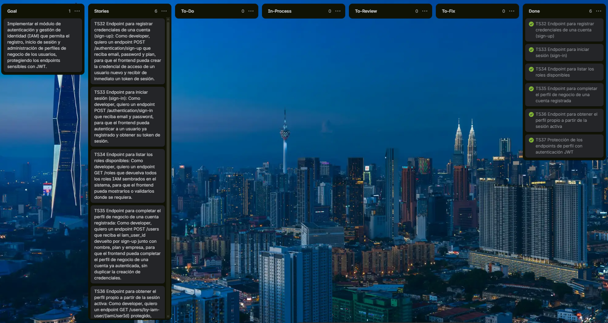

#### 5.2.4.3. Sprint Backlog 4

El objetivo principal del Sprint 4 fue completar el módulo de IAM (Identity and Access Management) del RESTful API de AgroTrack, implementando el registro y autenticación de cuentas, la emisión de tokens JWT y la protección de los endpoints de perfil de usuario, distribuyendo el desarrollo entre los integrantes del equipo. A continuación se presenta el tablero del sprint y la descomposición de Technical Stories en Work-Items/Tasks.

*Sprint 4 de AgroTrack*

*Nota.* Elaboración propia.

**Link del trello:** https://trello.com/b/GAgdFmxb/agrotrack-sprint-4

| User Story Id | User Story | Work-Item / Task Id | Work-Item / Task Title | Work-Item / Task Description | Estimation (Hours) | Assigned To | Status |
|---|---|---|---|---|---|---|---|
| TS32 | Endpoint para registrar credenciales de una cuenta (sign-up) | T-044 | Implementar capa de dominio del BC IAM | Crear el agregado IamUser con sus value objects (Email, HashedPassword, Role) y el comando SignUpCommand para el registro de credenciales. | 4 | Velasquez Laquihuanaco, Eduardo David | Done |
| | | T-045 | Implementar capa de aplicación del BC IAM | Implementar SignUpCommandServiceImpl, incluyendo el hasheo de la contraseña con BCrypt y la asignación automática del rol según el plan (FARMER para BASIC/PRO, AGRICULTURAL_MANAGER para ENTERPRISE). | 4 | Velasquez Laquihuanaco, Eduardo David | Done |
| | | T-046 | Implementar capa de infraestructura del BC IAM | Crear IamUserPersistenceEntity, RolePersistenceEntity, repositorios JPA y un RoleSeeder que registre ROLE_FARMER, ROLE_AGRICULTURAL_MANAGER y ROLE_ADMIN al arrancar la aplicación. | 4 | Velasquez Laquihuanaco, Eduardo David | Done |
| | | T-047 | Implementar endpoint POST /authentication/sign-up | Crear AuthenticationController con el endpoint POST /authentication/sign-up, retornando el token JWT generado y manejando el conflicto 409 por email duplicado. | 3 | Velasquez Laquihuanaco, Eduardo David | Done |
| TS33 | Endpoint para iniciar sesión (sign-in) | T-048 | Implementar SignInCommand y servicio de autenticación | Implementar SignInCommandServiceImpl, validando credenciales con BCrypt y generando el token JWT correspondiente. | 3 | Velasquez Laquihuanaco, Eduardo David | Done |
| | | T-049 | Implementar endpoint POST /authentication/sign-in | Agregar el endpoint POST /authentication/sign-in en AuthenticationController, manejando el error 400 por password incorrecto y 404 por email no registrado. | 2 | Velasquez Laquihuanaco, Eduardo David | Done |
| TS34 | Endpoint para listar los roles disponibles | T-050 | Implementar RolesController con endpoint GET /roles | Crear el endpoint GET /roles que retorna los roles IAM sembrados en el sistema (ROLE_FARMER, ROLE_AGRICULTURAL_MANAGER, ROLE_ADMIN). | 1 | Velasquez Laquihuanaco, Eduardo David | Done |
| TS35 | Endpoint para completar el perfil de negocio de una cuenta registrada | T-051 | Vincular el agregado User del BC Identity con la credencial IAM | Actualizar el agregado User para referenciar el iam_user_id y derivar el user_type a partir del plan recibido. | 3 | Alfaro Mallma, Alberto Joaquin | Done |
| | | T-052 | Implementar endpoint POST /users para completar el perfil de negocio | Crear el endpoint POST /users que recibe el iam_user_id junto con nombre, plan y empresa, y crea automáticamente la AlertPreference asociada al nuevo perfil. | 3 | Alfaro Mallma, Alberto Joaquin | Done |
| | | T-053 | Manejar validaciones del endpoint POST /users | Implementar el manejo de errores 404 (iam_user_id inexistente) y 409 (perfil ya existente para esa credencial). | 2 | Alfaro Mallma, Alberto Joaquin | Done |
| TS36 | Endpoint para obtener el perfil propio a partir de la sesión activa | T-054 | Implementar endpoint GET /users/by-iam-user/{iamUserId} | Crear el endpoint protegido que retorna el perfil completo del usuario a partir de su iamUserId. | 2 | Rodriguez Rojas, Miler Alexander | Done |
| | | T-055 | Implementar validación de propiedad del perfil consultado | Validar que el iamUserId de la URL coincida con el del dueño del token, retornando 403 en caso contrario. | 2 | Rodriguez Rojas, Miler Alexander | Done |
| TS37 | Protección de los endpoints de perfil con autenticación JWT | T-056 | Configurar Spring Security y el filtro de autenticación JWT | Implementar JwtAuthenticationFilter y la configuración de Spring Security para exigir un token JWT válido en todos los endpoints bajo /users/**. | 4 | Quispe Perez, Eder Edu | Done |
| | | T-057 | Manejar errores de autenticación en endpoints protegidos | Configurar el manejo de errores 401 para solicitudes sin token o con token inválido/expirado. | 2 | Quispe Perez, Eder Edu | Done |
