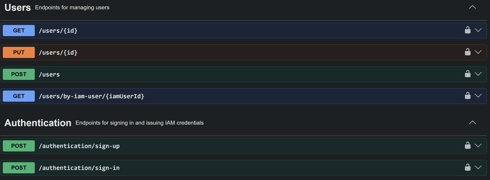
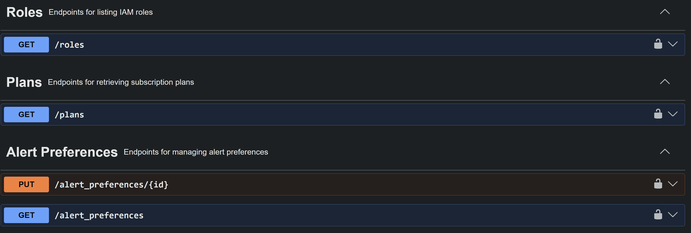
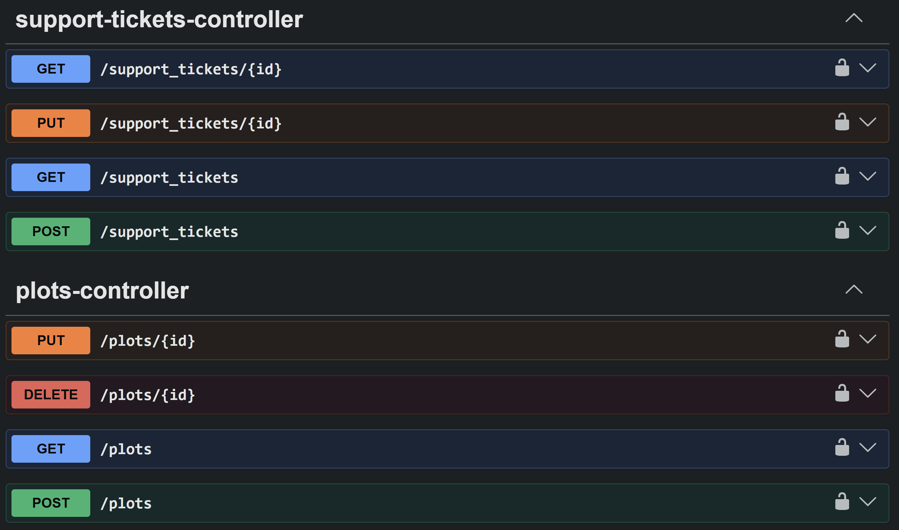
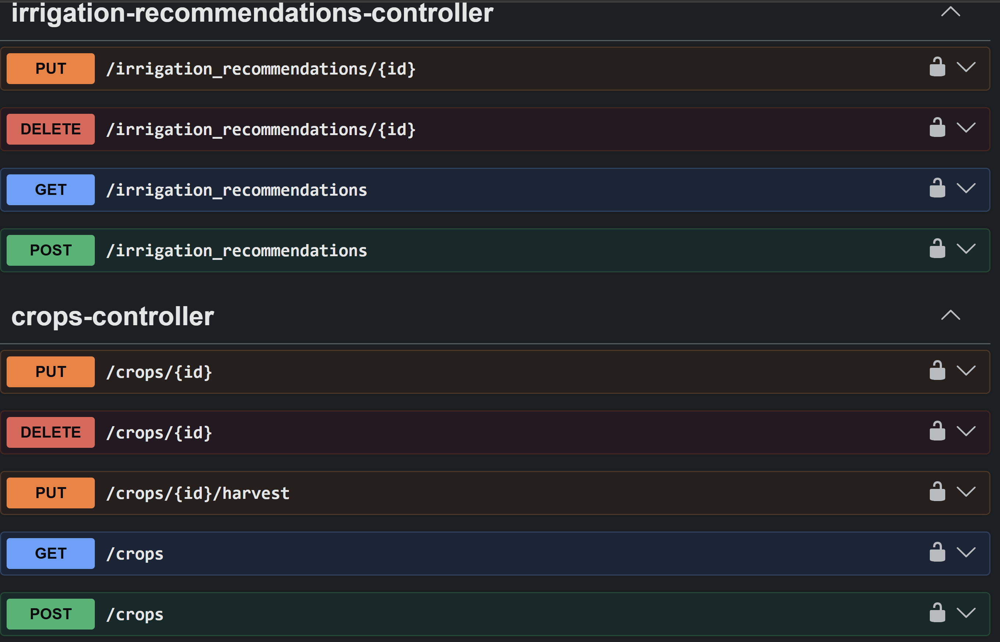
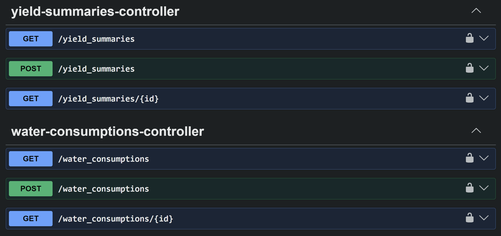
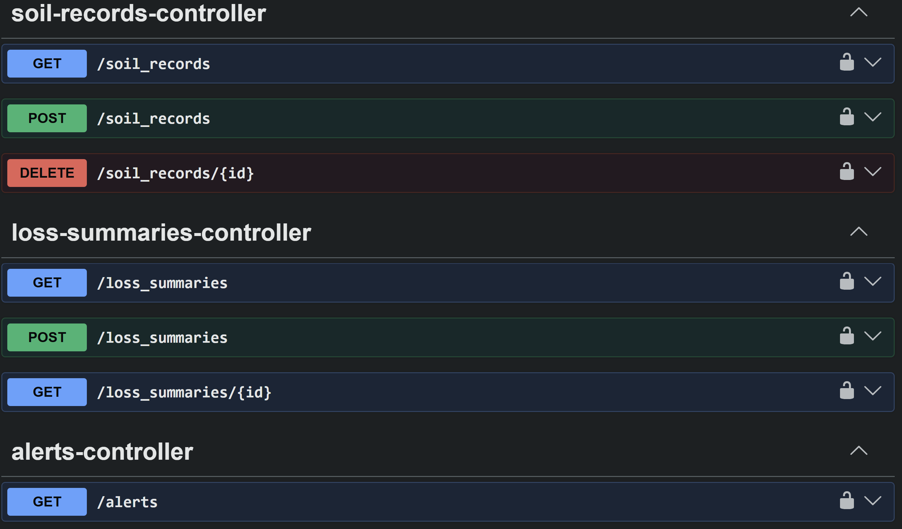

#### 5.2.4.5. Execution Evidence for Sprint Review

Durante el Sprint 4, el equipo de Andes Smart completó la implementación del Bounded Context de Identity (IAM) del sistema AgroTrack. Se desarrollaron los endpoints de autenticación (sign-up y sign-in) y de gestión de perfil de negocio, protegidos mediante JWT, como parte de la RESTful API desplegada en Render, documentada mediante OpenAPI/Swagger y consumida exitosamente por la Web Application. A continuación se presentan las capturas de las principales vistas del funcionamiento del sistema.
 
**Swagger UI - Documentación de endpoints desplegados**
 
 
 
 
  
  
  

**Video de demostración**
 
A continuación se presenta el video de demostración del Sprint 4, donde se muestra el funcionamiento de los Web Services de autenticación e identidad documentados en Swagger y los endpoints implementados por el equipo.
 
 
 
**Link del video:** https://upcedupe-my.sharepoint.com/:v:/g/personal/u202324623_upc_edu_pe/IQBe2DaJnk2nRITEOF8NEWw1AUNSwXuPQMT2jwS22LQeqag?e=6vj60X&nav=eyJyZWZlcnJhbEluZm8iOnsicmVmZXJyYWxBcHAiOiJTdHJlYW1XZWJBcHAiLCJyZWZlcnJhbFZpZXciOiJTaGFyZURpYWxvZy1MaW5rIiwicmVmZXJyYWxBcHBQbGF0Zm9ybSI6IldlYiIsInJlZmVycmFsTW9kZSI6InZpZXcifX0%3D
 
 
 