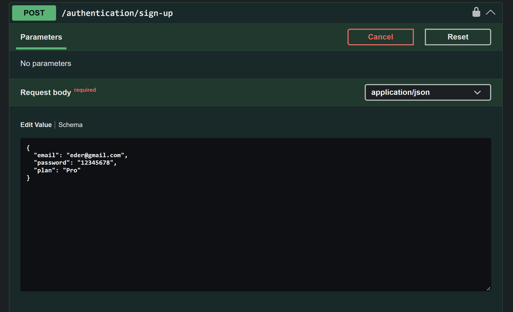
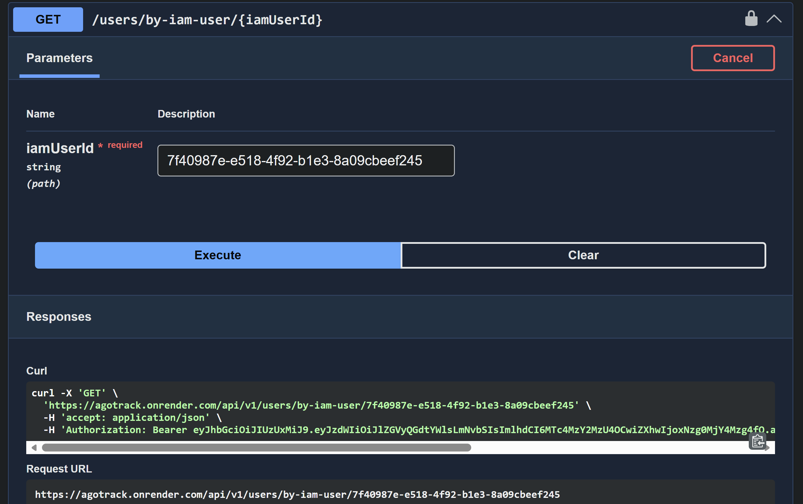

#### 5.2.4.6. Services Documentation Evidence for Sprint Review

Durante el Sprint 4, el equipo documentó los Web Services de autenticación e identidad (IAM) de AgroTrack mediante **OpenAPI / Swagger UI**. La documentación se generó automáticamente a partir de las anotaciones de los controladores REST.
 
A continuación se presenta la tabla con todos los endpoints documentados, junto con la sintaxis de llamada, parámetros, descripción de operación y códigos de respuesta:
 
| Endpoint | Verbo HTTP | Sintaxis de llamada | Parámetros | Descripción | Response |
|:---|:---:|:---|:---|:---|:---:|
| Authentication | POST | `POST /api/v1/authentication/sign-up` | Body: `email`, `password`, `plan` | Registra una nueva credencial de acceso y retorna el id, email, roles derivados del plan y un token JWT | 201, 400, 409 |
| Authentication | POST | `POST /api/v1/authentication/sign-in` | Body: `email`, `password` | Autentica a un usuario existente y retorna el id, email, roles y token JWT | 200, 400, 404 |
| Roles | GET | `GET /api/v1/roles` | — | Retorna el catálogo completo de roles IAM sembrados en el sistema (ROLE_FARMER, ROLE_AGRICULTURAL_MANAGER, ROLE_ADMIN) | 200 |
| Users | POST | `POST /api/v1/users` | Header: `Authorization`; Body: `iam_user_id`, `name`, `plan`, `company` | Completa el perfil de negocio de una cuenta ya autenticada y crea automáticamente una AlertPreference | 201, 401, 404, 409 |
| Users | GET | `GET /api/v1/users/by-iam-user/{iamUserId}` | `iamUserId` (path, UUID); Header: `Authorization` | Obtiene el perfil de negocio completo del usuario autenticado a partir de su iamUserId | 200, 401, 403 |
| Users | ALL | `/api/v1/users/**` | Header: `Authorization` (JWT requerido) | Middleware de protección que exige un token JWT válido para acceder a cualquier endpoint de perfil de usuario | 401 |
 
### Documentación en Swagger UI
 
Se incluyen a continuación capturas de la documentación interactiva accesible en Swagger:
 
 
**Captura 1: Ejecución interactiva del endpoint POST /authentication/sign-up**
 
 
 
 
**Captura 2: Detalle del endpoint GET /users/by-iam-user/{iamUserId}**
 
 
 
 
 
### Referencias de Implementación
 
**Repositorio de Web Services:** https://github.com/AgroTrack-Project/web-services
 
**URL de la Documentación Swagger:** https://agotrack.onrender.com/api/v1/swagger-ui/index.html#/
 
---
 
 