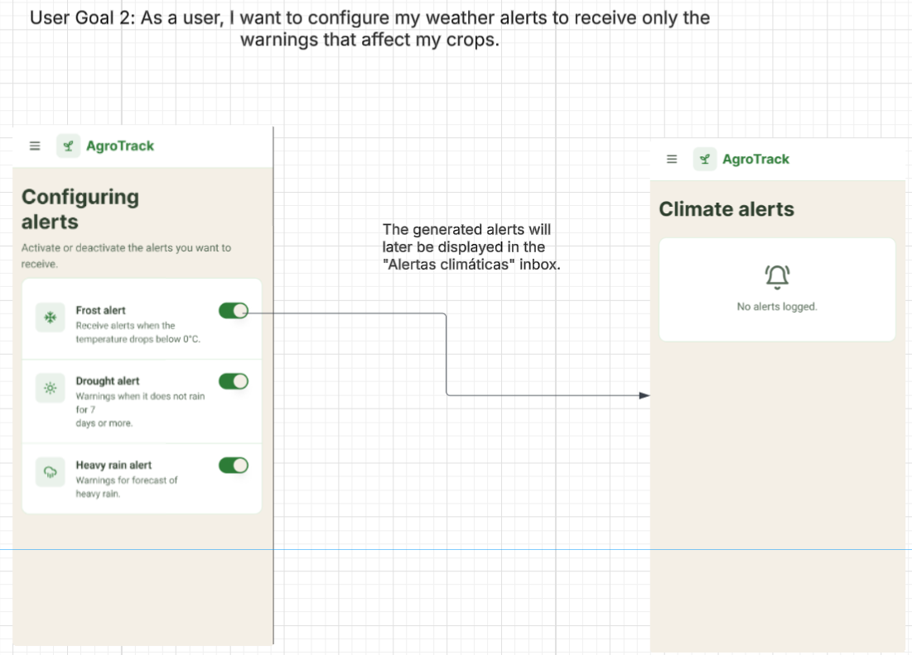

### 4.4.4. Web Applications User Flow Diagrams

El diagrama de flujo de usuario es una representación visual de los pasos que un usuario sigue al interactuar con una aplicación o sitio web. Muestra la secuencia de acciones que el usuario realiza para completar una tarea específica, lo que nos ayuda a identificar posibles puntos de fricción y a optimizar la experiencia del usuario.

