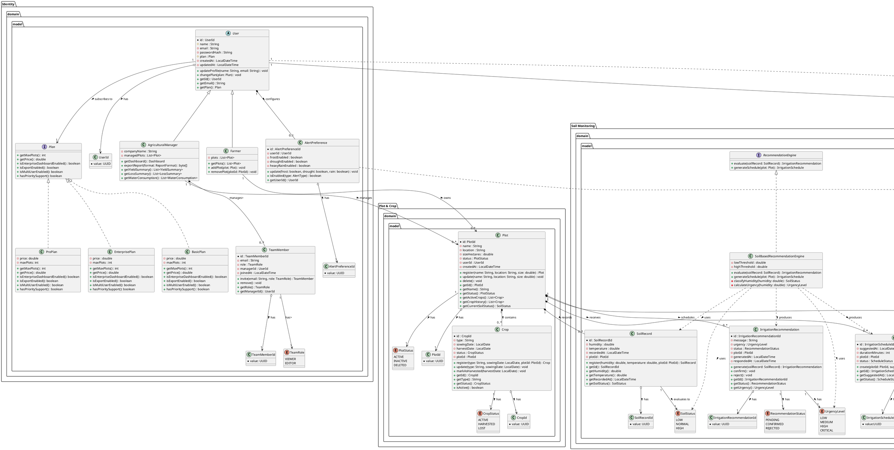

## 4.7. Software Object-Oriented Design

### 4.7.1. Class Diagrams

```plantuml
@startuml AgroTrack_ClassDiagram
 
'BOUNDED CONTEXT: User & Auth
package "Identity.domain.model" {
 
  interface Plan {
    +getMaxPlots() : int
    +getPrice() : double
    +isEnterpriseDashboardEnabled() : boolean
    +isExportEnabled() : boolean
    +isMultiUserEnabled(): boolean
    +hasPrioritySupport(): boolean
  }
 
  class BasicPlan {
    -price : double
    -maxPlots : int
    +getMaxPlots() : int
    +getPrice() : double
    +isEnterpriseDashboardEnabled() : boolean
    +isExportEnabled() : boolean
    +isMultiUserEnabled() : boolean
    +hasPrioritySupport() : boolean
  }
 
  class ProPlan
  {
    - price: double
    - maxPlots: int
    + getMaxPlots() : int
    + getPrice() : double
    + isEnterpriseDashboardEnabled(): boolean
    + isExportEnabled(): boolean
    + isMultiUserEnabled() : boolean
    + hasPrioritySupport() : boolean
  }
 
  class EnterprisePlan {
    -price : double
    -maxPlots : int
    +getMaxPlots() : int
    +getPrice() : double
    +isEnterpriseDashboardEnabled() : boolean
    +isExportEnabled() : boolean
    +isMultiUserEnabled(): boolean
    +hasPrioritySupport(): boolean
  }
 
  class TeamMemberId
  {
    *value: UUID
  }
  class TeamMember {
    *id : TeamMemberId
    -email : String
    -role : TeamRole
    -managerId : UserId
    -joinedAt : LocalDateTime
    +invite(email: String, role: TeamRole) : TeamMember
    +remove() : void
    +getRole() : TeamRole
    +getManagerId() : UserId
  }
 
  enum TeamRole {
    VIEWER
    EDITOR
  }
 
  class UserId
  {
    *value: UUID
  }
 
  abstract class User {
    *id : UserId
    #name : String
    -email : String
    -passwordHash : String
    #plan : Plan
    -createdAt : LocalDateTime
    -updatedAt : LocalDateTime
    +updateProfile(name: String, email: String) : void
    +changePlan(plan: Plan) : void
    +getId() : UserId
    +getEmail() : String
    +getPlan() : Plan
  }
 
  class Farmer {
    -plots : List<Plot>
    +getPlots() : List<Plot>
    +addPlot(plot: Plot) : void
    +removePlot(plotId: PlotId) : void
  }
 
  class AgriculturalManager {
    -companyName : String
    -managedPlots : List<Plot>
    +getDashboard() : Dashboard
    +exportReport(format: ReportFormat) : byte[]
    +getYieldSummary() : List<YieldSummary>
    +getLossSummary() : List<LossSummary>
    +getWaterConsumption() : List<WaterConsumption>
  }
 
  class AlertPreferenceId
  {
    *value: UUID
  }
 
  class AlertPreference {
    *id : AlertPreferenceId
    -userId : UserId
    -frostEnabled : boolean
    -droughtEnabled : boolean
    -heavyRainEnabled : boolean
    +update(frost: boolean, drought: boolean, rain: boolean) : void
    +isEnabled(type: AlertType) : boolean
    +getUserId() : UserId
  }
 
  AlertPreference o--> "1" AlertPreferenceId : has >
  TeamMember o--> "1" TeamMemberId : has >
  User o--> "1" UserId : has >
  User <|-- Farmer
  User <|-- AgriculturalManager
  Plan <|.. BasicPlan
  Plan <|.. ProPlan
  Plan <|.. EnterprisePlan
  User "1" --> "1" Plan : subscribes to >
  User "1" *-- "0..1" AlertPreference : configures >
  AgriculturalManager "1" *-- "0..*" TeamMember: manages>
  TeamMember "1" --> "1" TeamRole : has>
}
 
 
' Support
package Support.domain.model{
 
    class SupportTicketId
    {
        *value: UUID
    }
    class SupportTicket {
      *id : SupportTicketId
      -userId : UserId
      -subject : String
      -message : String
      -status : TicketStatus
      -createdAt : LocalDateTime
      -respondedAt : LocalDateTime
      +create(subject: String, message: String) : SupportTicket
      +close() : void
      +getId() : SupportTicketId
      +getStatus() : TicketStatus
    }
 
    enum TicketStatus {
      OPEN
      IN_PROGRESS
      CLOSED
    }
    SupportTicket o--> "1" SupportTicketId : has >
    SupportTicket "1" --> "1" TicketStatus : has >
}
 
 
' BOUNDED CONTEXT: Plot & Crop
 
package "Plot & Crop.domain.model" {
 
  enum PlotStatus {
    ACTIVE
    INACTIVE
    DELETED
  }
 
  enum CropStatus {
    ACTIVE
    HARVESTED
    LOST
  }
 
  class PlotId
  {
    *value: UUID
  }
 
  class Plot {
    *id: PlotId
    -name : String
    -location : String
    -sizeHectares : double
    -status : PlotStatus
    -userId : UserId
    -createdAt : LocalDateTime
    +register(name: String, location: String, size: double) : Plot
    +update(name: String, location: String, size: double) : void
    +delete() : void
    +getId() : PlotId
    +getName() : String
    +getStatus() : PlotStatus
    +getActiveCrops() : List<Crop>
    +getCropHistory() : List<Crop>
    +getCurrentSoilStatus() : SoilStatus
  }
 
  class CropId
  {
    *value: UUID
  }
 
  class Crop {
    *id : CropId
    -type : String
    -sowingDate : LocalDate
    -harvestDate : LocalDate
    -status : CropStatus
    -plotId : PlotId
    +register(type: String, sowingDate: LocalDate, plotId: PlotId) : Crop
    +update(type: String, sowingDate: LocalDate) : void
    +markAsHarvested(harvestDate: LocalDate) : void
    +getId() : CropId
    +getType() : String
    +getStatus() : CropStatus
    +isActive() : boolean
  }
 
  Crop o--> "1" CropId : has >
  Plot o--> "1" PlotId : has >
  Plot "1" --> "1" PlotStatus : has >
  Plot "1" *-- "0..*" Crop : contains >
  Crop "1" --> "1" CropStatus : has >
}
 
 
' BOUNDED CONTEXT: Soil Monitoring
 
package "Soil Monitoring.domain.model" {
 
  enum SoilStatus {
    LOW
    NORMAL
    HIGH
  }
 
  enum UrgencyLevel {
    LOW
    MEDIUM
    HIGH
    CRITICAL
  }
 
  enum RecommendationStatus {
    PENDING
    CONFIRMED
    REJECTED
  }
 
  enum ScheduleStatus {
    PENDING
    COMPLETED
    SKIPPED
  }
 
  class SoilRecordId
  {
    *value: UUID
  }
 
  class SoilRecord {
    *id : SoilRecordId
    -humidity : double
    -temperature : double
    -recordedAt : LocalDateTime
    -plotId : PlotId
    +register(humidity: double, temperature: double, plotId: PlotId) : SoilRecord
    +getId() : SoilRecordId
    +getHumidity() : double
    +getTemperature() : double
    +getRecordedAt() : LocalDateTime
    +getSoilStatus() : SoilStatus
  }
 
  class IrrigationRecommendationId
  {
    *value: UUID
  }
 
  class IrrigationRecommendation {
    *id : IrrigationRecommendationId
    -message : String
    -urgency : UrgencyLevel
    -status : RecommendationStatus
    -plotId : PlotId
    -generatedAt : LocalDateTime
    -respondedAt : LocalDateTime
    +generate(soilRecord: SoilRecord) : IrrigationRecommendation
    +confirm() : void
    +reject() : void
    +getId() : IrrigationRecommendationId
    +getStatus() : RecommendationStatus
    +getUrgency() : UrgencyLevel
  }
 
  class IrrigationScheduleId
  {
    *value:UUID
  }
 
  class IrrigationSchedule {
    *id : IrrigationScheduleId
    -suggestedAt : LocalDateTime
    -durationMinutes : int
    -plotId : PlotId
    -status : ScheduleStatus
    +create(plotId: PlotId, suggestedAt: LocalDateTime) : IrrigationSchedule
    +getId() : IrrigationScheduleId
    +getSuggestedAt() : LocalDateTime
    +getStatus() : ScheduleStatus
  }
 
  interface RecommendationEngine {
    +evaluate(soilRecord: SoilRecord) : IrrigationRecommendation
    +generateSchedule(plot: Plot) : IrrigationSchedule
  }
 
  class SoilBasedRecommendationEngine {
    -lowThreshold : double
    -highThreshold : double
    +evaluate(soilRecord: SoilRecord) : IrrigationRecommendation
    +generateSchedule(plot: Plot) : IrrigationSchedule
    -classifyHumidity(humidity: double) : SoilStatus
    -calculateUrgency(humidity: double) : UrgencyLevel
  }
 
 
  IrrigationSchedule o--> "1" IrrigationScheduleId : has >
  IrrigationRecommendation o--> "1" IrrigationRecommendationId : has >
  SoilRecord o--> "1" SoilRecordId : has >
  SoilRecord "1" --> "1" SoilStatus : evaluates to >
  IrrigationRecommendation "1" --> "1" RecommendationStatus : has >
  IrrigationRecommendation "1" --> "1" UrgencyLevel : has >
  IrrigationSchedule "1" --> "1" ScheduleStatus : has >
  RecommendationEngine <|.. SoilBasedRecommendationEngine
  SoilBasedRecommendationEngine ..> SoilRecord : uses >
  SoilBasedRecommendationEngine ..> IrrigationRecommendation : produces >
  SoilBasedRecommendationEngine ..> IrrigationSchedule : produces >
  SoilBasedRecommendationEngine ..> SoilStatus : uses >
  SoilBasedRecommendationEngine ..> UrgencyLevel : uses >
}
 
 
' BOUNDED CONTEXT: Climate Alerts
 
package "Climate Alerts.domain.model" {
 
  enum AlertType {
    FROST
    DROUGHT
    HEAVY_RAIN
  }
 
  enum AlertStatus {
    ACTIVE
    DISMISSED
    EXPIRED
  }
 
  class ClimateAlertId
  {
    *value: UUID
  }
 
  class ClimateAlert {
    *id : ClimateAlertId
    -type : AlertType
    -description : String
    -alertDate : LocalDate
    -status : AlertStatus
    -plotId : PlotId
    +create(type: AlertType, plotId: PlotId) : ClimateAlert
    +dismiss() : void
    +getId() : ClimateAlertId
    +getType() : AlertType
    +getStatus() : AlertStatus
  }
 
  class WeatherForecast {
    -location : String
    -minTemperature : double
    -maxTemperature : double
    -precipitationMm : double
    -daysWithoutRain : int
    -forecastDate : LocalDate
    +getMinTemperature() : double
    +getPrecipitationMm() : double
    +getDaysWithoutRain() : int
    +hasFrostRisk() : boolean
    +hasDroughtRisk() : boolean
    +hasHeavyRainRisk() : boolean
  }
 
  interface WeatherService {
    +getForecast(location: String) : WeatherForecast
    +checkFrostRisk(location: String) : boolean
    +checkDroughtRisk(location: String) : boolean
    +checkHeavyRainRisk(location: String) : boolean
  }
 
  ClimateAlert o--> "1" ClimateAlertId : has >
  ClimateAlert "1" --> "1" AlertType : has >
  ClimateAlert "1" --> "1" AlertStatus : has >
  WeatherService ..> WeatherForecast : returns >
  WeatherForecast ..> ClimateAlert : triggers >
  AlertPreference ..> AlertType : filters >
}
 
 
' BOUNDED CONTEXT: Enterprise Dashboard
 
package "Enterprise Dashboard.domain.model" {
 
  class Dashboard {
    -plots : List<Plot>
    -yieldSummaries : List<YieldSummary>
    -lossSummaries : List<LossSummary>
    -waterConsumptions : List<WaterConsumption>
    +getPlotsSummary() : List<Plot>
    +getYieldSummary() : List<YieldSummary>
    +getLossSummary() : List<LossSummary>
    +getWaterSummary() : List<WaterConsumption>
    +exportPDF() : byte[]
    +exportExcel() : byte[]
  }
 
  class YieldSummary {
    -plotId : PlotId
    -plotName : String
    -yieldPerHectare : double
    -season : String
    +getPlotId() : PlotId
    +getYieldPerHectare() : double
    +getSeason() : String
  }
 
  class LossSummary {
    -plotId : PlotId
    -plotName : String
    -lossPercentage : double
    -cause : String
    +getPlotId() : PlotId
    +getLossPercentage() : double
    +getCause() : String
  }
 
  class WaterConsumption {
    -plotId : PlotId
    -plotName : String
    -totalLiters : double
    -season : String
    +getPlotId() : PlotId
    +getTotalLiters() : double
    +getSeason() : String
  }
 
  User "1" ..> "0..1" Dashboard: Accesses if the plan is suitable
  Dashboard "1" *-- "0..*" YieldSummary : contains >
  Dashboard "1" *-- "0..*" LossSummary : contains >
  Dashboard "1" *-- "0..*" WaterConsumption : contains >
}
 
 
' RELACIONES ENTRE BOUNDED CONTEXTS
 
Farmer "1" --> "0..*" Plot : owns >
AgriculturalManager "1" --> "0..*" Plot : manages >
Plot "1" *-- "0..*" SoilRecord : records >
Plot "1" *-- "0..*" IrrigationRecommendation : receives >
Plot "1" *-- "0..*" IrrigationSchedule : schedules >
Plot "1" *-- "0..*" ClimateAlert : receives >
User "1" --> "0..*" SupportTicket: creates >
@enduml
```