<h1>
Universidad Peruana de Ciencias Aplicadas
</h1>

**Facultad de Ingeniería**

**Ingeniería de Software**

**Ciclo:** 5

**Desarrollo de Aplicaciones Open Source - 1ASI0729**

**NRC:** 11959

**Profesor:** Mori Paiva, Hugo Allan

**"Informe de Trabajo Final"**

**Startup:** Andes Smart

**Producto:** AgroTrack

**Integrantes:**

- Alfaro Mallma, Alberto Joaquin - U20241A267
- Martínez Gaona, Pablo Afranio - U202120011
- Quispe Perez, Eder Edu - U202324623
- Rodriguez Rojas, Miler Alexander - U20241A827
- Velasquez Laquihuanaco, Eduardo David - U202323350

<br>

**Abril 2026-10**

# Registro de Versiones del Informe

  --------------------------------------------------------------------------------
  Versión      Fecha        Autor          Descripción de modificación
  ------------ ------------ -------------- ---------------------------------------
  AV1          26/04/2026   Alberto        Para esta primera entrega, elaboramos
                            Joaquin Alfaro los cinco capítulos iniciales del
                            Mallma, Pablo  informe y desarrollamos la versión
                            Afranio        inicial del landing page de AgroTrack.
                            Martínez       
                            Gaona, Eder    
                            Edu Quispe     
                            Perez, Miler   
                            Alexander      
                            Rodriguez      
                            Rojas, Eduardo 
                            David          
                            Velasquez      
                            Laquihuanaco   

  --------------------------------------------------------------------------------

# Project Report Collaboration Insights

**Enlace del repositorio - Informe:**
https://github.com/AgroTrack-Project/report/tree/docs/chapter-1

<br>

  -----------------------------------------------------------------------
  Integrante                  Tareas Designadas
  --------------------------- -------------------------------------------
  Alberto Joaquin Alfaro      Desarrollo y redacción del Capítulo I, y
  Mallma                      apoyo en la elaboración de la Landing Page

  Pablo Afranio Martinez      Desarrollo y redacción del Capítulo II y
  Gaona                       apoyo en la elaboración de la Landing Page

  Eder Edu Quispe Perez       Desarrollo y redacción del Capítulo III y
                              apoyo en la elaboración de la Landing Page

  Miler Alexander Rodriguez   Desarrollo y redacción del Capítulo IV y
  Rojas                       apoyo en la elaboración de la Landing Page

  Eduardo David Velasquez     Desarrollo y redacción del Capítulo V,
  Laquihuanaco                consolidación del informe y apoyo en la
                              elaboración de la Landing Page
  -----------------------------------------------------------------------

<br>
<br>


# Índice

# Capítulo I: Introducción
- [1.1. Startup Profile](#11-startup-profile)
  - [1.1.1. Descripción de la Startup](#111-descripción-de-la-startup)
  - [1.1.2. Perfiles de integrantes del equipo](#112-perfiles-de-integrantes-del-equipo)
- [1.2. Solution Profile](#12-solution-profile)
  - [1.2.1. Antecedentes y problemática](#121-antecedentes-y-problemática)
  - [1.2.2. Lean UX Process](#122-lean-ux-process)
    - [1.2.2.1. Lean UX Problem Statements](#1221-lean-ux-problem-statements)
    - [1.2.2.2. Lean UX Assumptions](#1222-lean-ux-assumptions)
    - [1.2.2.3. Lean UX Hypothesis Statements](#1223-lean-ux-hypothesis-statements)
    - [1.2.2.4. Lean UX Canvas](#1224-lean-ux-canvas)
- [1.3. Segmentos objetivo](#13-segmentos-objetivo)

# Capítulo II: Requirements Elicitation & Analysis
- [2.1. Competidores](#21-competidores)
  - [2.1.1. Análisis competitivo](#211-análisis-competitivo)
  - [2.1.2. Estrategias y tácticas frente a competidores](#212-estrategias-y-tácticas-frente-a-competidores)
- [2.2. Entrevistas](#22-entrevistas)
  - [2.2.1. Diseño de entrevistas](#221-diseño-de-entrevistas)
  - [2.2.2. Registro de entrevistas](#222-registro-de-entrevistas)
  - [2.2.3. Análisis de entrevistas](#223-análisis-de-entrevistas)
- [2.3. Needfinding](#23-needfinding)
  - [2.3.1. User Personas](#231-user-personas)
  - [2.3.2. User Task Matrix](#232-user-task-matrix)
  - [2.3.3. User Journey Mapping](#233-user-journey-mapping)
  - [2.3.4. Empathy Mapping](#234-empathy-mapping)
- [2.4. Big Picture Event Storming](#24-big-picture-event-storming)
- [2.5. Ubiquitous Language](#25-ubiquitous-language)

# Capítulo III: Requirements Specification
- [3.1. User Stories](#31-user-stories)
- [3.2. Impact Mapping](#32-impact-mapping)
- [3.3. Product Backlog](#33-product-backlog)

# Capítulo IV: Product Design
- [4.1. Style Guidelines](#41-style-guidelines)
  - [4.1.1. General Style Guidelines](#411-general-style-guidelines)
  - [4.1.2. Web Style Guidelines](#412-web-style-guidelines)
- [4.2. Information Architecture](#42-information-architecture)
  - [4.2.1. Organization Systems](#421-organization-systems)
  - [4.2.2. Labeling Systems](#422-labeling-systems)
  - [4.2.3. SEO Tags and Meta Tags](#423-seo-tags-and-meta-tags)
  - [4.2.4. Searching Systems](#424-searching-systems)
  - [4.2.5. Navigation Systems](#425-navigation-systems)
- [4.3. Landing Page UI Design](#43-landing-page-ui-design)
  - [4.3.1. Landing Page Wireframe](#431-landing-page-wireframe)
  - [4.3.2. Landing Page Mock-up](#432-landing-page-mock-up)
- [4.4. Web Applications UX/UI Design](#44-web-applications-uxui-design)
  - [4.4.1. Web Applications Wireframes](#441-web-applications-wireframes)
  - [4.4.2. Web Applications Wireflow Diagrams](#442-web-applications-wireflow-diagrams)
  - [4.4.3. Web Applications Mock-ups](#443-web-applications-mock-ups)
  - [4.4.4. Web Applications User Flow Diagrams](#444-web-applications-user-flow-diagrams)
- [4.5. Web Applications Prototyping](#45-web-applications-prototyping)
- [4.6. Domain-Driven Software Architecture](#46-domain-driven-software-architecture)
  - [4.6.1. Design-Level Event Storming](#461-design-level-event-storming)
  - [4.6.2. Software Architecture Context Diagram](#462-software-architecture-context-diagram)
  - [4.6.3. Software Architecture Container Diagrams](#463-software-architecture-container-diagrams)
  - [4.6.4. Software Architecture Components Diagrams](#464-software-architecture-components-diagrams)
- [4.7. Software Object-Oriented Design](#47-software-object-oriented-design)
  - [4.7.1. Class Diagrams](#471-class-diagrams)
- [4.8. Database Design](#48-database-design)
  - [4.8.1. Database Diagrams](#481-database-diagrams)

# Capítulo V: Product Implementation, Validation & Deployment
- [5.1. Software Configuration Management](#51-software-configuration-management)
  - [5.1.1. Software Development Environment Configuration](#511-software-development-environment-configuration)
  - [5.1.2. Source Code Management](#512-source-code-management)
  - [5.1.3. Source Code Style Guide & Conventions](#513-source-code-style-guide--conventions)
  - [5.1.4. Software Deployment Configuration](#514-software-deployment-configuration)
- [5.2. Landing Page, Services & Applications Implementation](#52-landing-page-services--applications-implementation)
  - [5.2.1. Sprint 1](#521-sprint-1)
    - [5.2.1.1. Sprint Planning 1](#5211-sprint-planning-1)
    - [5.2.1.2. Aspect Leaders and Collaborators](#5212-aspect-leaders-and-collaborators)
    - [5.2.1.3. Sprint Backlog 1](#5213-sprint-backlog-1)
    - [5.2.1.4. Development Evidence for Sprint Review](#5214-development-evidence-for-sprint-review)
    - [5.2.1.5. Execution Evidence for Sprint Review](#5215-execution-evidence-for-sprint-review)
    - [5.2.1.6. Services Documentation Evidence for Sprint Review](#5216-services-documentation-evidence-for-sprint-review)
    - [5.2.1.7. Software Deployment Evidence for Sprint Review](#5217-software-deployment-evidence-for-sprint-review)
    - [5.2.1.8. Team Collaboration Insights during Sprint](#5218-team-collaboration-insights-during-sprint)
   


<br>
<br>


# Student Outcome

El curso contribuye al cumplimiento del Student Outcome ABET - EAC - Student Outcome 3, cuyo criterio es la capacidad de comunicarse efectivamente con un rango de audiencias. En el siguiente cuadro se describe las acciones realizadas y enunciados de conclusiones por parte del grupo, que permiten sustentar el haber alcanzado el logro del ABET - EAC - Student Outcome 3.

| Criterio específico | Acciones realizadas | Conclusiones |
|---------------------|---------------------|--------------|
| Comunica oralmente con efectividad a diferentes rangos de audiencia. | <br>**Alberto Joaquin Alfaro Mallma** <br> **AV1:** Realizó la entrevista N°6 al empresario agrícola Cristofer Ordalla (Piura), adaptando el lenguaje técnico a un perfil no especializado en tecnología para obtener información sobre la gestión de sus parcelas y sus expectativas frente a una solución digital. <br> <br>**Pablo Afranio Martinez Gaona** <br> **AV1**: Participó en la sesión colaborativa de Big Picture Event Storming, comunicando oralmente al equipo los eventos, comandos y actores del dominio agrícola identificados, facilitando la comprensión compartida del sistema entre miembros con distintos niveles de conocimiento del negocio. <br> <br> **Eder Edu Quispe Perez** <br> **AV1:** AV1: Realizó las entrevistas N°2 y N°3 a las agricultoras Lucía Alarcón (Amazonas) y Luz Mamani (Arequipa), comunicando el propósito del proyecto de forma clara y accesible a usuarias con poca experiencia tecnológica, logrando que expresaran sus necesidades y frustraciones con confianza. <br><br> **Miler Alexander Rodriguez Rojas** **AV1:** AV1: Realizó las entrevistas N°1 y N°4 al agricultor Walter Medina (Chachapoyas) y al empresario agrícola Renzo Quispe (Lima), ajustando el tono y el nivel de detalle de las preguntas según el perfil de cada entrevistado para facilitar respuestas claras y comparables. <br><br> **Eduardo David Velasquez Laquihuanaco** <br>**AV1:** Expuso ante el equipo los resultados del análisis de competidores (CropX, Trimble Ag, Agroptima), sintetizando verbalmente las diferencias estratégicas relevantes para orientar las decisiones de diseño del producto hacia el segmento peruano desatendido. <br><br>| El equipo demostró capacidad de comunicación oral efectiva al conducir seis entrevistas con agricultores y empresarios agrícolas de distintas regiones del Perú (Amazonas, Arequipa, Lima, Piura), adaptando el vocabulario y el nivel de detalle técnico según el perfil de cada entrevistado. La escucha activa y las preguntas abiertas permitieron identificar los puntos de dolor reales del segmento objetivo, validando los Problem Statements definidos en el Lean UX Process.|
| Comunica por escrito con efectividad a diferentes rangos de audiencia. | <br>**Alberto Joaquin Alfaro Mallma** <br> **AV1:** Redactó las Style Guidelines del producto (tipografía, paleta de colores, espaciado, tono de voz), comunicando por escrito los criterios visuales y editoriales de AgroTrack de forma que sean comprensibles tanto para el equipo de desarrollo como para evaluadores externos.  <br> <br>**Pablo Afranio Martinez Gaona** <br> **AV1**: Redactó el análisis FODA de AgroTrack y las estrategias y tácticas frente a competidores, estructurando la información de forma clara para una audiencia de negocio que requiere argumentación estratégica y no solo descripción técnica del producto. <br> <br> **Eder Edu Quispe Perez** <br> **AV1:** Desarrolló la Landing Page de AgroTrack con soporte bilingüe (EN/ES) mediante el sistema i18n implementado en JavaScript, garantizando que la propuesta de valor del producto se comunique por escrito de forma efectiva tanto a usuarios hispanohablantes como angloparlantes. <br><br> **Miler Alexander Rodriguez Rojas** **AV1:** Redactó las secciones de Needfinding (User Personas, User Task Matrix, User Journey Mapping y Empathy Mapping), traduciendo los hallazgos cualitativos de las entrevistas en documentos estructurados comprensibles para audiencias de diseño y de negocio. <br><br> **Eduardo David Velasquez Laquihuanaco** <br>**AV1:** Redactó el Ubiquitous Language y contribuyó a la especificación de User Stories y Technical Stories, asegurando que los términos del dominio agrícola (Plot, Crop, Soil Moisture, Weather Alert) estén definidos con precisión para audiencias técnicas y no técnicas por igual. <br><br>| El equipo evidenció comunicación escrita efectiva a múltiples audiencias a lo largo del informe: los capítulos de introducción y problemática están redactados en lenguaje accesible orientado al lector no técnico, mientras que las secciones de User Stories, Technical Stories y especificaciones de API están dirigidas a una audiencia técnica especializada. La Landing Page, desarrollada en HTML/CSS/JS con soporte bilingüe (EN/ES), demuestra la capacidad del equipo de comunicar la propuesta de valor del producto de forma escrita clara y persuasiva a dos segmentos diferenciados de usuarios. |   

 

# Capítulo I: Introducción

## 1.1. Startup Profile

### 1.1.1. Descripción de la Startup

Andes Smart es una startup enfocada en desarrollar soluciones
tecnológicas accesibles para el sector agrícola, especialmente para
pequeños y medianos agricultores que no cuentan con herramientas
digitales avanzadas. Nace con la intención de reducir la brecha
tecnológica en el campo y mejorar la toma de decisiones a través del uso
de datos.

Su producto principal, AgroTack, es una plataforma web que permite a los
agricultores registrar sus parcelas, ingresar información sobre sus
cultivos y recibir recomendaciones prácticas para optimizar el riego y
el cuidado de sus tierras. La propuesta busca reemplazar prácticas
tradicionales basadas en la intuición por decisiones más informadas y
eficientes.

A futuro, Andes Smart planea integrar tecnologías IoT, como sensores de
humedad y temperatura, que permitirán recolectar datos en tiempo real
directamente desde el campo. Esto no solo reducirá la carga manual del
agricultor, sino que también mejorará la precisión de las
recomendaciones, generando un impacto positivo en la productividad y el
uso responsable de los recursos.


### 1.1.2 Perfiles de integrantes del equipo 

|||
|------|-------------|
|  | **Nombres y apellidos:** Alberto Joaquín Alfaro Mallma <br><br> **Código:** U20241A267 <br><br> **Descripción de carrera:** La ingeniería de software es una carrera enfocada en el diseño, desarrollo, prueba y mantenimiento de programas y aplicaciones informáticas. Los ingenieros de software aplican principios de ingeniería y métodos sistemáticos para crear soluciones de software eficientes, fiables y escalables que satisfacen las necesidades de usuarios y organizaciones. <br><br>**Principales conocimientos técnicos y habilidades:** Creatividad, trabajo en equipo, responsabilidad y conocimientos básicos en frameworks JavaScript, HTML, CSS, Angular 7 y Node.js |
| <br> | <br>**Eder Edu Quispe Perez**<br><br> Código de Estudiante: U202324623<br><br>Me llamo Eder Edu Quispe Pérez, soy estudiante de Ingeniería de Software en la Universidad Peruana de Ciencias Aplicadas (UPC), manejo lenguajes como Python y C++, y en mi tiempo libre me gusta ver películas y series<br><br>|
| <br> | <br> **Rodriguez Rojas, Miler Alexander U20241A827**<br><br>Soy estudiante de Ingeniería de Software de quinto ciclo, con 22 años, enfocado en el desarrollo de soluciones tecnológicas eficientes. Me considero una persona con liderazgo, capaz de trabajar en equipo y adaptarme rápidamente a distintos entornos y necesidades del proyecto.<br>Cuento con conocimientos en lenguajes y herramientas como SQL Server, C++, HTML, CSS y Python, los cuales aplico en el desarrollo de proyectos académicos y personales.<br>En mis tiempos libres disfruto jugar fútbol, escuchar música, programar y ver películas, actividades que complementan mi creatividad y disciplina.|
| <br> |<br> **Martinez Gaona, Pablo Afranio U202120011** <br><br> Tengo 24 años y estudio la carrera de Ingeniería de Software. Me considero alguien adaptable a la situación, así como alguien que trabaja muy bien en equipo. Manejo lenguajes de programación como C++ y Python. Busco aprender más acerca de la ciencia de datos asi como de la inteligencia artificial. Me gusta los videojuegos y escuchar música.
|<br> |<br> **Velasquez Laquihuanaco, Eduardo David U202323350** <br><br> Mi nombre es Eduardo David Velasquez Laquihuanaco, tengo 20 años, estudio la carrera de Ingeniería de Software con un gran interés en la tecnología y la innovación con el objetivo de desarrollar soluciones que mejoren la vida de las personas. Actualmente estoy en el 5to ciclo en la Universidad Peruana de Ciencias Aplicadas. <br> En mis ratos libres me gusta escuchar música, jugar en línea con amigos y programar.<br><br>|


## 1.2. Solution Profile

### 1.2.1. Antecedentes y problemática

Para estructurar el análisis del problema central que dio origen a
AgroTrack, se utiliza el framework **5W2H**, que permite identificar con
claridad el contexto, los actores involucrados y la naturaleza del
problema.

------------------------------------------------------------------------

**What (¿Qué ocurre?)**

Los agricultores pequeños del Perú toman sus decisiones de riego
basándose principalmente en la intuición, la experiencia empírica o
rutinas heredadas de generaciones anteriores. Esta práctica, aunque
comprensible dado el contexto en que opera la mayoría de ellos, genera
consecuencias directas en la productividad: el exceso de riego provoca
encharcamiento y pérdida de nutrientes en el suelo, mientras que el
déficit hídrico produce estrés en los cultivos y merma la cosecha. En
ninguno de los dos casos el agricultor cuenta con información objetiva
que le permita actuar a tiempo.

A esto se suma la ausencia de herramientas de registro. La mayoría lleva
el seguimiento de sus parcelas en papel, en libretas personales o
simplemente de memoria. Cuando algo falla, es difícil rastrear qué salió
mal y cuándo. El conocimiento sobre el estado de la tierra no se acumula
ni se analiza, se pierde con cada temporada.

------------------------------------------------------------------------

**Why (¿Por qué sucede?)**

El problema tiene raíces estructurales. Las soluciones tecnológicas
disponibles en el mercado como CropX o Trimble Ag fueron diseñadas para
grandes operaciones agroindustriales con presupuestos elevados y equipos
técnicos especializados. Un agricultor pequeño en Cajamarca, Junín o Ica
no tiene acceso real a esas herramientas, no solo por su costo, sino
porque requieren infraestructura que no existe en zonas rurales.

Por otro lado, las iniciativas estatales orientadas a la digitalización
del agro peruano impulsadas por el MIDAGRI y la ANA aún no han logrado
traducirse en herramientas concretas y usables para el agricultor de a
pie. La brecha entre la política pública y la realidad del campo sigue
siendo grande.

A todo esto se agrega un factor cultural: el agricultor tradicional
tiende a desconfiar de herramientas que no comprende o que percibe como
ajenas a su trabajo. Si la tecnología no habla su idioma, no se adapta a
su ritmo y no le muestra un beneficio claro desde el primer uso,
simplemente no la adopta.

------------------------------------------------------------------------

**Who (¿A quiénes afecta?)**

El problema impacta principalmente a dos perfiles:

- **Agricultores pequeños e independientes**, hombres y mujeres de entre
  20 y 75 años que trabajan sus propias parcelas, muchas veces con apoyo
  familiar. Para ellos, una mala decisión de riego no es solo un error
  técnico, puede significar perder una temporada entera y comprometer el
  sustento del hogar.
- **Empresarios agrícolas con pequeñas y medianas empresas (PYMEs)**,
  que gestionan varias parcelas pero no cuentan con sistemas que les den
  visibilidad real sobre su producción. Su problema no es la falta de
  conocimiento agrícola, sino la ausencia de datos organizados que les
  permitan tomar decisiones de inversión más informadas.

Ambos perfiles comparten una necesidad común: necesitan información
útil, en el momento justo, sin tener que convertirse en especialistas en
tecnología para obtenerla.

------------------------------------------------------------------------

**Where (¿Dónde ocurre?)**

La problemática se concentra en las zonas agrícolas del Perú,
especialmente en regiones donde la agricultura de pequeña escala es la
actividad económica principal: la sierra central y norte, los valles
interandinos y algunas zonas de la costa. Son regiones con conectividad
limitada, escasa presencia de servicios tecnológicos y una fuerte
dependencia de métodos tradicionales de cultivo.

------------------------------------------------------------------------

**When (¿Cuándo se hace más evidente?)**

El problema se vuelve crítico durante los momentos de decisión: antes de
regar, cuando cambia el clima, cuando aparecen señales de deterioro en
el cultivo o cuando el agricultor necesita planificar la siguiente
siembra. Son momentos en que la falta de datos concretos obliga a actuar
por intuición, asumiendo riesgos que podrían evitarse con información
básica pero confiable.

------------------------------------------------------------------------

**How (¿Cómo se manifiesta el impacto?)**

Las consecuencias son visibles en tres dimensiones:

- **Económica**: el desperición de agua eleva los costos operativos, y
  los cultivos arruinados por riego inadecuado representan pérdidas
  directas para el agricultor.
- **Productiva**: la falta de seguimiento sistemático impide identificar
  patrones de mejora o deterioro en las parcelas, lo que limita la
  capacidad de optimizar la producción temporada a temporada.
- **Ambiental**: el uso ineficiente del agua en el agro peruano
  contribuye a la sobreexplotación de recursos hídricos, un problema
  cada vez más urgente en el contexto de variabilidad climática que vive
  el país.

------------------------------------------------------------------------

**How much (¿Cuál es la magnitud del problema?)**

Según datos del IV Censo Nacional Agropecuario (CENAGRO), más del 70% de
las unidades agropecuarias en el Perú tienen menos de 5 hectáreas. La
gran mayoría de estos productores no utiliza ningún tipo de herramienta
digital para gestionar sus cultivos. En paralelo, el Perú enfrenta una
creciente presión sobre sus recursos hídricos, y la agricultura es el
sector que más agua consume a nivel nacional. La ineficiencia en el
riego no es un problema menor: es uno de los principales factores que
limitan la productividad del agro peruano y el bienestar de las familias
que dependen de él.

### 1.2.2. Lean UX Process

#### 1.2.2.1. Lean UX Problem Statements

A partir del análisis de antecedentes y del Lean UX Canvas desarrollado
para AgroTrack, se identifican los siguientes problem statements que
guían el diseño de la solución:

------------------------------------------------------------------------

**Problem Statement 1 --- Agricultores pequeños**

Hemos observado que los agricultores pequeños en el Perú toman
decisiones de riego sin contar con información objetiva sobre el estado
real de su suelo. Esto genera un uso ineficiente del agua, pérdida de
cultivos y un impacto económico directo en sus familias.

¿Cómo podríamos brindar a los agricultores pequeños una herramienta
sencilla que les muestre, de forma clara y en su idioma, cuándo y cuánto
regar, para que puedan tomar mejores decisiones sin necesidad de ser
expertos en tecnología?

------------------------------------------------------------------------

**Problem Statement 2 --- Agricultores pequeños frente a eventos
climáticos**

Hemos observado que los agricultores pequeños no cuentan con alertas
anticipadas sobre cambios climáticos que puedan dañar sus cultivos.
Cuando se enteran de que viene una helada, una lluvia intensa o una
sequía prolongada, ya es demasiado tarde para actuar.

¿Cómo podríamos anticipar a los agricultores los eventos climáticos que
amenazan sus parcelas, con el tiempo suficiente para que puedan tomar
medidas preventivas y proteger su cosecha?

------------------------------------------------------------------------

**Problem Statement 3 --- Seguimiento y registro de cultivos**

Hemos observado que la mayoría de los agricultores pequeños lleva el
control de sus parcelas en papel, libretas o simplemente de memoria.
Esto hace imposible analizar qué funcionó y qué no en temporadas
anteriores, y obliga a repetir los mismos errores.

¿Cómo podríamos ofrecer a los agricultores un sistema de registro
digital simple y visual que reemplace el papel sin requerir habilidades
tecnológicas avanzadas, y que les permita llevar un historial útil de
sus cultivos?

------------------------------------------------------------------------

**Problem Statement 4 --- Empresarios agrícolas con PYMEs**

Hemos observado que los empresarios agrícolas que gestionan pequeñas y
medianas empresas no tienen visibilidad centralizada sobre el estado de
sus parcelas ni sobre el rendimiento de su inversión. Sus decisiones de
gestión se basan en reportes informales o en la memoria de sus
trabajadores.

¿Cómo podríamos dar a los empresarios agrícolas un panel de control que
les permita ver en un solo lugar el estado de todas sus parcelas, el
historial de cultivos y los indicadores clave para tomar decisiones más
informadas sobre su operación?

#### 1.2.2.2. Lean UX Assumptions

Para el desarrollo de AgroTrack, se plantean las siguientes suposiciones
iniciales basadas en el enfoque Lean UX:

- Creemos que los agricultores pequeños tienen dificultades para tomar
  decisiones de riego debido a la falta de información sobre el estado
  real de su suelo.
- Creemos que contar con datos como la humedad del suelo puede ayudar a
  los agricultores a tomar decisiones más acertadas sobre cuándo regar.
- Creemos que los agricultores valoran recibir alertas anticipadas sobre
  cambios climáticos que puedan afectar sus cultivos.
- Creemos que las recomendaciones automáticas basadas en datos del suelo
  y del clima pueden mejorar el uso del agua y reducir desperdicios.
- Creemos que los agricultores prefieren herramientas simples y visuales
  que les permitan entender fácilmente el estado de sus cultivos.
- Creemos que llevar un registro digital de sus cultivos facilitará el
  seguimiento y control de sus siembras en comparación con métodos
  tradicionales.
- Creemos que los agricultores estarán dispuestos a usar una plataforma
  web si perciben beneficios claros en su producción o ahorro de
  recursos.
- Creemos que, aunque inicialmente el ingreso de datos sea manual, los
  usuarios verán valor en la plataforma si reciben recomendaciones
  útiles.

#### 1.2.2.3. Lean UX Hypothesis Statements

- Creemos que mostrar en tiempo real el nivel de humedad del suelo para
  agricultores pequeños con poco acceso a tecnología logrará que tomen
  mejores decisiones sobre cuándo regar. Sabremos que es verdad cuando
  al menos el 60% de usuarios consulte el monitoreo antes de regar
  durante las primeras 2 semanas de uso.

- Creemos que enviar alertas climáticas anticipadas para agricultores
  pequeños logrará que protejan sus cultivos antes de que ocurra un
  evento climático adverso. Sabremos que es verdad cuando veamos que el
  50% de usuarios que recibe una alerta toma alguna acción preventiva
  dentro de las siguientes 24 horas.

- Creemos que brindar recomendaciones automáticas de riego basadas en
  los datos del suelo y el clima logrará que reduzcan el desperdicio de
  agua en los cultivos. Sabremos que es verdad cuando veamos que los
  usuarios reportan una reducción en su consumo de agua después de 30
  días de uso.

- Creemos que ofrecer un registro visual y simple del estado de cada
  cultivo logrará que lleven un mejor seguimiento de sus siembras sin
  necesidad de papel o memoria. Sabremos que es verdad cuando veamos que
  al menos el 40% de usuarios registra sus cultivos activamente durante
  el primer mes.

### 1.2.2.4. Lean UX Canvas

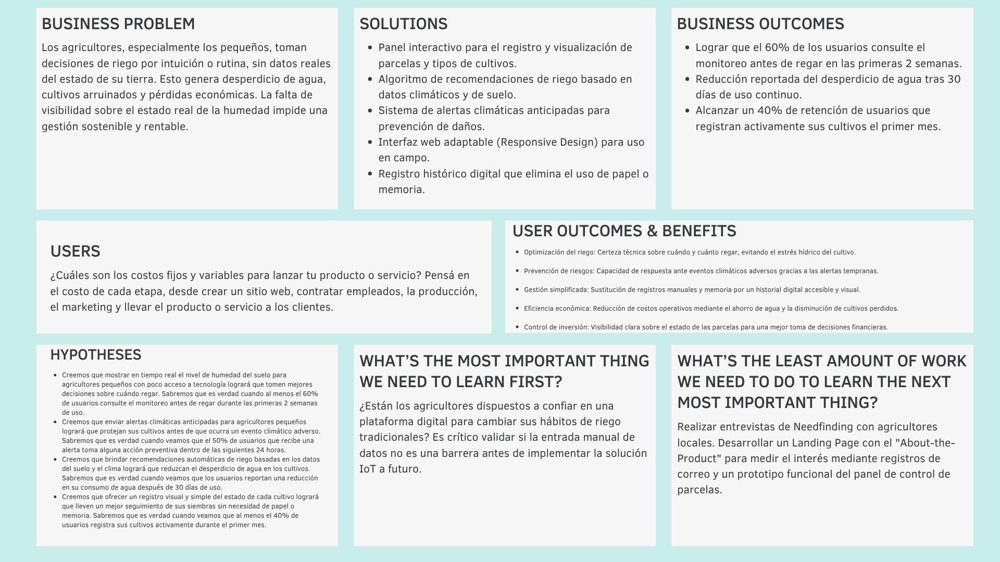

## 1.3. Segmentes Objetivo

- **Agricultores** Trabajadores en el sector agrícola del Perú entre 20
  y 75 años, con educación secundaria completa. Valoran la mano de obra,
  pero buscan la automatización y optimización.

- **Empresarios agrícolas** Empresarios dueños de PYMEs en el Perú, que
  gestionan cultivos y buscan optimizar su producción para maximizar sus
  ganancias y reducir mermas. Tienen entre 30 y 75 años y buscan
  herramientas que les den visibilidad sobre su inversión.

<br>
<br>


# Capítulo II: Requirements Elicitation & Analysis

## 2.1. Competidores

### 2.1.1. Análisis Competitivo

A continuación se presenta el análisis competitivo de AgroTrack frente a las principales soluciones digitales existentes en el mercado agrícola.

**Competitive Analysis Landscape**

**¿Por qué llevar a cabo este análisis?**

Realizamos este análisis para identificar las fortalezas y debilidades de los competidores directos e indirectos de AgroTrack, con el fin de definir una propuesta de valor diferenciada y estrategias que nos permitan captar el segmento de agricultores pequeños y empresarios agrícolas en el Perú.

---

**Tabla de Análisis Competitivo**

|  | **AgroTrack** | **CropX** | **Trimble Ag** | **Agroptima** |
|---|---|---|---|---|
| **Logo** | *(Andes Smart)* | *(CropX Inc.)* | *(Trimble Inc.)* | *(Agroptima SL)* |
| **Perfil General** | Plataforma web de monitoreo agrícola orientada a pequeños agricultores y PYMEs del Perú, con alertas climáticas y recomendaciones de riego. | Solución IoT de sensores de suelo para monitoreo de humedad y temperatura, enfocada en grandes operaciones agrícolas. | Suite completa de gestión agrícola con GPS, maquinaria y análisis de datos para grandes productores. | App de gestión de cultivos para pequeños y medianos agricultores en España y Latinoamérica. |
| **Ventaja Competitiva** | Adaptado al contexto peruano, bajo costo de entrada, interfaz simple en español para usuarios con poca experiencia tecnológica. | Alta precisión de datos de suelo en tiempo real mediante sensores físicos instalados en campo. | Ecosistema integrado de hardware y software con décadas de experiencia en el sector. | Facilidad de uso y orientación a pequeños productores; registro de actividades y cuaderno de campo digital. |
| **Mercado Objetivo** | Agricultores pequeños y empresarios agrícolas PYMEs en Perú (20–75 años). | Grandes productores agrícolas en EE.UU., Australia, Israel y mercados emergentes. | Grandes y medianas empresas agroindustriales a nivel global. | Pequeños y medianos agricultores en España, México, Chile, Colombia y Perú. |
| **Estrategias de Marketing** | Redes sociales, landing page con demostración del producto, alianzas con asociaciones agrícolas locales. | Venta directa B2B, ferias agrícolas internacionales, demostraciones técnicas en campo. | Fuerza de ventas corporativa, distribuidores especializados, presencia en ferias globales (Agritechnica). | Marketing digital, prueba gratuita, modelo freemium con planes de pago por funcionalidades. |
| **Productos & Servicios** | Panel de control de parcelas, alertas climáticas, recomendaciones de riego, historial digital de cultivos. | Sensores de humedad/temperatura de suelo, plataforma de análisis de datos, informes predictivos. | Software de planificación de cultivos, gestión de maquinaria, mapas de rendimiento, telemetría GPS. | Cuaderno de campo digital, registro de actividades, control de fitosanitarios, análisis de costes. |
| **Precios & Costos** | Por definir (modelo freemium orientado a bajo costo para el mercado peruano). | Desde ~$500 USD por kit de sensor + suscripción mensual. | Licencias corporativas desde cientos de dólares anuales; alto costo de implementación. | Plan gratuito limitado; planes de pago desde ~10–30 EUR/mes. |
| **Canales de Distribución** | Web app directa, WhatsApp y redes sociales como canal de soporte y adquisición. | Venta directa, distribuidores agrícolas, integradores de tecnología. | Distribuidores autorizados Trimble, integradores de soluciones agro. | App Store, Google Play, sitio web oficial. |

---

**Análisis FODA de AgroTrack**

| | **Fortalezas** | **Debilidades** |
|---|---|---|
| | - Diseñado específicamente para el contexto peruano. | - Sin datos históricos propios ni base de usuarios establecida. |
| | - Interfaz simple en español, orientada a usuarios con bajo nivel tecnológico. | - Dependencia de conectividad a internet en zonas rurales con baja cobertura. |
| | - Bajo costo de entrada frente a soluciones internacionales. | - Equipo pequeño con recursos limitados para escalar rápidamente. |
| | - Panel visual de parcelas y alertas climáticas como diferenciador inmediato. | - Aún sin integración IoT real (entrada manual de datos en la fase inicial). |
| **Oportunidades** | **Amenazas** |
| | - Creciente digitalización del agro peruano impulsada por el Estado y ONG. | - Competidores internacionales con mayor respaldo financiero y tecnológico. |
| | - Bajo nivel de penetración de soluciones tecnológicas en el agro peruano. | - Agroptima ya tiene presencia en Latinoamérica con producto maduro. |
| | - Posibilidad de alianzas con el Ministerio de Agricultura (MIDAGRI) y ANA. | - Posible desconfianza del agricultor tradicional hacia herramientas digitales. |
| | - Expansión a otros países andinos con problemática similar (Bolivia, Ecuador). | - Riesgo de copia rápida de funcionalidades por startups con más recursos. |

---

### 2.1.2. Estrategias y Tácticas frente a Competidores

Frente al panorama competitivo analizado, AgroTrack adoptará las siguientes estrategias:

**Estrategia de Diferenciación por Contexto Local**

A diferencia de CropX y Trimble Ag, cuyas soluciones están diseñadas para grandes productores con alto poder adquisitivo, AgroTrack se posiciona como la alternativa accesible y adaptada al agricultor peruano. El uso de lenguaje sencillo, la interfaz en español y el modelo de bajo costo son barreras de entrada intencionales para captar al segmento desatendido.

**Estrategia de Penetración con Modelo Freemium**

Al igual que Agroptima, AgroTrack ofrecerá acceso gratuito a funcionalidades básicas (registro de parcelas, alertas climáticas) para reducir la fricción de adopción. Las funcionalidades avanzadas (historial analítico, recomendaciones personalizadas) estarán disponibles en planes de pago asequibles.

**Estrategia de Validación Temprana con Usuarios**

Antes de competir directamente con plataformas maduras, AgroTrack priorizará entrevistas de Needfinding y pruebas de prototipo con agricultores locales. Esto permite iterar el producto rápidamente con retroalimentación real antes de escalar, reduciendo el riesgo de construir funcionalidades que el usuario no adopte.

**Táctica de Alianzas Institucionales**

Se explorarán alianzas con el MIDAGRI, la ANA (Autoridad Nacional del Agua), y asociaciones de productores regionales para ganar credibilidad y acceso a base de usuarios sin depender exclusivamente de marketing digital.

**Táctica de Contenido Educativo**

Dado que el agricultor objetivo puede ser reticente a adoptar tecnología, AgroTrack desarrollará contenido educativo (tutoriales en video, guías en WhatsApp) que reduzca la curva de aprendizaje y genere confianza en la plataforma antes de la primera descarga.

### 2.1.2. Estrategias y Tácticas frente a Competidores

Frente al panorama competitivo analizado, AgroTrack adoptará las
siguientes estrategias:

**Estrategia de Diferenciación por Contexto Local**

A diferencia de CropX y Trimble Ag, cuyas soluciones están diseñadas
para grandes productores con alto poder adquisitivo, AgroTrack se
posiciona como la alternativa accesible y adaptada al agricultor
peruano. El uso de lenguaje sencillo, la interfaz en español y el modelo
de bajo costo son barreras de entrada intencionales para captar al
segmento desatendido.

**Estrategia de Penetración con Modelo Freemium**

Al igual que Agroptima, AgroTrack ofrecerá acceso gratuito a
funcionalidades básicas (registro de parcelas, alertas climáticas) para
reducir la fricción de adopción. Las funcionalidades avanzadas
(historial analítico, recomendaciones personalizadas) estarán
disponibles en planes de pago asequibles.

**Estrategia de Validación Temprana con Usuarios**

Antes de competir directamente con plataformas maduras, AgroTrack
priorizará entrevistas de Needfinding y pruebas de prototipo con
agricultores locales. Esto permite iterar el producto rápidamente con
retroalimentación real antes de escalar, reduciendo el riesgo de
construir funcionalidades que el usuario no adopte.

**Táctica de Alianzas Institucionales**

Se explorarán alianzas con el MIDAGRI, la ANA (Autoridad Nacional del
Agua), y asociaciones de productores regionales para ganar credibilidad
y acceso a base de usuarios sin depender exclusivamente de marketing
digital.

**Táctica de Contenido Educativo**

Dado que el agricultor objetivo puede ser reticente a adoptar
tecnología, AgroTrack desarrollará contenido educativo (tutoriales en
video, guías en WhatsApp) que reduzca la curva de aprendizaje y genere
confianza en la plataforma antes de la primera descarga.

## 2.2. Entrevistas

### 2.2.1. Diseño de entrevistas

El objetivo de estas entrevistas es validar los puntos de dolor
relacionados con la gestión del riego y la disposición al uso de
herramientas digitales. Se han diseñado cuestionarios específicos para
cada segmento objetivo. - Preguntas para los agricultores: 1. ¿Qué
cultivos maneja actualmente y qué herramientas o maquinaria utiliza para
su mantenimiento diario? 2. ¿Qué aplicaciones utiliza con más frecuencia
en su celular y para qué fines (comunicación, entretenimiento, trabajo)?
3. ¿Cómo determina hoy, paso a paso, que una parcela necesita riego sin
usar sensores? 4. ¿Cuál ha sido su mayor frustración relacionada con la
pérdida de una cosecha en el último año? 5. ¿Cómo calcula la cantidad de
agua o fertilizante que debe comprar para una temporada? 6. ¿A quién
acude o qué medios consulta cuando tiene una duda técnica sobre sus
cultivos? 7. ¿Cómo lleva el registro de las fechas de siembra y cosecha
actualmente (papel, memoria, otros)? 8. Ante una alerta de helada o
sequía, ¿qué acciones preventivas suele tomar y con cuánto tiempo de
anticipación? 9. Si tuviera una herramienta que automatizara sus
registros, ¿qué es lo primero que le gustaría que hiciera por usted? 10.
¿Qué le convencería de que usar una plataforma web es mejor que seguir
su intuición de años? - Preguntas para los empresarios agricolas: 1.
¿Cómo está estructurada su empresa y qué metas de producción tiene para
este ciclo académico/fiscal? 2. ¿Qué dispositivos (Laptop, Tablet,
Smartphone) considera indispensables para gestionar su negocio? 3. ¿Qué
indicadores de rendimiento (KPIs) monitorea para saber si su inversión
en cultivos es rentable? 4. ¿De qué manera la falta de datos precisos
sobre el suelo ha afectado sus costos de operación anteriormente? 5. ¿En
qué información se basa para autorizar el presupuesto de riego y
mantenimiento de la temporada? 6. ¿Qué herramientas digitales conoce que
use su competencia y qué opina de ellas? 7. ¿Qué porcentaje de su
producción se pierde usualmente por factores climáticos y cómo intenta
reducirlo? 8. ¿Cómo recibe los reportes del estado de los cultivos por
parte del personal de campo? 9. ¿Qué valor le daría a tener datos en
tiempo real de sus campos sin depender del ingreso manual de su
personal? 10. ¿Qué ahorro mínimo en costos de agua o mejora en la
cosecha esperaría para considerar que esta plataforma es un éxito?

### 2.2.2. Registro de entrevistas

**Entrevista N° 1**

  -----------------------------------------------------------------------
  **Nombres y             **Edad:** 26            **Distrito:**
  apellidos:** Walter                             Chachapoyas, Amazonas
  Medina Macedo                                   
  ----------------------- ----------------------- -----------------------

  -----------------------------------------------------------------------

  ---------------------------------------------------------------------------------------------------------------------------------------------------------------------------------------------------------------------------------------------------------------------------------------------------------------------------------------------------------------------------------
  **URL:** [Entrevista - 1er seg obj - Miler Rodriguez                                                                                                                                                                                                                                                                              **Inicio de la          **Duración:** 6:34 min
  1.mp4](https://upcedupe-my.sharepoint.com/:v:/g/personal/u20241a827_upc_edu_pe/IQA7Y8rY1pOWRIXG-iCyIG6oAZ2IIM0sMFGl20NuTco6qfI?e=YgDGTl&nav=eyJyZWZlcnJhbEluZm8iOnsicmVmZXJyYWxBcHAiOiJTdHJlYW1XZWJBcHAiLCJyZWZlcnJhbFZpZXciOiJTaGFyZURpYWxvZy1MaW5rIiwicmVmZXJyYWxBcHBQbGF0Zm9ybSI6IldlYiIsInJlZmVycmFsTW9kZSI6InZpZXcifX0%3D)   entrevista:** 00:00     
  --------------------------------------------------------------------------------------------------------------------------------------------------------------------------------------------------------------------------------------------------------------------------------------------------------------------------------- ----------------------- -----------------------

  ---------------------------------------------------------------------------------------------------------------------------------------------------------------------------------------------------------------------------------------------------------------------------------------------------------------------------------------------------------------------------------

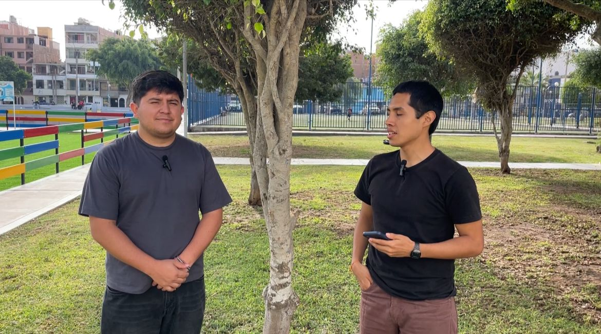

**Resumen:** Walter, de 26 años y estudiante de Ingeniería de Sistemas,
proviene de una familia dedicada al cultivo de café. Utilizan
herramientas como motoguadañas, fumigadoras y mano de obra para el
mantenimiento. Gestiona la comunicación con WhatsApp y usa Excel para
organizar costos, mientras que los registros de cultivo se llevan
principalmente en papel. Las decisiones de riego se toman de forma
manual, observando el estado de las plantas. Ha sufrido pérdidas por
plagas y no cuenta con medidas preventivas sólidas ante cambios
climáticos. Se apoya en técnicos agrícolas y programas del Estado para
asesoría. Le gustaría una herramienta que mida la humedad del suelo,
automatice registros y genere reportes, siempre que sea fácil de usar y
más eficiente que sus métodos actuales.

------------------------------------------------------------------------

**Entrevista N° 2**

  -----------------------------------------------------------------------
  **Nombres y             **Edad:** 25            **Distrito:** Cumba,
  apellidos:** Lucia                              Amazonas
  Alarcon                                         
  ----------------------- ----------------------- -----------------------

  -----------------------------------------------------------------------

  --------------------------------------------------------------------------------------------------------------------------------------------------------------------------------------------------------------------------------------------------------------------------------------------------------------------------------------------------------------------------------------
  **URL:** [Entrevista - 1er seg obj - Eder                                                                                                                                                                                                                                                                                              **Inicio de la          **Duración:** 4:12
  Quispe.mp4](https://upcedupe-my.sharepoint.com/:v:/g/personal/u202324623_upc_edu_pe/IQDidGgCC_E9QIX1GOCVgAAOAVuK1pcpOl7TY5HJ6ZAcxlY?nav=eyJyZWZlcnJhbEluZm8iOnsicmVmZXJyYWxBcHAiOiJTdHJlYW1XZWJBcHAiLCJyZWZlcnJhbFZpZXciOiJTaGFyZURpYWxvZy1MaW5rIiwicmVmZXJyYWxBcHBQbGF0Zm9ybSI6IldlYiIsInJlZmVycmFsTW9kZSI6InZpZXcifX0%3D&e=MifF7G)   entrevista:** 00:00     
  -------------------------------------------------------------------------------------------------------------------------------------------------------------------------------------------------------------------------------------------------------------------------------------------------------------------------------------- ----------------------- -----------------------

  --------------------------------------------------------------------------------------------------------------------------------------------------------------------------------------------------------------------------------------------------------------------------------------------------------------------------------------------------------------------------------------


**Resumen:** Lucía, de 25 años y estudiante de Psicología, es una
agricultora que cultiva maíz y hortalizas como tomate y lechuga. Utiliza
herramientas básicas como pala, azadón y fumigadora manual, y
ocasionalmente alquila motocultores para la preparación de tierra.
Gestiona la comunicación con WhatsApp para contactar compradores y otros
agricultores, mientras que usa Facebook y YouTube para obtener
información agrícola y aprender sobre plagas. Los registros de siembra y
cosecha los lleva principalmente en un cuaderno, con ocasionales apuntes
en memoria. Las decisiones de riego se toman de forma manual, observando
la sequedad del suelo y el estado de las plantas. Ha sufrido pérdidas
significativas por plagas que no detectó a tiempo. Le gustaría una
herramienta que automatice los registros de riego, siembra y
fertilización, y se convencería de adoptarla si demuestra mejorar la
producción, reducir pérdidas y sea fácil de usar.

------------------------------------------------------------------------

**Entrevista N° 3**

  -----------------------------------------------------------------------
  **Nombres y             **Edad:** 24            **Distrito:** Arequipa,
  apellidos:** Luz Mamani                         Perú
  ----------------------- ----------------------- -----------------------

  -----------------------------------------------------------------------

  ---------------------------------------------------------------------------------------------------------------------------------------------------------------------------------------------------------------------------------------------------------------------------------------------------------------------------------------------------------------------------------
  **URL:** [Entrevista - 1er seg obj - Eder Quispe                                                                                                                                                                                                                                                                                  **Inicio de la          **Duración:** 2:57
  1.mp4](https://upcedupe-my.sharepoint.com/:v:/g/personal/u202324623_upc_edu_pe/IQD12rOS9xukQKDOJngTl7w0Aa2RYMlbZo7YzQXCsVdR7tw?nav=eyJyZWZlcnJhbEluZm8iOnsicmVmZXJyYWxBcHAiOiJTdHJlYW1XZWJBcHAiLCJyZWZlcnJhbFZpZXciOiJTaGFyZURpYWxvZy1MaW5rIiwicmVmZXJyYWxBcHBQbGF0Zm9ybSI6IldlYiIsInJlZmVycmFsTW9kZSI6InZpZXcifX0%3D&e=u8jJHb)   entrevista:** 00:00     
  --------------------------------------------------------------------------------------------------------------------------------------------------------------------------------------------------------------------------------------------------------------------------------------------------------------------------------- ----------------------- -----------------------

  ---------------------------------------------------------------------------------------------------------------------------------------------------------------------------------------------------------------------------------------------------------------------------------------------------------------------------------------------------------------------------------


**Resumen:** Luz, de 24 años y estudiante de Psicología, es una
agricultora que se dedica al cultivo de frutas como mango, palta y
limón. Utiliza herramientas básicas como pala, machete, tijeras para
podar y ocasionalmente una motobomba para el riego. Gestiona la
comunicación con WhatsApp para contactar otros agricultores y
compradores, mientras que usa Facebook y YouTube para obtener
información y aprender sobre agricultura. Los registros de siembra y
cosecha los lleva principalmente en un cuaderno, aunque también confía
en su memoria. Ha sufrido pérdidas significativas por calor extremo y
falta de agua. Ante alertas de heladas o sequía, intenta adelantar el
riego o proteger las plantas, aunque reconoce que la falta de tiempo
anticipado dificulta tomar medidas preventivas efectivas. Le gustaría
una herramienta que le avise automáticamente cuándo regar o abonar y que
guarde registros sin anotar manualmente, siempre que sea fácil de usar y
no consuma mucho internet.

------------------------------------------------------------------------

**Entrevista N° 4**

  -----------------------------------------------------------------------
  **Nombres y             **Edad:** 28            **Distrito:** Lima,
  apellidos:** Renzo                              Perú
  Quispe Mamani                                   
  ----------------------- ----------------------- -----------------------

  -----------------------------------------------------------------------

  -----------------------------------------------------------------------------------------------------------------------------------------------------------------------------------------------------------------------------------------------------------------------------------------------------------------------------------------------------------------------------------------
  **URL:** [Entrevista - 2do seg obj - Miler                                                                                                                                                                                                                                                                                                **Inicio de la          **Duración:** 4:16 min
  Rodriguez.mp4](https://upcedupe-my.sharepoint.com/:v:/g/personal/u20241a827_upc_edu_pe/IQBpPA9-AgKuTYSsa7rfQ_3NAWt06SZe20fFxPk2vz_tj6o?e=cWepbS&nav=eyJyZWZlcnJhbEluZm8iOnsicmVmZXJyYWxBcHAiOiJTdHJlYW1XZWJBcHAiLCJyZWZlcnJhbFZpZXciOiJTaGFyZURpYWxvZy1MaW5rIiwicmVmZXJyYWxBcHBQbGF0Zm9ybSI6IldlYiIsInJlZmVycmFsTW9kZSI6InZpZXcifX0%3D)   entrevista:** 00:00     
  ----------------------------------------------------------------------------------------------------------------------------------------------------------------------------------------------------------------------------------------------------------------------------------------------------------------------------------------- ----------------------- -----------------------

  -----------------------------------------------------------------------------------------------------------------------------------------------------------------------------------------------------------------------------------------------------------------------------------------------------------------------------------------------------------------------------------------


**Resumen:** Renzo Sebastián Quispe Mamani, de 28 años y egresado de la
Universidad de Lima, es fundador de Ecotrack, un emprendimiento agrícola
organizado en producción, logística y administración. Su objetivo es
aumentar la producción en un 15% manteniendo la calidad. Utiliza
celular, laptop y tablet para gestionar su negocio y monitorea KPIs como
rendimiento por hectárea, costos, consumo de agua, pérdidas y
rentabilidad. Enfrenta problemas por la falta de datos precisos del
suelo, lo que genera decisiones ineficientes y mayores costos.
Actualmente se basa en experiencia, reportes manuales y estimaciones
climáticas. Pierde entre 10% y 20% de producción por factores climáticos
y considera clave contar con datos en tiempo real. Espera como mínimo un
10% de ahorro de agua o un 15% de aumento en la producción para
considerar exitosa una solución tecnológica.

------------------------------------------------------------------------

**Entrevista N° 5**

  -----------------------------------------------------------------------
  **Nombres y             **Edad:** 26            **Distrito:** Lima,
  apellidos:** Sofia                              Perú
  Martinez                                        
  ----------------------- ----------------------- -----------------------

  -----------------------------------------------------------------------

  --------------------------------------------------------------------------------------------------------------------------------------------------------------------------------------------------------------------------------------------------------------------------------------------------------------------------------------------------------------------------------------
  **URL:** [Entrevista - 2do seg obj - Eder                                                                                                                                                                                                                                                                                              **Inicio de la          **Duración:** 3:58
  Quispe.mp4](https://upcedupe-my.sharepoint.com/:v:/g/personal/u202324623_upc_edu_pe/IQBALW19b-Z_SIeQbTrZUZ1fAUpuk-2I7KrrwWEJK9rsHi0?nav=eyJyZWZlcnJhbEluZm8iOnsicmVmZXJyYWxBcHAiOiJTdHJlYW1XZWJBcHAiLCJyZWZlcnJhbFZpZXciOiJTaGFyZURpYWxvZy1MaW5rIiwicmVmZXJyYWxBcHBQbGF0Zm9ybSI6IldlYiIsInJlZmVycmFsTW9kZSI6InZpZXcifX0%3D&e=lvIQ03)   entrevista:** 00:00     
  -------------------------------------------------------------------------------------------------------------------------------------------------------------------------------------------------------------------------------------------------------------------------------------------------------------------------------------- ----------------------- -----------------------

  --------------------------------------------------------------------------------------------------------------------------------------------------------------------------------------------------------------------------------------------------------------------------------------------------------------------------------------------------------------------------------------


**Resumen:** Sofía, de 26 años y estudiante de Psicología, es una joven
empresaria agrícola en la empresa Viru. La empresa está estructurada en
tres áreas principales: producción, logística y administración, con
supervisores de campo y personal técnico. Su meta para este ciclo es
aumentar la producción un 15% y reducir costos mediante el uso de
tecnología. Monitorea indicadores clave como rendimiento por hectárea,
costos de riego, porcentajes de pérdidas y calidad del cultivo. Autoriza
presupuestos basándose en condiciones climáticas, historial de
producción y experiencia del personal. La falta de datos precisos sobre
el suelo ha generado uso innecesario de fertilizantes y menor
productividad. Pierde entre 10% y 30% de su producción por factores
climáticos. Actualmente recibe reportes mediante llamadas, WhatsApp y
reportes manuscritos del personal de campo. Consideraría exitosa una
plataforma que reduzca 15% el consumo de agua, aumente 10% la producción
y disminuya pérdidas en un 10%.

------------------------------------------------------------------------

**Entrevista N° 6**

  -----------------------------------------------------------------------
  **Nombres y             **Edad:** 29            **Distrito:** Piura,
  apellidos:** Cristofer                          Perú
  Ordalla                                         
  ----------------------- ----------------------- -----------------------

  -----------------------------------------------------------------------

  ----------------------------------------------------------------------------------------------------------------------------------------------------------------------------------------------------------------------------------------------------------------------------------------------------------------------------------------------------------------------------------
  **URL:** [Entrevista - 2do seg obj - Joaquin                                                                                                                                                                                                                                                                                       **Inicio de la          **Duración:** 7:44
  Alfaro](https://upcedupe-my.sharepoint.com/:v:/g/personal/u20241a267_upc_edu_pe/IQDZaXNASBtjSqMs6HKMKmKSAVUVdK2ce6BrVstfl1zh2gk?e=CN8ApV&nav=eyJyZWZlcnJhbEluZm8iOnsicmVmZXJyYWxBcHAiOiJTdHJlYW1XZWJBcHAiLCJyZWZlcnJhbFZpZXciOiJTaGFyZURpYWxvZy1MaW5rIiwicmVmZXJyYWxBcHBQbGF0Zm9ybSI6IldlYiIsInJlZmVycmFsTW9kZSI6InZpZXcifX0%3D)   entrevista:** 00:00     
  ---------------------------------------------------------------------------------------------------------------------------------------------------------------------------------------------------------------------------------------------------------------------------------------------------------------------------------- ----------------------- -----------------------

  ----------------------------------------------------------------------------------------------------------------------------------------------------------------------------------------------------------------------------------------------------------------------------------------------------------------------------------------------------------------------------------


**Resumen:** Christopher Ordalla, de 29 años, se integró hace
aproximadamente un año y medio a una pequeña empresa agrícola familiar
que cuenta con 5 hectáreas alquiladas. La empresa opera mediante un
contrato de colaboración con un vecino para el alquiler de máquinas y el
trabajo de la tierra. Su meta para este ciclo fiscal es alcanzar una
producción de 8 toneladas de maíz en unas 3 hectáreas y estabilizar la
rentabilidad, dado que actualmente manejan un presupuesto ajustado.
Considera indispensables el celular para la comunicación general, la
toma de fotos de los cultivos y la revisión del clima, así como una
laptop para llevar las cuentas de ingresos y egresos en Excel. Monitorea
indicadores clave (KPIs) como el rendimiento por hectárea, el costo
total por kilo producido y el margen neto después del riesgo de
fertilizantes. Autoriza presupuestos basándose empíricamente en la
experiencia de su padre, los pronósticos de lluvias y la observación de
cómo va creciendo el cultivo. La falta de datos precisos sobre el suelo
provocó que sembraran en un terreno arcilloso creyendo que era
homogéneo, lo que demandó un mayor uso de nitrógeno y les hizo perder un
25% de la producción esperada en ese lote. Conoce a un vecino de la zona
que utiliza un dron para obtener vistas macro de la plantación y datos
del suelo, herramienta que considera muy interesante. Pierden alrededor
de un 18% de su producción por factores climáticos adversos en el norte,
como granizo o sequías, e intentan mitigar el impacto revisando
aplicaciones del clima para anticiparse. Actualmente, visita el campo de
1 a 3 veces al mes y recibe reportes de la persona que los ayuda
mediante fotos y audios por WhatsApp, información que él mismo se
encarga de vaciar en Excel. Valora enormemente la posibilidad de obtener
datos en tiempo real de forma automática, ya que le ahorraría bastante
tiempo y los costos asociados a la persona que ingresa los datos
manualmente. Consideraría que la plataforma es un éxito si le ayuda a
generar un ahorro de entre el 10% y el 20% en costos de agua y
fertilizantes.

### 2.2.3. Análisis de entrevistas

**Segmento objetivo 1: Agricultores**

A partir de las entrevistas realizadas a Walter Medina, Lucía Alarcón y
Luz Mamani, se identifican los siguientes patrones comunes:

- Los tres entrevistados llevan registros de forma manual (papel o
  cuaderno) y toman decisiones de riego de manera empírica, observando
  el estado visual del suelo y las plantas.
- El uso de WhatsApp es universal como canal de comunicación, y
  plataformas como Facebook y YouTube son sus principales fuentes de
  información técnica.
- Todos han sufrido pérdidas por factores climáticos o plagas sin contar
  con alertas anticipadas.
- La disposición a adoptar una herramienta digital es alta, siempre que
  sea simple, en español, funcione con poca internet y demuestre
  resultados concretos en reducción de pérdidas.
- La función más demandada es la automatización de registros y las
  alertas de riego o eventos climáticos.

**Segmento objetivo 2: Empresarios agrícolas**

A partir de las entrevistas realizadas a Renzo Quispe y Sofía Martínez,
se identifican los siguientes patrones comunes:

- Ambos gestionan empresas con estructura formal (producción, logística,
  administración) y utilizan múltiples dispositivos (celular, laptop,
  tablet).
- Monitorean KPIs similares: rendimiento por hectárea, costos de riego,
  porcentaje de pérdidas y calidad del cultivo.
- La principal fricción es la dependencia de reportes manuales del
  personal de campo, lo que genera demoras y decisiones basadas en datos
  inexactos.
- Pierden entre 10% y 30% de producción por factores climáticos y
  valoran enormemente tener datos en tiempo real.
- El umbral de éxito para adoptar una solución tecnológica es claro: al
  menos 10% de ahorro en agua y 15% de mejora en producción.

## 2.3. Needfinding

### 2.3.1. User Personas

Los User Persona son perfiles que representan a nuestros usuarios
principales, creados a partir de información real recogida en
entrevistas. Esta herramienta nos ayuda a entender sus objetivos,
dificultades y necesidades clave. En AgroTrack, estos perfiles permiten
diseñar soluciones más adecuadas a las expectativas tanto de los
artistas como de sus posibles clientes.

**User persona - Agricultores**

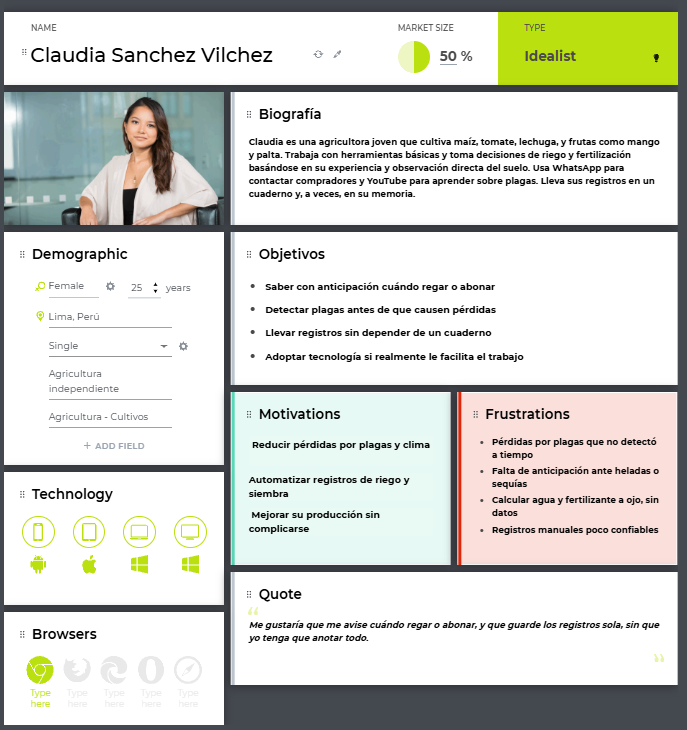

`<br>`{=html}

**User persona - Empresarios Agrícolas**

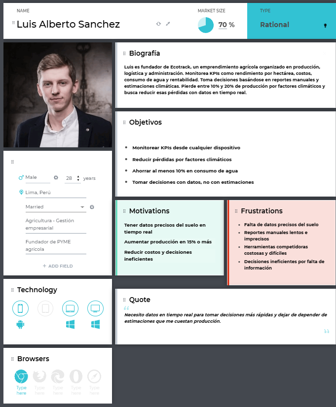

### 2.3.2. User Task Matrix

Para diseñar una solución con valor, se consideraron dos segmentos del
sector agrícola los agricultores, que buscan automatizar y optimizar sus
labores para mejorar su productividad y los empresarios agrícolas, que
necesitan herramientas para controlar su inversión, reducir pérdidas y
aumentar sus ganancias. La propuesta busca brindar información clara y
útil para ambos perfiles.


<br>


<br>

Los cuadros reflejan cómo para los agricultores, las tareas más
frecuentes y relevantes se centran en registrar información del cultivo,
monitorear el estado del suelo y tomar decisiones de riego, ya que estas
actividades impactan directamente en su producción diaria. En cambio,
los empresarios agrícolas se enfocan en monitorear indicadores, analizar
rendimiento y supervisar reportes, buscando optimizar costos y maximizar
resultados.

### 2.3.3. User Journey Mapping

En esta sección se presentan los User Journey Mapping de los dos
segmentos identificados agricultores y empresarios agrícolas. Se
describe el recorrido actual As-Is que siguen para gestionar sus
cultivos y tomar decisiones de riego, desde la identificación de una
necesidad hasta la evaluación de resultados. Estos journeys reflejan las
actividades, necesidades y dificultades que enfrentan actualmente sin el
uso de una solución tecnológica como AgroTrack.

**User Journey Mapping - Agricultor**

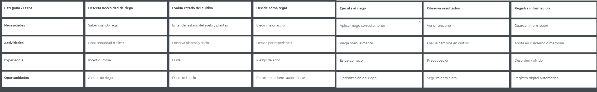

**User Journey Mapping - Empresario Agrícola**
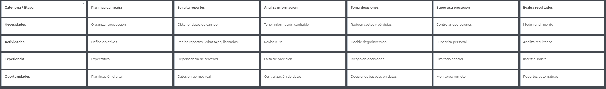

### 2.3.4. Empathy Mapping

En esta sección se presentan los Empathy Maps desarrollados para
profundizar en la comprensión de los segmentos objetivo de AgroTrack.
Este análisis permite identificar los dolores y las motivaciones reales
de los usuarios finales.

**Empathy Mapping - Agricultor**


**Empathy Mapping - Empresario Agricola**


### 2.4. Big Picture Event Storming

El equipo realizó una sesión colaborativa en Miro para entender el
dominio del negocio de alto nivel, identificando procesos clave y
eventos significativos de AgroTrack. La organización visual sigue una
línea de tiempo narrativa de izquierda a derecha.


https://miro.com/app/board/uXjVGhuhZ48=/?share_link_id=264887531428

Descripción del proceso modelado: \* **Exploración de Eventos
(Naranja):** Representan hechos que ya sucedieron en el sistema, como el
registro del usuario (User Registered), la creación de una parcela (Plot
Created) o el envío de una recomendación de riego (Recommendation Sent).
\* **Comandos (Azul):** Acciones que disparan los eventos, tales como
Register User, Create Plot e Irrigation. \* **Actores (Amarillo):**
Identificación de los perfiles que ejecutan las acciones: Farmer
(Agricultor) y SME Owner (Empresario Agrícola). \* **Sistemas Externos
(Rosado):** Se integraron servicios externos críticos como Weather API
(para la obtención de pronósticos) y Email/SMS Gateway (para el despacho
de alertas preventivas). \* **Puntos de Fricción (Rojo):** Se
identificaron áreas de mejora como el "Registro manual lento" y la
"Falta de conexión en campo", las cuales guían el diseño de la solución
hacia la futura implementación de IoT.

### 2.5. Ubiquitous Language

A continuación, se define el glosario de términos técnicos del dominio
del negocio para asegurar una comunicación sin ambigüedades entre los
miembros del equipo y los stakeholders.

- **Plot (Parcela):** Área de tierra física registrada por el usuario
  donde se realiza el cultivo y monitoreo.
- **Crop (Cultivo):** Especie vegetal sembrada en una parcela (maíz,
  tomate, etc.) con requisitos hídricos específicos.
- **Soil Moisture (Humedad del Suelo):** Cantidad de agua presente en el
  suelo, utilizada como indicador principal para el riego.
- **Weather Alert (Alerta Climática):** Notificación preventiva sobre
  eventos como heladas, sequías o lluvias intensas que amenazan la
  cosecha.
- **Irrigation Schedule (Cronograma de Riego):** Planificación de las
  actividades de riego recomendadas por la plataforma basadas en datos
  de suelo y clima.
- **Yield (Rendimiento):** Cantidad de producto cosechado por unidad de
  área, utilizado como KPI de éxito.
- **Waste (Desperdicio):** Uso ineficiente del recurso hídrico o pérdida
  de insumos por riego inadecuado.


<br>
<br>  


# Capítulo III: Requirements Specification

## 3.1. User Stories


| **Épica** | **Título** |
|-----------|------------|
| EP01 | Landing Page |
| EP02 | Autenticación y Gestión de Cuenta |
| EP03 | Gestión de Parcelas |
| EP04 | Gestión de Cultivos |
| EP05 | Monitoreo y Registro de Datos del Suelo |
| EP06 | Recomendaciones de Riego |
| EP07 | Alertas Climáticas |
| EP08 | Dashboard y Reportes |
| EP09 | RESTful API - Autenticación |
| EP10 | RESTful API - Parcelas |
| EP11 | RESTful API - Cultivos |
| EP12 | RESTful API - Suelo |
| EP13 | RESTful API - Alertas Climáticas |
| EP14 | RESTful API - Recomendaciones de Riego |

<br>
<br>

| Epic / Story ID | Título | Descripción | Criterios de Aceptación | Relacionado con (Epic ID) |
|-----------------|--------|-------------|-------------------------|---------------------------|
| EP01 / US01 | Ver propuesta de valor de AgroTrack | Como visitante, quiero ver claramente qué problema resuelve AgroTrack, para entender si la plataforma es útil para mí. | **Escenario 1: Visitante ve la propuesta de valor** <br> **Given** el visitante ingresa al landing page, <br> **When** la página carga correctamente, <br> **Then** se muestra una sección principal con el problema que resuelve AgroTrack y un botón de llamada a la acción. | EP01 |
| EP01 / US02 | Ver sección de funcionalidades principales | Como visitante, quiero ver las funcionalidades que ofrece AgroTrack, para evaluar si cubre mis necesidades como agricultor o empresario. | **Escenario 1: Visitante visualiza las funcionalidades** <br> **Given** el visitante está en el landing page, <br> **When** navega hacia la sección de funcionalidades, <br> **Then** se muestran al menos 4 funcionalidades con ícono, título y descripción breve cada una. | EP01 |
| EP01 / US03 | Ver los segmentos objetivo a los que va dirigido | Como visitante, quiero saber a quiénes va dirigida la plataforma, para identificar si pertenezco al público objetivo. | **Escenario 1: Visitante identifica su segmento** <br> **Given** el visitante está en el landing page, <br> **When** llega a la sección de segmentos, <br> **Then** se muestran los dos perfiles (Agricultor y Empresario Agrícola) con una descripción clara de cada uno. | EP01 |
| EP01 / US04 | Ver planes y precios disponibles | Como visitante, quiero conocer los planes y precios de AgroTrack, para decidir si puedo pagarlo. | **Escenario 1: Visitante revisa los planes disponibles** <br> **Given** el visitante está en el landing page, <br> **When** navega a la sección de precios, <br> **Then** se muestran los planes disponibles con sus funcionalidades y precio. | EP01 |
| EP01 / US05 | Solicitar demo o acceso anticipado | Como visitante interesado, quiero dejar mis datos para solicitar una demo, para probar la plataforma antes de registrarme formalmente. | **Escenario 1: Visitante envía solicitud de demo exitosamente** <br> **Given** el visitante completa el formulario de demo con nombre y correo válidos, <br> **When** envía el formulario <br> **Then** se muestra un mensaje de confirmación indicando que su solicitud fue recibida. <br><br> **Escenario 2: Visitante intenta enviar el formulario vacío** <br> **Given** el visitante no completa los campos del formulario, <br> **When** presiona el botón de enviar, <br> **Then** se muestran mensajes de error indicando los campos obligatorios. | EP01 |
| EP01 / US06 | Ver testimonios o casos de uso reales | Como visitante, quiero leer experiencias de otros usuarios, para ganar confianza en la plataforma antes de registrarme. | **Escenario 1: Visitante visualiza los testimonios** <br> **Given** el visitante está en el landing page, <br> **When** llega a la sección de testimonios, <br> **Then** se muestran al menos 2 testimonios con nombre, perfil y comentario del usuario. | EP01 |
| EP01 / US07 | Navegar desde un menú fijo de secciones | Como visitante, quiero un menú de navegación siempre visible, para acceder rápidamente a cualquier sección del landing page. | **Escenario 1: Visitante navega usando el menú fijo** <br> **Given** el visitante está en cualquier parte del landing page, <br> **When** hace clic en una opción del menú, <br> **Then** la página hace scroll automático hacia la sección correspondiente. <br><br> **Escenario 2: El menú permanece visible al hacer scroll** <br> **Given** el visitante está haciendo scroll en la página, <br> **When** baja por el contenido, <br> **Then** el menú de navegación permanece fijo en la parte superior. | EP01 |
| EP01 / US08 | Visualizar el landing page desde cualquier dispositivo | Como visitante, quiero que el landing page se adapte a mi celular o tablet, para poder verlo bien desde cualquier dispositivo. | **Escenario 1: Visitante accede desde un celular** <br> **Given** el visitante abre el landing page desde un dispositivo móvil, <br> **When** la página carga, <br> **Then** el contenido se reorganiza correctamente sin elementos cortados ni scroll horizontal. <br><br> **Escenario 2: Visitante accede desde una tablet** <br> **Given** el visitante abre el landing page desde una tablet, <br> **When** la página carga, <br> **Then** el diseño se adapta correctamente al tamaño de pantalla. | EP01 |
| EP02 / US09 | Registrar una cuenta nueva | Como usuario nuevo, quiero crear una cuenta en AgroTrack, para acceder a todas las funcionalidades de la plataforma. | **Escenario 1: Usuario se registra exitosamente** <br> **Given** el usuario completa todos los campos del formulario con datos válidos, <br> **When** presiona el botón de registrarse, <br> **Then** se crea su cuenta y es redirigido al dashboard principal. <br><br> **Escenario 2: Correo ya existente** <br> **Given** el usuario ingresa un correo que ya está registrado, <br> **When** presiona el botón de registrarse, <br> **Then** se muestra un mensaje de error indicando que el correo ya está en uso. <br><br> **Escenario 3: Campos obligatorios vacíos** <br> **Given** el usuario no completa todos los campos requeridos, <br> **When** presiona el botón de registrarse, <br> **Then** se resaltan los campos vacíos con un mensaje de error. | EP02 |
| EP02 / US10 | Iniciar sesión con correo y contraseña | Como usuario registrado, quiero iniciar sesión con mi correo y contraseña, para acceder a mi cuenta y mis datos. | **Escenario 1: Usuario inicia sesión correctamente** <br> **Given** el usuario ingresa un correo y contraseña válidos, <br> **When** presiona el botón de iniciar sesión, <br> **Then** es redirigido a su dashboard principal. <br><br> **Escenario 2: Credenciales incorrectas** <br> **Given** el usuario ingresa un correo o contraseña incorrectos, <br> **When** presiona el botón de iniciar sesión, <br> **Then** se muestra un mensaje de error indicando que las credenciales son inválidas. | EP02 |
| EP02 / US11 | Cerrar sesión | Como usuario autenticado, quiero cerrar sesión, para proteger mi cuenta cuando dejo de usar la plataforma. | **Escenario 1: Usuario cierra sesión exitosamente** <br> **Given** el usuario está autenticado en la plataforma, <br> **When** presiona la opción de cerrar sesión, <br> **Then** su sesión termina y es redirigido a la página de inicio de sesión. | EP02 |
| EP02 / US12 | Recuperar contraseña olvidada | Como usuario, quiero recuperar mi contraseña si la olvidé, para volver a acceder a mi cuenta sin perder mis datos. | **Escenario 1: Recuperación con correo válido** <br> **Given** el usuario ingresa un correo registrado en el formulario de recuperación, <br> **When** presiona el botón de enviar, <br> **Then** se muestra un mensaje indicando que recibirá instrucciones en su correo. <br><br> **Escenario 2: Correo no registrado** <br> **Given** el usuario ingresa un correo que no existe en el sistema, <br> **When** presiona el botón de enviar, <br> **Then** se muestra un mensaje de error indicando que el correo no está registrado. | EP02 |
| EP02 / US13 | Editar datos del perfil personal | Como usuario registrado, quiero editar mi información de perfil, para mantener mis datos actualizados. | **Escenario 1: Usuario actualiza su perfil correctamente** <br> **Given** el usuario modifica uno o más campos de su perfil con datos válidos, <br> **When** presiona el botón de guardar cambios, <br> **Then** los datos se actualizan y se muestra un mensaje de confirmación. <br><br> **Escenario 2: Campos obligatorios vacíos** <br> **Given** el usuario borra un campo obligatorio de su perfil, <br> **When** presiona el botón de guardar cambios, <br> **Then** se muestra un mensaje de error indicando los campos requeridos. | EP02 |
| EP02 / US14 | Seleccionar tipo de usuario al registrarse (Agricultor o Empresario Agrícola) | Como usuario nuevo, quiero elegir si soy Agricultor o Empresario Agrícola al registrarme, para que la plataforma me muestre las funcionalidades que corresponden a mi perfil. | **Escenario 1: Usuario selecciona el tipo Agricultor** <br> **Given** el usuario está en el formulario de registro, <br> **When** selecciona el tipo "Agricultor" y completa el registro, <br> **Then** accede a un dashboard con funcionalidades orientadas al agricultor. <br><br> **Escenario 2: Usuario selecciona el tipo Empresario Agrícola** <br> **Given** el usuario está en el formulario de registro, <br> **When** selecciona el tipo "Empresario Agrícola" y completa el registro, <br> **Then** accede a un dashboard con funcionalidades de gestión empresarial y métricas. | EP02 |
| EP03 / US15 | Registrar una nueva parcela | Como agricultor, quiero registrar una nueva parcela en la plataforma, para comenzar a hacer seguimiento de mis cultivos en ese terreno. | **Escenario 1: Parcela registrada exitosamente** <br> **Given** el agricultor completa el formulario con nombre, ubicación y tamaño de la parcela, <br> **When** presiona el botón de guardar, <br> **Then** la parcela queda registrada y aparece en su listado. <br><br> **Escenario 2: Nombre de parcela vacío** <br> **Given** el agricultor deja el campo nombre vacío, <br> **When** presiona el botón de guardar, <br> **Then** se muestra un mensaje de error indicando que el nombre es obligatorio. | EP03 |
| EP03 / US16 | Ver listado de mis parcelas | Como agricultor, quiero ver todas mis parcelas registradas en un solo lugar, para tener una vista general de mis terrenos. | **Escenario 1: Agricultor visualiza su listado de parcelas** <br> **Given** el agricultor tiene al menos una parcela registrada, <br> **When** accede a la sección de parcelas, <br> **Then** se muestran todas sus parcelas con nombre, ubicación y estado actual. <br><br> **Escenario 2: Sin parcelas registradas** <br> **Given** el agricultor no ha registrado ninguna parcela, <br> **When** accede a la sección de parcelas, <br> **Then** se muestra un mensaje indicando que no tiene parcelas y un botón para crear la primera. | EP03 |
| EP03 / US17 | Editar información de una parcela | Como agricultor, quiero editar los datos de una parcela, para corregir o actualizar su información cuando sea necesario. | **Escenario 1: Parcela editada exitosamente** <br> **Given** el agricultor selecciona una parcela y modifica sus datos con información válida, <br> **When** presiona el botón de guardar cambios, <br> **Then** los datos actualizados se guardan y se muestra un mensaje de confirmación. | EP03 |
| EP03 / US18 | Eliminar una parcela registrada | Como agricultor, quiero eliminar una parcela que ya no uso, para mantener mi listado limpio y organizado. | **Escenario 1: Parcela eliminada exitosamente** <br> **Given** el agricultor selecciona la opción de eliminar en una parcela, <br> **When** confirma la acción en el mensaje de advertencia, <br> **Then** la parcela desaparece del listado permanentemente. <br><br> **Escenario 2: Agricultor cancela la eliminación** <br> **Given** el agricultor selecciona la opción de eliminar en una parcela, <br> **When** cancela la acción en el mensaje de advertencia, <br> **Then** la parcela se mantiene en el listado sin cambios. | EP03 |
| EP03 / US19 | Ver detalle de una parcela específica | Como agricultor, quiero ver el detalle completo de una parcela, para revisar toda su información y el estado de sus cultivos. | **Escenario 1: Agricultor accede al detalle de una parcela** <br> **Given** el agricultor selecciona una parcela de su listado, <br> **When** la página de detalle carga, <br> **Then** se muestra la información completa de la parcela junto con sus cultivos activos y el estado del suelo. | EP03 |
| EP04 / US20 | Registrar un cultivo en una parcela | Como agricultor, quiero registrar un nuevo cultivo en una de mis parcelas, para llevar un control digital de lo que estoy sembrando. | **Escenario 1: Cultivo registrado exitosamente** <br> **Given** el agricultor selecciona una parcela y completa el formulario con tipo de cultivo y fecha de siembra, <br> **When** presiona el botón de guardar, <br> **Then** el cultivo queda registrado y aparece en el detalle de la parcela. <br><br> **Escenario 2: Campo tipo de cultivo vacío** <br> **Given** el agricultor deja el campo tipo de cultivo vacío, <br> **When** presiona el botón de guardar, <br> **Then** se muestra un mensaje de error indicando que el campo es obligatorio. | EP04 |
| EP04 / US21 | Ver los cultivos activos de una parcela | Como agricultor, quiero ver los cultivos activos de una parcela, para saber qué estoy cultivando actualmente en ese terreno. | **Escenario 1: Agricultor visualiza cultivos activos** <br> **Given** el agricultor tiene al menos un cultivo activo en una parcela, <br> **When** accede al detalle de esa parcela, <br> **Then** se muestran todos los cultivos activos con su tipo, fecha de siembra y estado. <br><br> **Escenario 2: Parcela sin cultivos activos** <br> **Given** la parcela no tiene cultivos activos registrados, <br> **When** el agricultor accede a su detalle, <br> **Then** se muestra un mensaje indicando que no hay cultivos activos y un botón para agregar uno. | EP04 |
| EP04 / US22 | Editar información de un cultivo | Como agricultor, quiero editar los datos de un cultivo registrado, para corregir errores o actualizar su información. | **Escenario 1: Cultivo editado exitosamente** <br> **Given** el agricultor selecciona un cultivo y modifica sus datos con información válida, <br> **When** presiona guardar cambios, <br> **Then** los nuevos datos quedan guardados y se muestra un mensaje de confirmación. | EP04 |
| EP04 / US23 | Marcar un cultivo como cosechado o finalizado | Como agricultor, quiero marcar un cultivo como finalizado, para registrar que ese ciclo de siembra ya terminó. | **Escenario 1: Cultivo finalizado exitosamente** <br> **Given** el agricultor selecciona un cultivo activo y elige la opción de marcar como cosechado, <br> **When** confirma la acción, <br> **Then** el cultivo cambia su estado a "Finalizado" y se mueve al historial de la parcela. <br><br> **Escenario 2: Cultivo ya finalizado** <br> **Given** el agricultor accede a un cultivo con estado "Finalizado", <br> **When** revisa sus opciones, <br> **Then** la opción de marcar como cosechado no está disponible. | EP04 |
| EP04 / US24 | Ver historial de cultivos anteriores por parcela | Como agricultor, quiero ver el historial de cultivos pasados de una parcela, para analizar qué sembré en temporadas anteriores y qué resultados tuve. | **Escenario 1: Agricultor revisa el historial de cultivos** <br> **Given** el agricultor tiene al menos un cultivo finalizado en una parcela, <br> **When** accede a la sección de historial de esa parcela, <br> **Then** se muestran los cultivos finalizados con su tipo, fecha de siembra y fecha de cosecha. | EP04 |
| EP05 / US25 | Ingresar manualmente datos de humedad del suelo | Como agricultor, quiero registrar manualmente el nivel de humedad del suelo de mi parcela, para que la plataforma pueda darme recomendaciones basadas en datos reales. | **Escenario 1: Humedad registrada exitosamente** <br> **Given** el agricultor ingresa un valor numérico de humedad entre 0 y 100, <br> **When** presiona el botón de guardar registro, <br> **Then** el dato queda almacenado con la fecha y hora del registro. <br><br> **Escenario 2: Valor fuera del rango permitido** <br> **Given** el agricultor ingresa un valor menor a 0 o mayor a 100, <br> **When** presiona el botón de guardar registro, <br> **Then** se muestra un mensaje de error indicando que el valor debe estar entre 0 y 100. | EP05 |
| EP05 / US26 | Ingresar manualmente datos de temperatura del suelo | Como agricultor, quiero registrar la temperatura del suelo de mi parcela, para tener un historial de condiciones del terreno. | **Escenario 1: Temperatura registrada exitosamente** <br> **Given** el agricultor ingresa un valor numérico de temperatura válido, <br> **When** presiona el botón de guardar registro, <br> **Then** el dato queda almacenado con la fecha y hora del registro. <br><br> **Escenario 2: Valor no numérico** <br> **Given** el agricultor ingresa letras o caracteres especiales en el campo de temperatura, <br> **When** presiona el botón de guardar registro, <br> **Then** se muestra un mensaje de error indicando que el valor debe ser numérico. | EP05 |
| EP05 / US27 | Ver el estado actual del suelo de una parcela | Como agricultor, quiero ver el estado actual del suelo de mi parcela, para saber si necesita riego o está en condiciones adecuadas. | **Escenario 1: Agricultor visualiza el estado actual del suelo** <br> **Given** el agricultor tiene al menos un registro de suelo en su parcela, <br> **When** accede al detalle de esa parcela, <br> **Then** se muestra el último valor de humedad y temperatura registrados junto con un indicador visual de estado (bajo, normal, alto). <br><br> **Escenario 2: Sin registros de suelo** <br> **Given** la parcela no tiene registros de suelo, <br> **When** el agricultor accede a su detalle, <br> **Then** se muestra un mensaje indicando que aún no hay datos del suelo registrados. | EP05 |
| EP05 / US28 | Ver historial de registros del suelo por parcela | Como agricultor, quiero ver el historial de datos del suelo de una parcela, para identificar cómo han variado las condiciones con el tiempo. | **Escenario 1: Agricultor revisa el historial del suelo** <br> **Given** el agricultor tiene múltiples registros de suelo en una parcela, <br> **When** accede a la sección de historial del suelo, <br> **Then** se muestran los registros ordenados del más reciente al más antiguo con fecha, humedad y temperatura. | EP05 |
| EP06 / US29 | Recibir recomendación de riego basada en datos del suelo | Como agricultor, quiero recibir una recomendación de riego según el nivel de humedad registrado, para tomar decisiones más informadas y no basarme solo en mi intuición. | **Escenario 1: Humedad baja genera recomendación de riego** <br> **Given** el agricultor registra un nivel de humedad menor al 40%, <br> **When** el sistema procesa el dato, <br> **Then** se muestra una recomendación indicando que la parcela necesita riego. <br><br> **Escenario 2: Humedad normal sin recomendación** <br> **Given** el agricultor registra un nivel de humedad entre 40% y 70%, <br> **When** el sistema procesa el dato, <br> **Then** se muestra un mensaje indicando que la parcela está en condiciones adecuadas. <br><br> **Escenario 3: Humedad alta genera advertencia** <br> **Given** el agricultor registra un nivel de humedad mayor al 70%, <br> **When** el sistema procesa el dato, <br> **Then** se muestra una advertencia indicando que el suelo tiene exceso de humedad y no debe regarse. | EP06 |
| EP06 / US30 | Ver el cronograma de riego sugerido por la plataforma | Como agricultor, quiero ver un cronograma de riego recomendado para mi parcela, para planificar mis actividades de riego con anticipación. | **Escenario 1: Agricultor visualiza el cronograma de riego** <br> **Given** el agricultor accede a la sección de cronograma de riego de una parcela, <br> **When** la sección carga, <br> **Then** se muestra una lista de fechas y horarios sugeridos de riego basados en los datos del suelo registrados. | EP06 |
| EP06 / US31 | Confirmar o rechazar una recomendación de riego | Como agricultor, quiero poder confirmar o rechazar una recomendación de riego, para registrar si seguí o no el consejo de la plataforma. | **Escenario 1: Agricultor confirma una recomendación** <br> **Given** el agricultor recibe una recomendación de riego, <br> **When** presiona el botón de confirmar, <br> **Then** la recomendación queda registrada como aplicada en el historial. <br><br> **Escenario 2: Agricultor rechaza una recomendación** <br> **Given** el agricultor recibe una recomendación de riego, <br> **When** presiona el botón de rechazar, <br> **Then** la recomendación queda registrada como no aplicada en el historial. | EP06 |
| EP06 / US32 | Ver historial de riegos aplicados en una parcela | Como agricultor, quiero ver el historial de riegos que apliqué en una parcela, para revisar con qué frecuencia regué y si seguí las recomendaciones. | **Escenario 1: Agricultor revisa su historial de riegos** <br> **Given** el agricultor tiene al menos un riego confirmado en una parcela, <br> **When** accede a la sección de historial de riegos, <br> **Then** se muestran los registros con fecha, hora y si la recomendación fue seguida o no. | EP06 |
| EP07 / US33 | Recibir alerta ante riesgo de helada | Como agricultor, quiero recibir una alerta cuando se pronostique una helada en mi zona, para proteger mis cultivos con anticipación. | **Escenario 1: Sistema detecta riesgo de helada** <br> **Given** el sistema obtiene un pronóstico de temperatura menor a 0°C en la zona de una parcela, <br> **When** se procesa la alerta, <br> **Then** se muestra una notificación visible en el dashboard indicando el riesgo de helada y la fecha estimada. <br><br> **Escenario 2: Sin riesgo de helada** <br> **Given** el pronóstico de temperatura en la zona es mayor a 0°C, <br> **When** el sistema revisa las condiciones, <br> **Then** no se genera ninguna alerta de helada. | EP07 |
| EP07 / US34 | Recibir alerta ante riesgo de sequía | Como agricultor, quiero recibir una alerta cuando se pronostique un período de sequía prolongada, para anticipar mis decisiones de riego. | **Escenario 1: Sistema detecta riesgo de sequía** <br> **Given** el sistema detecta un pronóstico de ausencia de lluvias por más de 7 días consecutivos, <br> **When** se procesa la alerta, <br> **Then** se muestra una notificación en el dashboard indicando el riesgo de sequía y los días proyectados sin lluvia. | EP07 |
| EP07 / US35 | Recibir alerta ante lluvias intensas previstas | Como agricultor, quiero recibir una alerta cuando se esperen lluvias intensas, para evitar el exceso de riego y proteger mis cultivos. | **Escenario 1: Sistema detecta lluvia intensa** <br> **Given** el pronóstico indica precipitaciones intensas en la zona de la parcela, <br> **When** el sistema procesa la alerta, <br> **Then** se muestra una notificación en el dashboard indicando la lluvia esperada y recomendando pausar el riego. | EP07 |
| EP07 / US36 | Ver historial de alertas climáticas recibidas | Como agricultor, quiero ver todas las alertas climáticas que recibí, para revisar qué eventos ocurrieron y cómo respondí ante ellos. | **Escenario 1: Agricultor revisa su historial de alertas** <br> **Given** el agricultor tiene al menos una alerta registrada, <br> **When** accede a la sección de historial de alertas, <br> **Then** se muestran las alertas ordenadas por fecha con tipo de alerta y descripción. <br><br> **Escenario 2: Sin alertas registradas** <br> **Given** el agricultor no tiene alertas registradas, <br> **When** accede al historial de alertas, <br> **Then** se muestra un mensaje indicando que no hay alertas registradas hasta el momento. | EP07 |
| EP07 / US37 | Configurar qué tipo de alertas quiero recibir | Como agricultor, quiero elegir qué tipos de alertas climáticas quiero recibir, para no saturarme de notificaciones que no me sean útiles. | **Escenario 1: Agricultor activa un tipo de alerta** <br> **Given** el agricultor accede a la configuración de alertas, <br> **When** activa la opción de un tipo de alerta específico, <br> **Then** ese tipo de alerta queda habilitado y el sistema lo incluirá en las notificaciones futuras. <br><br> **Escenario 2: Agricultor desactiva un tipo de alerta** <br> **Given** el agricultor accede a la configuración de alertas, <br> **When** desactiva la opción de un tipo de alerta específico, <br> **Then** ese tipo de alerta queda deshabilitado y el sistema dejará de generarla. | EP07 |
| EP08 / US38 | Ver panel de control con resumen de todas mis parcelas | Como empresario agrícola, quiero ver un panel de control con el estado de todas mis parcelas, para tener visibilidad centralizada de mi operación sin depender de reportes manuales. | **Escenario 1: Empresario visualiza el panel con parcelas** <br> **Given** el empresario tiene al menos una parcela registrada, <br> **When** accede a su dashboard principal, <br> **Then** se muestra un resumen de cada parcela con su estado actual de humedad, cultivo activo y última alerta recibida. <br><br> **Escenario 2: Empresario sin parcelas registradas** <br> **Given** el empresario no tiene parcelas registradas, <br> **When** accede a su dashboard principal, <br> **Then** se muestra un mensaje invitándolo a registrar su primera parcela. | EP08 |
| EP08 / US39 | Ver rendimiento por parcela | Como empresario agrícola, quiero ver el rendimiento de cada parcela, para identificar cuáles están siendo más productivas y tomar decisiones de inversión. | **Escenario 1: Empresario visualiza el rendimiento de sus parcelas** <br> **Given** el empresario tiene cultivos finalizados con datos registrados, <br> **When** accede a la sección de rendimiento, <br> **Then** se muestran métricas de producción por parcela ordenadas de mayor a menor rendimiento. | EP08 |
| EP08 / US40 | Ver porcentaje de pérdidas estimadas por parcela | Como empresario agrícola, quiero ver el porcentaje de pérdidas estimadas por parcela, para identificar dónde estoy perdiendo más y tomar acciones correctivas. | **Escenario 1: Empresario visualiza las pérdidas estimadas** <br> **Given** el empresario tiene registros de producción en sus parcelas, <br> **When** accede a la sección de pérdidas, <br> **Then** se muestra el porcentaje de pérdidas estimado por parcela junto con las causas registradas. | EP08 |
| EP08 / US41 | Ver consumo de agua registrado por temporada | Como empresario agrícola, quiero ver cuánta agua se ha consumido por temporada en cada parcela, para evaluar la eficiencia del riego y reducir costos operativos. | **Escenario 1: Empresario revisa el consumo de agua** <br> **Given** el empresario tiene registros de riego en sus parcelas, <br> **When** accede a la sección de consumo de agua, <br> **Then** se muestra el consumo total de agua por parcela agrupado por temporada. | EP08 |
| EP08 / US42 | Exportar reporte de producción en formato PDF o Excel | Como empresario agrícola, quiero exportar un reporte de producción de mis parcelas, para compartirlo con mi equipo o analizarlo fuera de la plataforma. | **Escenario 1: Exportación en PDF exitosa** <br> **Given** el empresario accede a la sección de reportes y selecciona el formato PDF, <br> **When** presiona el botón de exportar, <br> **Then** se descarga un archivo PDF con el resumen de producción de sus parcelas. <br><br> **Escenario 2: Exportación en Excel exitosa** <br> **Given** el empresario accede a la sección de reportes y selecciona el formato Excel, <br> **When** presiona el botón de exportar, <br> **Then** se descarga un archivo Excel con los datos de producción organizados por parcela y temporada. <br><br> **Escenario 3: Sin datos para exportar** <br> **Given** el empresario no tiene registros de producción, <br> **When** intenta exportar el reporte, <br> **Then** se muestra un mensaje indicando que no hay datos disponibles para generar el reporte. | EP08 |
| EP10 / TS01 | Endpoint de registro de usuario | Como developer, quiero un endpoint POST para registrar usuarios, para que el frontend pueda crear nuevas cuentas desde el formulario de registro. | **Escenario 1: Registro exitoso** <br> **Given** el developer envía una solicitud POST con datos válidos de usuario, <br> **When** el servidor procesa la solicitud, <br> **Then** responde con status 201 y el objeto del usuario creado sin incluir la contraseña. <br><br> **Escenario 2: Correo ya registrado** <br> **Given** el developer envía una solicitud POST con un correo ya existente, <br> **When** el servidor procesa la solicitud, <br> **Then** responde con status 400 y un mensaje indicando que el correo ya está en uso. <br><br> **Escenario 3: Campos obligatorios faltantes** <br> **Given** el developer envía una solicitud POST con campos requeridos vacíos, <br> **When** el servidor procesa la solicitud, <br> **Then** responde con status 400 y un mensaje indicando los campos faltantes. | EP10 |
| EP10 / TS02 | Endpoint de inicio de sesión | Como developer, quiero un endpoint POST para autenticar usuarios, para que el frontend pueda iniciar sesión y recibir un token de acceso. | **Escenario 1: Login exitoso** <br> **Given** el developer envía credenciales válidas, <br> **When** el servidor las valida, <br> **Then** responde con status 200 y un token JWT junto con los datos básicos del usuario. <br><br> **Escenario 2: Credenciales incorrectas** <br> **Given** el developer envía credenciales inválidas, <br> **When** el servidor las valida, <br> **Then** responde con status 401 y un mensaje indicando que las credenciales son incorrectas. | EP10 |
| EP11 / TS03 | Endpoint para crear una parcela | Como developer, quiero un endpoint POST para registrar parcelas, para que el frontend pueda guardar nuevas parcelas vinculadas a un usuario. | **Escenario 1: Parcela creada exitosamente** <br> **Given** el developer envía una solicitud POST con datos válidos de parcela, <br> **When** el servidor procesa la solicitud, <br> **Then** responde con status 201 y el objeto de la parcela creada con su ID generado. <br><br> **Escenario 2: Datos incompletos** <br> **Given** el developer envía una solicitud POST sin el campo nombre, <br> **When** el servidor procesa la solicitud, <br> **Then** responde con status 400 y un mensaje indicando los campos requeridos. | EP11 |
| EP11 / TS04 | Endpoint para obtener parcelas de un usuario | Como developer, quiero un endpoint GET para obtener todas las parcelas de un usuario, para que el frontend pueda mostrar el listado de parcelas en el dashboard. | **Escenario 1: Usuario tiene parcelas registradas** <br> **Given** el developer envía una solicitud GET con un userId válido, <br> **When** el servidor procesa la solicitud, <br> **Then** responde con status 200 y un array con todas las parcelas del usuario. <br><br> **Escenario 2: Usuario sin parcelas** <br> **Given** el developer envía una solicitud GET con un userId que no tiene parcelas, <br> **When** el servidor procesa la solicitud, <br> **Then** responde con status 200 y un array vacío. <br><br> **Escenario 3: userId no existe** <br> **Given** el developer envía una solicitud GET con un userId inexistente, <br> **When** el servidor procesa la solicitud, <br> **Then** responde con status 404 y un mensaje indicando que el usuario no fue encontrado. | EP11 |
| EP11 / TS05 | Endpoint para actualizar una parcela | Como developer, quiero un endpoint PUT para actualizar los datos de una parcela, para que el frontend pueda guardar los cambios realizados por el usuario. | **Escenario 1: Actualización exitosa** <br> **Given** el developer envía una solicitud PUT con un ID de parcela válido y datos correctos, <br> **When** el servidor procesa la solicitud, <br> **Then** responde con status 200 y el objeto de la parcela con los datos actualizados. <br><br> **Escenario 2: Parcela no encontrada** <br> **Given** el developer envía una solicitud PUT con un ID de parcela que no existe, <br> **When** el servidor procesa la solicitud, <br> **Then** responde con status 404 y un mensaje indicando que la parcela no fue encontrada. | EP11 |
| EP11 / TS06 | Endpoint para eliminar una parcela | Como developer, quiero un endpoint DELETE para eliminar una parcela, para que el frontend pueda removerla cuando el usuario lo solicite. | **Escenario 1: Eliminación exitosa** <br> **Given** el developer envía una solicitud DELETE con un ID de parcela válido, <br> **When** el servidor procesa la solicitud, <br> **Then** responde con status 200 y un mensaje confirmando que la parcela fue eliminada. <br><br> **Escenario 2: Parcela no encontrada** <br> **Given** el developer envía una solicitud DELETE con un ID inexistente, <br> **When** el servidor procesa la solicitud, <br> **Then** responde con status 404 y un mensaje indicando que la parcela no fue encontrada. | EP11 |
| EP12 / TS07 | Endpoint para crear un cultivo | Como developer, quiero un endpoint POST para registrar cultivos en una parcela, para que el frontend pueda guardar la información de siembra del agricultor. | **Escenario 1: Cultivo creado exitosamente** <br> **Given** el developer envía una solicitud POST con datos válidos de cultivo, <br> **When** el servidor procesa la solicitud, <br> **Then** responde con status 201 y el objeto del cultivo creado con su ID. <br><br> **Escenario 2: plotId no existe** <br> **Given** el developer envía una solicitud POST con un plotId inexistente, <br> **When** el servidor procesa la solicitud, <br> **Then** responde con status 404 y un mensaje indicando que la parcela asociada no existe. | EP12 |
| EP12 / TS08 | Endpoint para obtener cultivos de una parcela | Como developer, quiero un endpoint GET para obtener todos los cultivos de una parcela, para que el frontend pueda mostrarlos en el detalle de la parcela. | **Escenario 1: Parcela tiene cultivos registrados** <br> **Given** el developer envía una solicitud GET con un plotId válido, <br> **When** el servidor procesa la solicitud, <br> **Then** responde con status 200 y un array con todos los cultivos de esa parcela. <br><br> **Escenario 2: Parcela sin cultivos** <br> **Given** el developer envía una solicitud GET con un plotId sin cultivos asociados, <br> **When** el servidor procesa la solicitud, <br> **Then** responde con status 200 y un array vacío. | EP12 |
| EP12 / TS09 | Endpoint para actualizar el estado de un cultivo | Como developer, quiero un endpoint PATCH para actualizar el estado de un cultivo, para que el frontend pueda marcarlo como finalizado cuando el agricultor coseche. | **Escenario 1: Estado actualizado exitosamente** <br> **Given** el developer envía una solicitud PATCH con un ID de cultivo válido y un estado permitido, <br> **When** el servidor procesa la solicitud, <br> **Then** responde con status 200 y el objeto del cultivo con el estado actualizado. <br><br>  | EP12 |
| EP13 / TS10 | Endpoint para registrar datos del suelo | Como developer, quiero un endpoint POST para registrar datos de humedad y temperatura del suelo, para que el frontend pueda guardar los registros manuales del agricultor. | **Escenario 1: Registro guardado exitosamente** <br> **Given** el developer envía una solicitud POST con valores válidos de humedad y temperatura, <br> **When** el servidor procesa la solicitud, <br> **Then** responde con status 201 y el objeto del registro con su ID y timestamp. <br><br> **Escenario 2: Humedad fuera de rango** <br> **Given** el developer envía un valor de humedad menor a 0 o mayor a 100, <br> **When** el servidor procesa la solicitud, <br> **Then** responde con status 400 y un mensaje indicando que el valor de humedad debe estar entre 0 y 100. | EP13 |
| EP13 / TS11 | Endpoint para obtener historial de datos del suelo | Como developer, quiero un endpoint GET para obtener el historial de registros del suelo de una parcela, para que el frontend pueda mostrarlo al agricultor. | **Escenario 1: Historial obtenido exitosamente** <br> **Given** el developer envía una solicitud GET con un plotId válido, <br> **When** el servidor procesa la solicitud, <br> **Then** responde con status 200 y un array con los registros ordenados del más reciente al más antiguo. <br><br> **Escenario 2: Sin registros de suelo** <br> **Given** el developer envía una solicitud GET con un plotId sin registros, <br> **When** el servidor procesa la solicitud, <br> **Then** responde con status 200 y un array vacío. | EP13 |
| EP14 / TS12 | Endpoint para obtener alertas climáticas de una parcela | Como developer, quiero un endpoint GET para obtener las alertas climáticas activas de una parcela, para que el frontend pueda mostrarlas en el dashboard del agricultor. | **Escenario 1: Alertas encontradas** <br> **Given** el developer envía una solicitud GET con un plotId que tiene alertas activas, <br> **When** el servidor procesa la solicitud, <br> **Then** responde con status 200 y un array con las alertas activas indicando tipo, descripción y fecha. <br><br> **Escenario 2: Sin alertas activas** <br> **Given** el developer envía una solicitud GET con un plotId sin alertas, <br> **When** el servidor procesa la solicitud, <br> **Then** responde con status 200 y un array vacío. | EP14 |
| EP14 / TS13 | Endpoint para crear una alerta climática | Como developer, quiero un endpoint POST para registrar una alerta climática en una parcela, para que el sistema pueda generarlas automáticamente al procesar datos del clima. | **Escenario 1: Alerta creada exitosamente** <br> **Given** el developer envía una solicitud POST con un tipo de alerta válido y un plotId existente, <br> **When** el servidor procesa la solicitud, <br> **Then** responde con status 201 y el objeto de la alerta creada. <br><br> | EP14 |
| EP15 / TS14 | Endpoint para obtener recomendación de riego | Como developer, quiero un endpoint GET que retorne una recomendación de riego basada en el último registro del suelo de una parcela, para que el frontend pueda mostrarla al agricultor. | **Escenario 1: Recomendación por humedad baja** <br> **Given** el developer envía una solicitud GET y el último registro de humedad de la parcela es menor al 40%, <br> **When** el servidor procesa la solicitud, <br> **Then** responde con status 200 y un objeto indicando que se recomienda regar junto con el nivel de urgencia. <br><br> **Escenario 2: Sin necesidad de riego** <br> **Given** el developer envía una solicitud GET y el último registro de humedad está entre 40% y 70%, <br> **When** el servidor procesa la solicitud, <br> **Then** responde con status 200 y un objeto indicando que no es necesario regar actualmente. <br><br> **Escenario 3: Sin datos de suelo disponibles** <br> **Given** el developer envía una solicitud GET y la parcela no tiene registros de suelo, <br> **When** el servidor procesa la solicitud, <br> **Then** responde con status 404 y un mensaje indicando que no hay datos del suelo para generar una recomendación. | EP15 |
| EP15 / TS15 | Endpoint para registrar respuesta a una recomendación | Como developer, quiero un endpoint POST para registrar si el agricultor aceptó o rechazó una recomendación de riego, para que el historial quede guardado en el sistema. | **Escenario 1: Respuesta registrada exitosamente** <br> **Given** el developer envía una solicitud POST con un ID de recomendación válido y un valor booleano de aceptación, <br> **When** el servidor procesa la solicitud, <br> **Then** responde con status 201 y el objeto de la respuesta registrada. <br><br> **Escenario 2: Recomendación no encontrada** <br> **Given** el developer envía una solicitud POST con un ID de recomendación inexistente, <br> **When** el servidor procesa la solicitud, <br> **Then** responde con status 404 y un mensaje indicando que la recomendación no fue encontrada. | EP15 |


### 3.2. Impact Mapping

Este artefacto estratégico permite al equipo de Andes Smart asegurar que cada funcionalidad del Product Backlog esté directamente vinculada a un objetivo de negocio medible, evitando el desarrollo de características que no aporten valor real al usuario final.

**Segmento Agricultor**


<br>

**Segmento Empresario Agricola**

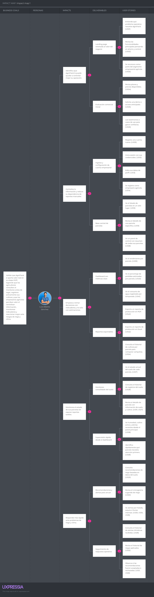


## 3.3. Product Backlog

| # Orden | User Story Id | Título | Descripción | Story Points (1/2/3/5/8) |
|--------|---------------|--------|-------------|--------------------------|
| **1** | **US01** | Ver propuesta de valor de AgroTrack | Como visitante, quiero ver claramente qué problema resuelve AgroTrack, para entender si la plataforma es útil para mí. | **1** |
| **2** | **US02** | Ver sección de funcionalidades principales | Como visitante, quiero ver las funcionalidades que ofrece AgroTrack, para evaluar si cubre mis necesidades como agricultor o empresario. | **1** |
| **3** | **US03** | Ver los segmentos objetivo a los que va dirigido | Como visitante, quiero saber a quiénes va dirigida la plataforma, para identificar si pertenezco al público objetivo. | **1** |
| **4** | **US04** | Ver planes y precios disponibles | Como visitante, quiero conocer los planes y precios de AgroTrack, para decidir si puedo pagarlo. | **2** |
| **5** | **US05** | Solicitar demo o acceso anticipado | Como visitante interesado, quiero dejar mis datos para solicitar una demo, para probar la plataforma antes de registrarme formalmente. | **3** |
| **6** | **US06** | Ver testimonios o casos de uso reales | Como visitante, quiero leer experiencias de otros usuarios, para ganar confianza en la plataforma antes de registrarme. | **1** |
| **7** | **US07** | Navegar desde un menú fijo de secciones | Como visitante, quiero un menú de navegación siempre visible, para acceder rápidamente a cualquier sección del landing page. | **2** |
| **8** | **US08** | Visualizar el landing page desde cualquier dispositivo | Como visitante, quiero que el landing page se adapte a mi celular o tablet, para poder verlo bien desde cualquier dispositivo. | **3** |
| **9** | **US09** | Registrar una cuenta nueva | Como usuario nuevo, quiero crear una cuenta en AgroTrack, para acceder a todas las funcionalidades de la plataforma. | **3** |
| **10** | **US10** | Iniciar sesión con correo y contraseña | Como usuario registrado, quiero iniciar sesión con mi correo y contraseña, para acceder a mi cuenta y mis datos. | **3** |
| **11** | **US11** | Cerrar sesión | Como usuario autenticado, quiero cerrar sesión, para proteger mi cuenta cuando dejo de usar la plataforma. | **1** |
| **12** | **US12** | Recuperar contraseña olvidada | Como usuario, quiero recuperar mi contraseña si la olvidé, para volver a acceder a mi cuenta sin perder mis datos. | **3** |
| **13** | **US13** | Editar datos del perfil personal | Como usuario registrado, quiero editar mi información de perfil, para mantener mis datos actualizados. | **3** |
| **14** | **US14** | Seleccionar tipo de usuario al registrarse (Agricultor o Empresario Agrícola) | Como usuario nuevo, quiero elegir si soy Agricultor o Empresario Agrícola al registrarme, para que la plataforma me muestre las funcionalidades que corresponden a mi perfil. | **2** |
| **15** | **US15** | Registrar una nueva parcela | Como agricultor, quiero registrar una nueva parcela en la plataforma, para comenzar a hacer seguimiento de mis cultivos en ese terreno. | **3** |
| **16** | **US16** | Ver listado de mis parcelas | Como agricultor, quiero ver todas mis parcelas registradas en un solo lugar, para tener una vista general de mis terrenos. | **2** |
| **17** | **US17** | Editar información de una parcela | Como agricultor, quiero editar los datos de una parcela, para corregir o actualizar su información cuando sea necesario. | **3** |
| **18** | **US18** | Eliminar una parcela registrada | Como agricultor, quiero eliminar una parcela que ya no uso, para mantener mi listado limpio y organizado. | **2** |
| **19** | **US19** | Ver detalle de una parcela específica | Como agricultor, quiero ver el detalle completo de una parcela, para revisar toda su información y el estado de sus cultivos. | **3** |
| **20** | **US20** | Registrar un cultivo en una parcela | Como agricultor, quiero registrar un nuevo cultivo en una de mis parcelas, para llevar un control digital de lo que estoy sembrando. | **3** |
| **21** | **US21** | Ver los cultivos activos de una parcela | Como agricultor, quiero ver los cultivos activos de una parcela, para saber qué estoy cultivando actualmente en ese terreno. | **2** |
| **22** | **US22** | Editar información de un cultivo | Como agricultor, quiero editar los datos de un cultivo registrado, para corregir errores o actualizar su información. | **3** |
| **23** | **US23** | Marcar un cultivo como cosechado o finalizado | Como agricultor, quiero marcar un cultivo como finalizado, para registrar que ese ciclo de siembra ya terminó. | **3** |
| **24** | **US24** | Ver historial de cultivos anteriores por parcela | Como agricultor, quiero ver el historial de cultivos pasados de una parcela, para analizar qué sembré en temporadas anteriores y qué resultados tuve. | **2** |
| **25** | **US25** | Ingresar manualmente datos de humedad del suelo | Como agricultor, quiero registrar manualmente el nivel de humedad del suelo de mi parcela, para que la plataforma pueda darme recomendaciones basadas en datos reales. | **3** |
| **26** | **US26** | Ingresar manualmente datos de temperatura del suelo | Como agricultor, quiero registrar la temperatura del suelo de mi parcela, para tener un historial de condiciones del terreno. | **3** |
| **27** | **US27** | Ver el estado actual del suelo de una parcela | Como agricultor, quiero ver el estado actual del suelo de mi parcela, para saber si necesita riego o está en condiciones adecuadas. | **3** |
| **28** | **US28** | Ver historial de registros del suelo por parcela | Como agricultor, quiero ver el historial de datos del suelo de una parcela, para identificar cómo han variado las condiciones con el tiempo. | **2** |
| **29** | **US29** | Recibir recomendación de riego basada en datos del suelo | Como agricultor, quiero recibir una recomendación de riego según el nivel de humedad registrado, para tomar decisiones más informadas y no basarme solo en mi intuición. | **5** |
| **30** | **US30** | Ver el cronograma de riego sugerido por la plataforma | Como agricultor, quiero ver un cronograma de riego recomendado para mi parcela, para planificar mis actividades de riego con anticipación. | **5** |
| **31** | **US31** | Confirmar o rechazar una recomendación de riego | Como agricultor, quiero poder confirmar o rechazar una recomendación de riego, para registrar si seguí o no el consejo de la plataforma. | **3** |
| **32** | **US32** | Ver historial de riegos aplicados en una parcela | Como agricultor, quiero ver el historial de riegos que apliqué en una parcela, para revisar con qué frecuencia regué y si seguí las recomendaciones. | **2** |
| **33** | **US33** | Recibir alerta ante riesgo de helada | Como agricultor, quiero recibir una alerta cuando se pronostique una helada en mi zona, para proteger mis cultivos con anticipación. | **5** |
| **34** | **US34** | Recibir alerta ante riesgo de sequía | Como agricultor, quiero recibir una alerta cuando se pronostique un período de sequía prolongada, para anticipar mis decisiones de riego. | **5** |
| **35** | **US35** | Recibir alerta ante lluvias intensas previstas | Como agricultor, quiero recibir una alerta cuando se esperen lluvias intensas, para evitar el exceso de riego y proteger mis cultivos. | **5** |
| **36** | **US36** | Ver historial de alertas climáticas recibidas | Como agricultor, quiero ver todas las alertas climáticas que recibí, para revisar qué eventos ocurrieron y cómo respondí ante ellos. | **2** |
| **37** | **US37** | Configurar qué tipo de alertas quiero recibir | Como agricultor, quiero elegir qué tipos de alertas climáticas quiero recibir, para no saturarme de notificaciones que no me sean útiles. | **3** |
| **38** | **US38** | Ver panel de control con resumen de todas mis parcelas | Como empresario agrícola, quiero ver un panel de control con el estado de todas mis parcelas, para tener visibilidad centralizada de mi operación sin depender de reportes manuales. | **8** |
| **39** | **US39** | Ver rendimiento por parcela | Como empresario agrícola, quiero ver el rendimiento de cada parcela, para identificar cuáles están siendo más productivas y tomar decisiones de inversión. | **8** |
| **40** | **US40** | Ver porcentaje de pérdidas estimadas por parcela | Como empresario agrícola, quiero ver el porcentaje de pérdidas estimadas por parcela, para identificar dónde estoy perdiendo más y tomar acciones correctivas. | **8** |
| **41** | **US41** | Ver consumo de agua registrado por temporada | Como empresario agrícola, quiero ver cuánta agua se ha consumido por temporada en cada parcela, para evaluar la eficiencia del riego y reducir costos operativos. | **5** |
| **42** | **US42** | Exportar reporte de producción en formato PDF o Excel | Como empresario agrícola, quiero exportar un reporte de producción de mis parcelas, para compartirlo con mi equipo o analizarlo fuera de la plataforma. | **8** |

<br><br><br>

| # Orden | Technical Story Id | Título | Descripción | Story Points (1 / 2 / 3 / 5 / 8) |
|--------|--------------------|--------|-------------|----------------------------------|
| **1**| **TS01** | Endpoint de registro de usuario | Como developer, quiero un endpoint POST para registrar usuarios, para que el frontend pueda crear nuevas cuentas desde el formulario de registro. | **3** |
| **2**| **TS02** | Endpoint de inicio de sesión | Como developer, quiero un endpoint POST para autenticar usuarios, para que el frontend pueda iniciar sesión y recibir un token de acceso. | **3** |
| **3**| **TS03** | Endpoint para crear una parcela | Como developer, quiero un endpoint POST para registrar parcelas, para que el frontend pueda guardar nuevas parcelas vinculadas a un usuario. | **3** |
| **4**| **TS04** | Endpoint para obtener parcelas de un usuario | Como developer, quiero un endpoint GET para obtener todas las parcelas de un usuario, para que el frontend pueda mostrar el listado de parcelas en el dashboard. | **2** |
| **5**| **TS05** | Endpoint para actualizar una parcela | Como developer, quiero un endpoint PUT para actualizar los datos de una parcela, para que el frontend pueda guardar los cambios realizados por el usuario. | **3** |
| **6**| **TS06** | Endpoint para eliminar una parcela | Como developer, quiero un endpoint DELETE para eliminar una parcela, para que el frontend pueda removerla cuando el usuario lo solicite. | **2** |
| **7**| **TS07** | Endpoint para crear un cultivo | Como developer, quiero un endpoint POST para registrar cultivos en una parcela, para que el frontend pueda guardar la información de siembra del agricultor. | **3** |
| **8**| **TS08** | Endpoint para obtener cultivos de una parcela | Como developer, quiero un endpoint GET para obtener todos los cultivos de una parcela, para que el frontend pueda mostrarlos en el detalle de la parcela. | **2** |
| **9**| **TS09** | Endpoint para actualizar el estado de un cultivo | Como developer, quiero un endpoint PATCH para actualizar el estado de un cultivo, para que el frontend pueda marcarlo como finalizado cuando el agricultor coseche. | **2** |
| **10** | **TS10** | Endpoint para registrar datos del suelo | Como developer, quiero un endpoint POST para registrar datos de humedad y temperatura del suelo, para que el frontend pueda guardar los registros manuales del agricultor. | **3** |
| **11** | **TS11** | Endpoint para obtener historial de datos del suelo | Como developer, quiero un endpoint GET para obtener el historial de registros del suelo de una parcela, para que el frontend pueda mostrarlo al agricultor. | **2** |
| **12** | **TS12** | Endpoint para obtener alertas climáticas de una parcela | Como developer, quiero un endpoint GET para obtener las alertas climáticas activas de una parcela, para que el frontend pueda mostrarlas en el dashboard del agricultor. | **3** |
| **13** | **TS13** | Endpoint para crear una alerta climática | Como developer, quiero un endpoint POST para registrar una alerta climática en una parcela, para que el sistema pueda generarlas automáticamente al procesar datos del clima. | **3** |
| **14** | **TS14** | Endpoint para obtener recomendación de riego | Como developer, quiero un endpoint GET que retorne una recomendación de riego basada en el último registro del suelo de una parcela, para que el frontend pueda mostrarla al agricultor. | **5** |
| **15** | **TS15** | Endpoint para registrar respuesta a una recomendación | Como developer, quiero un endpoint POST para registrar si el agricultor aceptó o rechazó una recomendación de riego, para que el historial quede guardado en el sistema. | **3** |


<br>
<br>


# Capítulo IV: Product Design

## 4.1. Style Guidelines

### 4.1.1. General Style Guidelines

#### Branding

- **Nombre del producto:** AgroTrack
- **Tagline:** *Cultiva mejor con datos reales.*
- **Identidad visual:** AgroTrack busca transmitir confianza, cercanía y
  modernidad accesible para el agricultor peruano. La identidad visual
  combina elementos naturales (tierra, agua, cultivos) con una estética
  limpia y funcional, adaptada a usuarios con poca experiencia
  tecnológica.
- **Logo:** El logotipo está compuesto por un ícono que representa una
  hoja o planta estilizada acompañada del nombre "AgroTrack" en
  tipografía sans-serif legible, reflejando el equilibrio entre el campo
  y la tecnología.
- **Valores visuales:** Confianza, simplicidad, eficiencia y cercanía
  con el campo.


------------------------------------------------------------------------

#### Typography

- **Tipografía principal:** **Inter** (sans-serif), elegida por su alta
  legibilidad en pantallas, especialmente en dispositivos móviles con
  conectividad limitada. Usada en títulos y encabezados.
- **Tipografía secundaria:** **Roboto** (sans-serif), empleada en
  cuerpos de texto, etiquetas y elementos de interfaz por su claridad en
  tamaños pequeños.

**Jerarquía tipográfica:** \* **Títulos (H1):** 32--40 px \*
**Subtítulos (H2):** 24--28 px \* **Texto base:** 16 px \* **Botones y
etiquetas:** 14--16 px, en mayúsculas o negrita según jerarquía.

> **Principio aplicado:** Legibilidad máxima para usuarios con baja
> experiencia tecnológica, sin recursos decorativos que dificulten la
> lectura rápida en campo.

------------------------------------------------------------------------

#### Colors

La paleta cromática busca evocar el entorno natural del campo peruano
(tierra, vegetación y agua) combinada con tonos neutros que transmiten
confianza y claridad de información.


La tabla a continuación resume la paleta con su aplicación principal:

  --------------------------------------------------------------------------
  Tipo                 Nombre            Código            Aplicación
                                                           principal
  -------------------- ----------------- ----------------- -----------------
  **Primario**         Verde campo       `#2D7A3A`         Botones
                                                           principales,
                                                           íconos activos,
                                                           encabezados

  **Secundario**       Verde suave       `#5DAB72`         Estados
                                                           positivos,
                                                           confirmaciones,
                                                           alertas de riego
                                                           OK

  **Complementario**   Azul agua         `#4A90D9`         Indicadores de
                                                           humedad, datos
                                                           del suelo,
                                                           gráficos

  **Neutro claro**     Fondo tierra      `#F5F0E8`         Fondos de
                                                           páginas, tarjetas
                                                           de parcela

  **Neutro oscuro**    Texto oscuro      `#2C3E2D`         Texto principal y
                                                           encabezados

  **Borde/divisor**    Verde pálido      `#D9EDD9`         Líneas,
                                                           contenedores,
                                                           separadores
  --------------------------------------------------------------------------

*Figura 14. Paleta de colores institucional de AgroTrack. Nota.
Elaboración propia.*

------------------------------------------------------------------------

#### Spacing y Layout

- **Márgenes y paddings:** Uniformes (mínimo 16 px).
- **Bordes:** Redondeados entre **4--8 px** para suavizar la interfaz y
  dar sensación de accesibilidad.
- **Grillas:** Uso de sistema de grillas (*grid system*) adaptable a
  distintos tamaños de pantalla.
- **Distribución:**
  - **Mobile:** Una sola columna.
  - **Desktop:** Dos o tres columnas para optimizar legibilidad y ritmo
    visual.
- **Interactividad:** Especial atención al tamaño de los elementos
  interactivos (botones, campos) para facilitar el uso táctil en campo.

------------------------------------------------------------------------

#### Tone of Voice

- **Dimensión tonal:** Cercano, claro y alentador.
- **Lenguaje:** Directo, sencillo y sin tecnicismos, hablando el mismo
  idioma que el agricultor.
- **Estilo comunicativo:** Práctico y orientado a la acción, generando
  confianza inmediata desde el primer uso.

**Ejemplos de tono de acción:** \* *"Tu parcela necesita riego hoy."* \*
*"Registra tu cultivo en segundos."* \* *"Recibe alertas antes de que
llegue la helada."*

### 4.1.2. Web Style Guidelines

#### Diseño Responsivo

- **Breakpoints definidos:**
  - Móvil: ≤768 px
  - Tablet: 769--1024 px
  - Desktop: ≥1025 px


*Figura 15. Tamaños de Breakpoints definidos para AgroTrack. Nota.
Elaboración propia.*

- **Comportamiento adaptativo:**
  - En móvil, se prioriza la visualización vertical con menú hamburguesa
    y tarjetas de parcelas apiladas.
  - En desktop, se emplea una distribución horizontal con estructura de
    dos o tres columnas.
  - El diseño mantiene jerarquía visual y lenguaje cromático consistente
    en todos los dispositivos.

------------------------------------------------------------------------

#### Componentes Web

- **Botones (CTAs):**
  - **Primario:** Fondo verde `#2D7A3A`, texto blanco, borde redondeado
    (8--12 px).
  - **Secundario:** Fondo blanco, borde verde `#5DAB72`, texto verde.
  - **Estados:** *hover* (tono más oscuro), *active* (sombra ligera),
    *disabled* (opacidad reducida).


*Figura 16. Variantes de botones CTA de AgroTrack. Nota. Elaboración
propia.*

- **Formularios:**
  - Campos con bordes finos y feedback visual al error o validación.
  - Etiquetas visibles y mensajes de error en texto rojo o ícono de
    advertencia.
  - Campos de ingreso de datos del suelo (humedad, temperatura) con
    validación de rango inmediata.
- **Navegación:**
  - Barra superior fija (*sticky header*) con logo, enlaces principales
    y CTA de registro.
  - Menú desplegable para secciones secundarias.
  - En móvil, menú tipo hamburguesa con ícono fácilmente reconocible.
- **Cards (tarjetas de parcela):**
  - Secciones por parcela con nombre, cultivo activo, estado del suelo e
    última alerta.
  - Bordes suaves, sin sombra pesada, márgenes consistentes de 16 px.
  - Indicador de estado del suelo con color semántico: verde (normal),
    amarillo (atención), rojo (crítico).

------------------------------------------------------------------------

#### Interacción y Accesibilidad

- **Animaciones:** Transiciones suaves de 0.2 s para interacciones con
  botones o cambios de vista.
- **Indicadores de carga:** Ícono circular o barra de progreso visible
  durante procesos de espera.
- **Accesibilidad (WCAG 2.1):**
  - Contraste mínimo AA en texto e íconos.
  - Navegación mediante teclado.
  - Etiquetas alternativas (*alt text*) en imágenes y gráficos de
    parcelas.
- **Microinteracciones:** Animaciones sutiles al hacer clic y
  retroalimentación visual al confirmar una acción (p.ej. registro de
  riego exitoso).

# 4.2. Information Architecture

## 4.2.1. Organization Systems

El equipo de AgroTrack definió los sistemas de organización del
contenido considerando los dos segmentos objetivo ---agricultores y
empresarios agrícolas--- y la naturaleza de cada experiencia: Landing
Page y Web Application.

**Landing Page**\*

La Landing Page organiza su contenido de forma **secuencial
(top-to-bottom)**, guiando al visitante a través de un flujo narrativo
que va desde la presentación del problema hasta la conversión:

1.  Hero / Propuesta de valor
2.  Funcionalidades principales
3.  Segmentos objetivo (Agricultor / Empresario Agrícola)
4.  Planes y precios
5.  Testimonios
6.  Formulario de demo / CTA final Este orden responde a la lógica de
    persuasión progresiva: el visitante primero entiende el problema,
    luego ve la solución, se identifica con su perfil y, finalmente,
    toma acción. No se aplica organización matricial ni alfabética, ya
    que el contenido es narrativo y no enciclopédico.

La categorización del contenido se realiza **por audiencia**: cada
sección comunica diferencialmente a agricultores individuales y a
empresarios de PYMEs, usando ejemplos y lenguaje adaptado a cada perfil.

**Web Application**

Dentro de la aplicación web, se combinan tres esquemas de organización
según el tipo de información:

**Organización jerárquica (visual hierarchy)** Se aplica en el Dashboard
principal y en la vista de detalle de parcela. El contenido más crítico
(estado del suelo, alertas activas, recomendación de riego) ocupa la
posición y tamaño visual más prominente. Los datos secundarios
(historial, configuración de alertas) se muestran en niveles inferiores
de la jerarquía.

**Organización secuencial (step-by-step)** Se aplica en los flujos de
registro y configuración: - Registro de cuenta → selección de perfil →
acceso al dashboard - Creación de parcela → registro de cultivo →
ingreso de datos del suelo → recepción de recomendación - Solicitud de
demo desde la Landing Page (formulario en pasos) Este esquema es
especialmente importante para el segmento de agricultores, que puede
tener poca experiencia tecnológica y necesita una guía clara paso a
paso.

**Organización por tópicos** Se aplica en la navegación general de la
aplicación. El contenido se agrupa en módulos funcionales claramente
diferenciados: - Mis Parcelas - Mis Cultivos - Estado del Suelo -
Recomendaciones de Riego - Alertas Climáticas - Dashboard / Reportes
(exclusivo para Empresarios Agrícolas) **Organización cronológica** Se
aplica en secciones de historial, donde la información más reciente
siempre aparece primero: - Historial de registros del suelo - Historial
de cultivos anteriores - Historial de riegos aplicados - Historial de
alertas climáticas recibidas **Categorización por audiencia** El
dashboard y las funcionalidades disponibles varían según el tipo de
usuario seleccionado al registrarse. El perfil **Agricultor** accede a
vistas orientadas al registro y seguimiento de su parcela individual. El
perfil **Empresario Agrícola** accede adicionalmente a vistas de
rendimiento centralizado, métricas de pérdidas, consumo de agua por
temporada y exportación de reportes.

## 4.2.2. Labeling Systems

El equipo definió etiquetas breves, en lenguaje directo y sin
tecnicismos, alineadas con el tono de voz de AgroTrack: cercano, claro y
práctico. Se priorizó el uso de términos que el agricultor peruano
reconoce en su práctica cotidiana.

\*\*\* Etiquetas de Navegación Principal (Web Application) \*\*\*

  Sección                                           Etiqueta
  ------------------------------------------------- ------------------------------
  Vista general de todas las parcelas del usuario   **Mis Parcelas**
  Lista de cultivos activos por parcela             **Mis Cultivos**
  Registros de humedad y temperatura                **Estado del Suelo**
  Sugerencias de cuándo y cuánto regar              **Recomendaciones de Riego**
  Notificaciones de helada, sequía o lluvia         **Alertas Climáticas**
  Vista centralizada de métricas (Empresario)       **Panel de Control**
  Exportación de datos de producción                **Reportes**
  Datos personales y preferencias                   **Mi Perfil**
  Preferencias de notificaciones                    **Configuración**

\*\*\* Etiquetas de Acciones Principales (CTAs) \*\*\*

  -----------------------------------------------------------------------
  Acción                              Etiqueta
  ----------------------------------- -----------------------------------
  Crear una nueva parcela             **+ Nueva Parcela**

  Agregar un cultivo a una parcela    **+ Registrar Cultivo**

  Ingresar datos de humedad o         **Registrar Datos del Suelo**
  temperatura                         

  Marcar un cultivo como terminado    **Marcar como Cosechado**

  Aceptar una sugerencia de riego     **Confirmar Riego**

  Rechazar una sugerencia de riego    **No Aplicado**

  Descargar reporte en PDF o Excel    **Exportar Reporte**

  Completar formulario de contacto en **Solicitar Demo**
  Landing Page                        

  Crear cuenta                        **Crear Cuenta**

  Entrar a la plataforma              **Iniciar Sesión**

  Salir de la cuenta                  **Cerrar Sesión**
  -----------------------------------------------------------------------

\*\*\* Etiquetas de Estado del Suelo \*\*\*

Los indicadores visuales del estado de la parcela usan colores
semánticos (verde, amarillo, rojo) acompañados de etiquetas de texto
para garantizar accesibilidad:

  Estado                        Etiqueta                Color
  ----------------------------- ----------------------- -----------------
  Humedad entre 40 % y 70 %     **Normal**              Verde `#5DAB72`
  Humedad por debajo del 40 %   **Necesita Riego**      Amarillo
  Humedad por encima del 70 %   **Exceso de Humedad**   Rojo

\*\*\* Etiquetas de Tipo de Alerta Climática \*\*\*

  Evento                                  Etiqueta
  --------------------------------------- ----------------------
  Temperatura pronosticada \< 0 °C        **Riesgo de Helada**
  Ausencia de lluvias por más de 7 días   **Riesgo de Sequía**
  Precipitaciones intensas previstas      **Lluvias Intensas**

\*\*\* Etiquetas de Estado de Cultivo \*\*\*

  Estado                          Etiqueta
  ------------------------------- ----------------
  Cultivo en curso                **Activo**
  Cultivo terminado y cosechado   **Finalizado**

\*\*\* Etiquetas de Formularios y Campos \*\*\*

  -----------------------------------------------------------------------
  Campo                               Etiqueta
  ----------------------------------- -----------------------------------
  Nombre de la parcela                **Nombre**

  Extensión del terreno               **Tamaño (ha)**

  Coordenadas o lugar                 **Ubicación**

  Tipo de planta sembrada             **Tipo de Cultivo**

  Fecha de inicio de la siembra       **Fecha de Siembra**

  Porcentaje de agua en el suelo      **Humedad del Suelo (%)**

  Grados del suelo al momento del     **Temperatura del Suelo (°C)**
  registro                            

  Correo electrónico del usuario      **Correo**

  Clave de acceso                     **Contraseña**

  Tipo de cuenta del usuario          **Soy...** (`Agricultor` /
                                      `Empresario Agrícola`)
  -----------------------------------------------------------------------

\*\*\* Etiquetas de la Landing Page \*\*\*

  -----------------------------------------------------------------------
  Sección                             Etiqueta visible
  ----------------------------------- -----------------------------------
  Bloque principal con propuesta de   **Cultiva mejor con datos reales**
  valor                               

  Lista de funciones del producto     **¿Qué puedes hacer con
                                      AgroTrack?**

  Descripción de perfiles de usuario  **¿Para quién es AgroTrack?**

  Tabla de planes disponibles         **Planes y Precios**

  Opiniones de usuarios               **Lo que dicen nuestros usuarios**

  Formulario de interés               **Solicita tu demo gratuita**

  Enlace a registro                   **Empieza ahora**
  -----------------------------------------------------------------------

### 4.2.3 SEO Tags and Meta Tags

Los SEO Tags y Meta Tags de AgroTrack se definen con el objetivo de
mejorar la visibilidad del producto en motores de búsqueda y facilitar
que agricultores, empresarios agrícolas y visitantes interesados
comprendan rápidamente el propósito de la solución. Estos metadatos se
aplican tanto al Landing Page como a la futura Web Application,
manteniendo una comunicación clara, directa y alineada con la propuesta
de valor del producto: ayudar a tomar decisiones agrícolas con datos
reales, especialmente en el registro de parcelas, monitoreo del suelo,
recomendaciones de riego y alertas climáticas. AgroTrack está orientado
a pequeños agricultores y empresarios agrícolas del Perú que necesitan
herramientas simples para registrar sus cultivos, monitorear el estado
del suelo y tomar decisiones más informadas sobre el riego y la gestión
de sus parcelas. Esta orientación se basa en el perfil del producto,
definido como una plataforma web para registrar parcelas, ingresar
información de cultivos y recibir recomendaciones prácticas para
optimizar el riego.

#### **Landing Page SEO & Meta Tags**

La Landing Page tiene una finalidad informativa y comercial. Por ello,
los meta tags se enfocan en comunicar la propuesta de valor de
AgroTrack, presentar sus funcionalidades principales y atraer a
visitantes interesados en digitalizar la gestión agrícola.

``` html
<title>AgroTrack | Grow better with real data</title>

<meta
    name="description"
    content="AgroTrack helps farmers and agricultural SMEs register plots, monitor soil conditions, receive irrigation recommendations and manage climate alerts using real data."
/>

<meta
    name="keywords"
    content="AgroTrack, agriculture technology, smart farming, soil monitoring, irrigation recommendations, climate alerts, crop management, agricultural SMEs, farmers Peru"
/>

<meta name="author" content="Andes Smart Team" />

<meta name="robots" content="index, follow" />

<meta
    property="og:title"
    content="AgroTrack | Grow better with real data"
/>

<meta
    property="og:description"
    content="Register your plots, monitor soil conditions and receive clear irrigation recommendations with AgroTrack."
/>

<meta
    property="og:image"
    content="https://www.agrotrack.com/assets/agrotrack-og-image.jpg"
/>

<meta
    property="og:url"
    content="https://www.agrotrack.com"
/>

<meta property="og:type" content="website" />
```

------------------------------------------------------------------------

#### **Web Application SEO & Meta Tags**

La Web Application está orientada a usuarios registrados, como
agricultores y empresarios agrícolas. En este caso, los meta tags se
enfocan en la funcionalidad principal de la plataforma: gestión de
parcelas, cultivos, suelo, riego, alertas y reportes. Aunque muchas
pantallas internas pueden requerir autenticación, estos metadatos ayudan
a mantener una identidad clara del producto dentro del navegador y en
páginas públicas o accesibles desde la aplicación.

``` html
<title>AgroTrack | Agricultural management platform</title>

<meta
    name="description"
    content="Access AgroTrack to manage plots, crops, soil records, irrigation recommendations, climate alerts, dashboards and agricultural reports from one platform."
/>

<meta
    name="keywords"
    content="AgroTrack platform, plot management, crop tracking, soil records, irrigation schedule, weather alerts, agricultural dashboard, farming reports"
/>

<meta name="author" content="Andes Smart Team" />

<meta name="robots" content="index, follow" />

<meta
    property="og:title"
    content="AgroTrack | Agricultural management platform"
/>

<meta
    property="og:description"
    content="Manage your agricultural operation with plot tracking, soil monitoring, irrigation recommendations, climate alerts and reports."
/>

<meta
    property="og:image"
    content="https://app.agrotrack.com/assets/agrotrack-app-og-image.jpg"
/>

<meta
    property="og:url"
    content="https://app.agrotrack.com"
/>

<meta property="og:type" content="website" />
```

### 4.2.4 Searching Systems

Dentro de la plataforma AgroTrack, los sistemas de búsqueda han sido
diseñados para facilitar el acceso rápido y eficiente a la información
relacionada con la gestión agrícola. Debido al manejo constante de datos
vinculados con parcelas, alertas, usuarios, configuraciones y registros
operativos, se contempla un sistema de búsqueda que permita a los
usuarios localizar información relevante de manera inmediata y mantener
un control ordenado de sus actividades. El sistema permitirá realizar
búsquedas dentro de los distintos módulos de la plataforma mediante:

- Palabras clave (nombre de parcela, ubicación, tipo de registro, nombre
  de usuario o descripción relacionada).
- Filtros por categoría (parcelas, alertas, configuraciones, perfiles o
  registros administrativos).
- Estados del registro (activo, pendiente, completado o actualizado).
- Identificadores internos asociados a parcelas, usuarios o elementos
  registrados dentro del sistema.

Este sistema será especialmente útil para:

- Ahorrar tiempo en la localización de parcelas, configuraciones o
  registros específicos sin necesidad de navegar manualmente entre
  módulos.

- Encontrar rápidamente información relacionada con parcelas agrícolas,
  alertas emitidas o datos administrativos.

- Mejorar la organización operativa mediante el acceso inmediato a
  información previamente registrada.

- Facilitar la gestión diaria del usuario al mantener una navegación más
  ágil y ordenada dentro de la plataforma.

- Una vez realizada la búsqueda, los resultados se mostrarán de forma
  estructurada dentro de listas, tablas o formularios interactivos según
  el módulo correspondiente, permitiendo visualizar, editar o gestionar
  la información de acuerdo con los permisos asignados al usuario.

### 4.2.5 Navigation Systems

Para el sistema de navegación otorgamos libertad y facilidad al usuario
dentro de la plataforma con diversas interfaces de navegación:

***PRIMERA NAVEGACIÓN:*** Acceso a apartados para cada tipo de usuario y
herramientas de registro e inicio de sesión. Este navegador global se
encuentra en la parte superior de la pantalla permitiendo que el usuario
pueda acceder en todo momento a las funciones principales del sitio sin
la necesidad de scrollear.


*Fuente: Propia.*

***SEGUNDA NAVEGACIÓN:*** Sección de registro continúa al apartado de
contenido principal. Esta sección de registro que va luego de que el
usuario haya visto el contenido principal del sitio, le ayuda a tomar
decisiones como agricultor.


*Fuente: Propia.*

***TERCERA NAVEGACIÓN:*** Pie de página con información complementaria.
Esta sección reúne enlaces de interés tanto para agricultores como para
empresarios agrícolas, permitiendo que los usuarios que llegaron al
final del sitio continúen navegando fácilmente sin necesidad de regresar
al inicio.


*Fuente: Propia.*

## 4.3. Landing Page UI Design

### 4.3.1. Landing Page Wireframe

Para la landing page se realizaron los Wireframes en figma de toda la
página web

 

*Nota: Elaboración propia. Elaborado en:
https://www.figma.com/design/tQSFHjZZpLcvBWkbzUfWLw/Untitled?node-id=0-1&p=f&t=rDZhOjwZFkCWZdXw-0*

### 4.3.2. Landing Page Mock-up

`<br>`{=html}

**Desktop Web Browser**

 

`<br>`{=html}

**Mobile Web Browser**

  

`<br>`{=html}

*Elaborado en:
https://www.figma.com/design/tQSFHjZZpLcvBWkbzUfWLw/Untitled?node-id=0-1&p=f&t=rDZhOjwZFkCWZdXw-0*

### 4.4.1. Web Applications Wireframes

    

### 4.4.2. Web Applications Wireflow Diagrams

Los Web Applications Wireflow Diagrams son representaciones visuales de
los flujos de navegación y la arquitectura de una aplicación web. Estos
diagramas combinan elementos de wireframes y diagramas de flujo para
proporcionar una vista general de cómo los usuarios navegarán a través
de la aplicación y cómo interactuarán con ella.


### 4.4.3. Web Applications Mock-ups

  


### 4.4.4. Web Applications User Flow Diagrams

El diagrama de flujo de usuario es una representación visual de los
pasos que un usuario sigue al interactuar con una aplicación o sitio
web. Muestra la secuencia de acciones que el usuario realiza para
completar una tarea específica, lo que nos ayuda a identificar posibles
puntos de fricción y a optimizar la experiencia del usuario.

  

### 4.5. Web Applications Prototyping

Prototipo de la aplicación web AgroTrack en Figma:
[Prototipo-AgroTrack](https://www.figma.com/design/tQSFHjZZpLcvBWkbzUfWLw/Untitled?node-id=0-1&p=f&t=VDnBfHM1uPU4jdXO-0)


Video del flujo del prototipo:
[FLUJO-PROTOTIPO-AGROTRACK.mp4](https://upcedupe-my.sharepoint.com/:v:/g/personal/u20241a267_upc_edu_pe/IQBGdqAI0J_NR7IAsWPnBl3TAe0ieQNo8cg4MmurJ2Owfuc?e=2yMdi8&nav=eyJyZWZlcnJhbEluZm8iOnsicmVmZXJyYWxBcHAiOiJTdHJlYW1XZWJBcHAiLCJyZWZlcnJhbFZpZXciOiJTaGFyZURpYWxvZy1MaW5rIiwicmVmZXJyYWxBcHBQbGF0Zm9ybSI6IldlYiIsInJlZmVycmFsTW9kZSI6InZpZXcifX0%3D)

### 4.6. Domain-Driven Software Architecture.

En esta sección se presenta la arquitectura de software de AgroTrack
desde el enfoque de Domain-Driven Design, tomando como base el Big
Picture Event Storming desarrollado previamente. A partir de dicho
análisis, se identificaron eventos, comandos, actores y sistemas
externos relevantes para el dominio agrícola, como el registro de
usuarios, la creación de parcelas, el ingreso de datos del suelo, las
recomendaciones de riego y las alertas climáticas. Con esta información,
el sistema se organizará en Bounded Contexts que separan las principales
responsabilidades del producto, como autenticación, gestión de parcelas
y cultivos, monitoreo del suelo, recomendaciones climaticas y de riego y
reportes. Esta división permite representar con mayor claridad cada
parte del dominio y mantener relación con el lenguaje ubicuo definido
para AgroTrack, donde se incluyen términos como Plot, Crop, Soil
Moisture, Weather Alert e Irrigation Schedule.

### 4.6.1. Design-Level Event Storming.

**Identity & Access Management**


**Farm Management**


**Soil Monitoring**


**Irrigation & Weather Advisory**


**Analytics & Reporting**


Miro:
https://miro.com/app/board/uXjVHcOGric=/?share_link_id=857544303236

### 4.6.2. Software Architecture Context Diagram.


### 4.6.3. Software Architecture Container Diagrams.


### 4.6.4. Software Architecture Components Diagrams.

**Identity & Access Management**


**Farm Management**


**Soil Monitoring**


**Irrigation & Weather Advisory**


**Analytics & Reporting**


## 4.7. Software Object-Oriented Design

### 4.7.1. Class Diagrams

``` plantuml
@startuml AgroTrack_ClassDiagram
 
'BOUNDED CONTEXT: User & Auth
package "Identity.domain.model" {
 
  interface Plan {
    +getMaxPlots() : int
    +getPrice() : double
    +isEnterpriseDashboardEnabled() : boolean
    +isExportEnabled() : boolean
    +isMultiUserEnabled(): boolean
    +hasPrioritySupport(): boolean
  }
 
  class BasicPlan {
    -price : double
    -maxPlots : int
    +getMaxPlots() : int
    +getPrice() : double
    +isEnterpriseDashboardEnabled() : boolean
    +isExportEnabled() : boolean
    +isMultiUserEnabled() : boolean
    +hasPrioritySupport() : boolean
  }
 
  class ProPlan
  {
    - price: double
    - maxPlots: int
    + getMaxPlots() : int
    + getPrice() : double
    + isEnterpriseDashboardEnabled(): boolean
    + isExportEnabled(): boolean
    + isMultiUserEnabled() : boolean
    + hasPrioritySupport() : boolean
  }
 
  class EnterprisePlan {
    -price : double
    -maxPlots : int
    +getMaxPlots() : int
    +getPrice() : double
    +isEnterpriseDashboardEnabled() : boolean
    +isExportEnabled() : boolean
    +isMultiUserEnabled(): boolean
    +hasPrioritySupport(): boolean
  }
 
  class TeamMemberId
  {
    *value: UUID
  }
  class TeamMember {
    *id : TeamMemberId
    -email : String
    -role : TeamRole
    -managerId : UserId
    -joinedAt : LocalDateTime
    +invite(email: String, role: TeamRole) : TeamMember
    +remove() : void
    +getRole() : TeamRole
    +getManagerId() : UserId
  }
 
  enum TeamRole {
    VIEWER
    EDITOR
  }
 
  class UserId
  {
    *value: UUID
  }
 
  abstract class User {
    *id : UserId
    #name : String
    -email : String
    -passwordHash : String
    #plan : Plan
    -createdAt : LocalDateTime
    -updatedAt : LocalDateTime
    +updateProfile(name: String, email: String) : void
    +changePlan(plan: Plan) : void
    +getId() : UserId
    +getEmail() : String
    +getPlan() : Plan
  }
 
  class Farmer {
    -plots : List<Plot>
    +getPlots() : List<Plot>
    +addPlot(plot: Plot) : void
    +removePlot(plotId: PlotId) : void
  }
 
  class AgriculturalManager {
    -companyName : String
    -managedPlots : List<Plot>
    +getDashboard() : Dashboard
    +exportReport(format: ReportFormat) : byte[]
    +getYieldSummary() : List<YieldSummary>
    +getLossSummary() : List<LossSummary>
    +getWaterConsumption() : List<WaterConsumption>
  }
 
  class AlertPreferenceId
  {
    *value: UUID
  }
 
  class AlertPreference {
    *id : AlertPreferenceId
    -userId : UserId
    -frostEnabled : boolean
    -droughtEnabled : boolean
    -heavyRainEnabled : boolean
    +update(frost: boolean, drought: boolean, rain: boolean) : void
    +isEnabled(type: AlertType) : boolean
    +getUserId() : UserId
  }
 
  AlertPreference o--> "1" AlertPreferenceId : has >
  TeamMember o--> "1" TeamMemberId : has >
  User o--> "1" UserId : has >
  User <|-- Farmer
  User <|-- AgriculturalManager
  Plan <|.. BasicPlan
  Plan <|.. ProPlan
  Plan <|.. EnterprisePlan
  User "1" --> "1" Plan : subscribes to >
  User "1" *-- "0..1" AlertPreference : configures >
  AgriculturalManager "1" *-- "0..*" TeamMember: manages>
  TeamMember "1" --> "1" TeamRole : has>
}
 
 
' Support
package Support.domain.model{
 
    class SupportTicketId
    {
        *value: UUID
    }
    class SupportTicket {
      *id : SupportTicketId
      -userId : UserId
      -subject : String
      -message : String
      -status : TicketStatus
      -createdAt : LocalDateTime
      -respondedAt : LocalDateTime
      +create(subject: String, message: String) : SupportTicket
      +close() : void
      +getId() : SupportTicketId
      +getStatus() : TicketStatus
    }
 
    enum TicketStatus {
      OPEN
      IN_PROGRESS
      CLOSED
    }
    SupportTicket o--> "1" SupportTicketId : has >
    SupportTicket "1" --> "1" TicketStatus : has >
}
 
 
' BOUNDED CONTEXT: Plot & Crop
 
package "Plot & Crop.domain.model" {
 
  enum PlotStatus {
    ACTIVE
    INACTIVE
    DELETED
  }
 
  enum CropStatus {
    ACTIVE
    HARVESTED
    LOST
  }
 
  class PlotId
  {
    *value: UUID
  }
 
  class Plot {
    *id: PlotId
    -name : String
    -location : String
    -sizeHectares : double
    -status : PlotStatus
    -userId : UserId
    -createdAt : LocalDateTime
    +register(name: String, location: String, size: double) : Plot
    +update(name: String, location: String, size: double) : void
    +delete() : void
    +getId() : PlotId
    +getName() : String
    +getStatus() : PlotStatus
    +getActiveCrops() : List<Crop>
    +getCropHistory() : List<Crop>
    +getCurrentSoilStatus() : SoilStatus
  }
 
  class CropId
  {
    *value: UUID
  }
 
  class Crop {
    *id : CropId
    -type : String
    -sowingDate : LocalDate
    -harvestDate : LocalDate
    -status : CropStatus
    -plotId : PlotId
    +register(type: String, sowingDate: LocalDate, plotId: PlotId) : Crop
    +update(type: String, sowingDate: LocalDate) : void
    +markAsHarvested(harvestDate: LocalDate) : void
    +getId() : CropId
    +getType() : String
    +getStatus() : CropStatus
    +isActive() : boolean
  }
 
  Crop o--> "1" CropId : has >
  Plot o--> "1" PlotId : has >
  Plot "1" --> "1" PlotStatus : has >
  Plot "1" *-- "0..*" Crop : contains >
  Crop "1" --> "1" CropStatus : has >
}
 
 
' BOUNDED CONTEXT: Soil Monitoring
 
package "Soil Monitoring.domain.model" {
 
  enum SoilStatus {
    LOW
    NORMAL
    HIGH
  }
 
  enum UrgencyLevel {
    LOW
    MEDIUM
    HIGH
    CRITICAL
  }
 
  enum RecommendationStatus {
    PENDING
    CONFIRMED
    REJECTED
  }
 
  enum ScheduleStatus {
    PENDING
    COMPLETED
    SKIPPED
  }
 
  class SoilRecordId
  {
    *value: UUID
  }
 
  class SoilRecord {
    *id : SoilRecordId
    -humidity : double
    -temperature : double
    -recordedAt : LocalDateTime
    -plotId : PlotId
    +register(humidity: double, temperature: double, plotId: PlotId) : SoilRecord
    +getId() : SoilRecordId
    +getHumidity() : double
    +getTemperature() : double
    +getRecordedAt() : LocalDateTime
    +getSoilStatus() : SoilStatus
  }
 
  class IrrigationRecommendationId
  {
    *value: UUID
  }
 
  class IrrigationRecommendation {
    *id : IrrigationRecommendationId
    -message : String
    -urgency : UrgencyLevel
    -status : RecommendationStatus
    -plotId : PlotId
    -generatedAt : LocalDateTime
    -respondedAt : LocalDateTime
    +generate(soilRecord: SoilRecord) : IrrigationRecommendation
    +confirm() : void
    +reject() : void
    +getId() : IrrigationRecommendationId
    +getStatus() : RecommendationStatus
    +getUrgency() : UrgencyLevel
  }
 
  class IrrigationScheduleId
  {
    *value:UUID
  }
 
  class IrrigationSchedule {
    *id : IrrigationScheduleId
    -suggestedAt : LocalDateTime
    -durationMinutes : int
    -plotId : PlotId
    -status : ScheduleStatus
    +create(plotId: PlotId, suggestedAt: LocalDateTime) : IrrigationSchedule
    +getId() : IrrigationScheduleId
    +getSuggestedAt() : LocalDateTime
    +getStatus() : ScheduleStatus
  }
 
  interface RecommendationEngine {
    +evaluate(soilRecord: SoilRecord) : IrrigationRecommendation
    +generateSchedule(plot: Plot) : IrrigationSchedule
  }
 
  class SoilBasedRecommendationEngine {
    -lowThreshold : double
    -highThreshold : double
    +evaluate(soilRecord: SoilRecord) : IrrigationRecommendation
    +generateSchedule(plot: Plot) : IrrigationSchedule
    -classifyHumidity(humidity: double) : SoilStatus
    -calculateUrgency(humidity: double) : UrgencyLevel
  }
 
 
  IrrigationSchedule o--> "1" IrrigationScheduleId : has >
  IrrigationRecommendation o--> "1" IrrigationRecommendationId : has >
  SoilRecord o--> "1" SoilRecordId : has >
  SoilRecord "1" --> "1" SoilStatus : evaluates to >
  IrrigationRecommendation "1" --> "1" RecommendationStatus : has >
  IrrigationRecommendation "1" --> "1" UrgencyLevel : has >
  IrrigationSchedule "1" --> "1" ScheduleStatus : has >
  RecommendationEngine <|.. SoilBasedRecommendationEngine
  SoilBasedRecommendationEngine ..> SoilRecord : uses >
  SoilBasedRecommendationEngine ..> IrrigationRecommendation : produces >
  SoilBasedRecommendationEngine ..> IrrigationSchedule : produces >
  SoilBasedRecommendationEngine ..> SoilStatus : uses >
  SoilBasedRecommendationEngine ..> UrgencyLevel : uses >
}
 
 
' BOUNDED CONTEXT: Climate Alerts
 
package "Climate Alerts.domain.model" {
 
  enum AlertType {
    FROST
    DROUGHT
    HEAVY_RAIN
  }
 
  enum AlertStatus {
    ACTIVE
    DISMISSED
    EXPIRED
  }
 
  class ClimateAlertId
  {
    *value: UUID
  }
 
  class ClimateAlert {
    *id : ClimateAlertId
    -type : AlertType
    -description : String
    -alertDate : LocalDate
    -status : AlertStatus
    -plotId : PlotId
    +create(type: AlertType, plotId: PlotId) : ClimateAlert
    +dismiss() : void
    +getId() : ClimateAlertId
    +getType() : AlertType
    +getStatus() : AlertStatus
  }
 
  class WeatherForecast {
    -location : String
    -minTemperature : double
    -maxTemperature : double
    -precipitationMm : double
    -daysWithoutRain : int
    -forecastDate : LocalDate
    +getMinTemperature() : double
    +getPrecipitationMm() : double
    +getDaysWithoutRain() : int
    +hasFrostRisk() : boolean
    +hasDroughtRisk() : boolean
    +hasHeavyRainRisk() : boolean
  }
 
  interface WeatherService {
    +getForecast(location: String) : WeatherForecast
    +checkFrostRisk(location: String) : boolean
    +checkDroughtRisk(location: String) : boolean
    +checkHeavyRainRisk(location: String) : boolean
  }
 
  ClimateAlert o--> "1" ClimateAlertId : has >
  ClimateAlert "1" --> "1" AlertType : has >
  ClimateAlert "1" --> "1" AlertStatus : has >
  WeatherService ..> WeatherForecast : returns >
  WeatherForecast ..> ClimateAlert : triggers >
  AlertPreference ..> AlertType : filters >
}
 
 
' BOUNDED CONTEXT: Enterprise Dashboard
 
package "Enterprise Dashboard.domain.model" {
 
  class Dashboard {
    -plots : List<Plot>
    -yieldSummaries : List<YieldSummary>
    -lossSummaries : List<LossSummary>
    -waterConsumptions : List<WaterConsumption>
    +getPlotsSummary() : List<Plot>
    +getYieldSummary() : List<YieldSummary>
    +getLossSummary() : List<LossSummary>
    +getWaterSummary() : List<WaterConsumption>
    +exportPDF() : byte[]
    +exportExcel() : byte[]
  }
 
  class YieldSummary {
    -plotId : PlotId
    -plotName : String
    -yieldPerHectare : double
    -season : String
    +getPlotId() : PlotId
    +getYieldPerHectare() : double
    +getSeason() : String
  }
 
  class LossSummary {
    -plotId : PlotId
    -plotName : String
    -lossPercentage : double
    -cause : String
    +getPlotId() : PlotId
    +getLossPercentage() : double
    +getCause() : String
  }
 
  class WaterConsumption {
    -plotId : PlotId
    -plotName : String
    -totalLiters : double
    -season : String
    +getPlotId() : PlotId
    +getTotalLiters() : double
    +getSeason() : String
  }
 
  User "1" ..> "0..1" Dashboard: Accesses if the plan is suitable
  Dashboard "1" *-- "0..*" YieldSummary : contains >
  Dashboard "1" *-- "0..*" LossSummary : contains >
  Dashboard "1" *-- "0..*" WaterConsumption : contains >
}
 
 
' RELACIONES ENTRE BOUNDED CONTEXTS
 
Farmer "1" --> "0..*" Plot : owns >
AgriculturalManager "1" --> "0..*" Plot : manages >
Plot "1" *-- "0..*" SoilRecord : records >
Plot "1" *-- "0..*" IrrigationRecommendation : receives >
Plot "1" *-- "0..*" IrrigationSchedule : schedules >
Plot "1" *-- "0..*" ClimateAlert : receives >
User "1" --> "0..*" SupportTicket: creates >
@enduml
```

## 4.8. Database Design.

### 4.8.1. Database Diagrams.


<br>
<br>


# Capítulo V: Product Implementation, Validation & Deployment

## 5.1. Software Configuration Management.

Esta sección presentará las herramientas que se han utilizado durante
este proyecto para desarrollar nuestras plataformas digitales con una
gestión estructurada de los cambios, versiones y configuraciones dentro
del desarrollo de software.

### 5.1.1 Software Development Environment Configuration.

En el presente proyecto, para la etapa de diseño UX/UI se utilizó la
plataforma Figma, la cual permitió elaborar prototipos, definir la
estructura visual y organizar la experiencia de usuario de la solución
propuesta.

Para el desarrollo de la landing page se trabajó con WebStorm como
entorno de desarrollo, facilitando la edición y organización del código
del proyecto. Asimismo, se emplearon tecnologías base del desarrollo web
como HTML para la estructura del contenido, CSS para el diseño y estilos
visuales, y JavaScript para agregar interactividad en la página.

Finalmente, para el control de versiones y el trabajo colaborativo entre
los integrantes del equipo, se utilizaron Git y GitHub, herramientas que
permitieron registrar cambios y mantener un desarrollo ordenado del
proyecto.

**FIGMA:** Es una plataforma orientada al diseño de interfaces y
experiencia de usuario, utilizada para crear wireframes, mockups,
prototipos interactivos y propuestas visuales de alta fidelidad. Su
principal ventaja es el trabajo colaborativo en tiempo real, ya que
permite que varios integrantes del equipo participen de manera
simultánea desde distintas ubicaciones. Además, facilita la
planificación de la estructura visual y la navegación de la aplicación
antes de iniciar la etapa de desarrollo.

**Figura 1**\
*Logo de Figma*

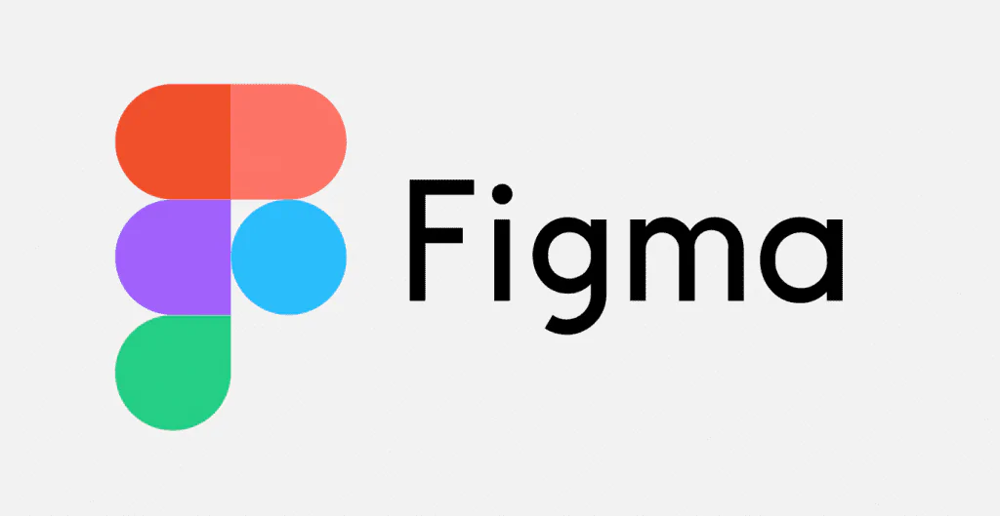

*Nota.* Obtenido de:
https://www.iebschool.com/hub/wp-content/uploads/2024/01/s-1024x529-1-768x397.png

**HTML:** Es el lenguaje de marcado utilizado para definir la estructura
base de una página web. Permite organizar el contenido mediante
elementos como títulos, párrafos, imágenes, enlaces, formularios y
secciones, facilitando una correcta distribución de la información
dentro del sitio web.

**Figura 2**\
*Logo de HTML*


*Nota.* Obtenido de:
<https://upload.wikimedia.org/wikipedia/commons/thumb/6/61/HTML5_logo_and_wordmark.svg/250px-HTML5_logo_and_wordmark.svg.png>

**CSS:** Es un lenguaje de estilos empleado para personalizar la
apariencia visual de una página web. Permite modificar colores,
tipografías, tamaños, márgenes, posiciones y diseños responsivos,
logrando una presentación más atractiva y adaptable a distintos
dispositivos.

**Figura 3**\
*Logo de CSS*

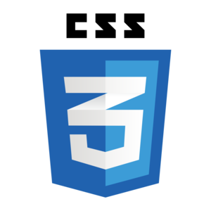

*Nota.* Obtenido de:
<https://lineadecodigo.com/wp-content/uploads/2014/04/css.png>

**JavaScript:** Es un lenguaje de programación orientado al desarrollo
web que permite incorporar dinamismo e interactividad en las páginas.
Gracias a JavaScript, es posible validar formularios, manipular
elementos del DOM, responder a eventos del usuario y mejorar la
experiencia general de navegación.

**Figura 4**\
*Logo de JavaScript*


*Nota.* Obtenido de:
<https://encrypted-tbn0.gstatic.com/images?q=tbn:ANd9GcRuHnJDLOcdm_0b6N6kNj-1OvO9KhKYgqIy0w&s>

**GIT:** Es un sistema de control de versiones ampliamente utilizado en
proyectos de software para registrar y administrar los cambios
realizados en el código fuente. Permite que varios desarrolladores
trabajen de manera colaborativa, manteniendo un historial detallado de
cada modificación. Al ser una herramienta distribuida, cada integrante
cuenta con una copia completa del repositorio en su equipo local.
Además, facilita la creación de ramas independientes para desarrollar
nuevas funcionalidades o corregir errores sin comprometer la versión
principal. Una vez finalizado el trabajo, los cambios pueden integrarse
de forma ordenada al proyecto principal.

**Figura 5**\
Logo de Git


*Nota.* Obtenido de:
<https://encrypted-tbn0.gstatic.com/images?q=tbn:ANd9GcSdd25hyNQOMs4Xx1Cv_A_oaT0zagfSWlXMBA&s>

**GITHUB:** Es una plataforma en la nube orientada al alojamiento de
repositorios Git, utilizada para almacenar, compartir y gestionar
proyectos de desarrollo de software. Proporciona herramientas para el
trabajo colaborativo como pull requests, revisión de código, control de
incidencias e integración continua. Asimismo, permite coordinar el
trabajo entre los miembros del equipo, mantener distintas versiones del
proyecto y conservar un historial completo de los avances realizados.

**Figura 6**\
*Logo de GitHub*

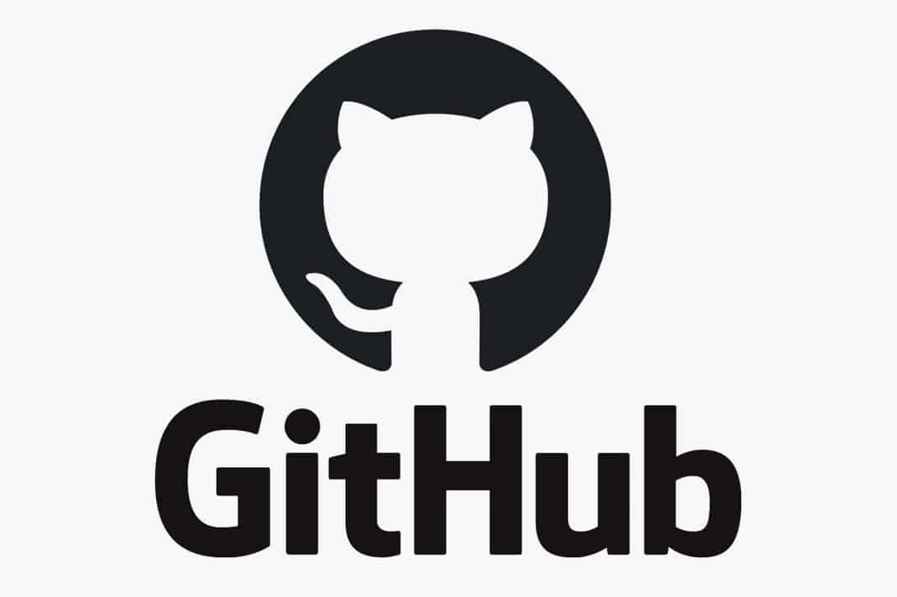

*Nota.* Obtenido de:
<https://encrypted-tbn0.gstatic.com/images?q=tbn:ANd9GcSuYIprEvJ5lj-58xOPTE1xD_DBgdbrNhicyg&s>

### 5.1.2. Source Code Management

Con el propósito de mantener un control adecuado del código fuente y
facilitar el trabajo colaborativo entre los integrantes del equipo, se
utilizará la plataforma **GitHub**. Esta herramienta permitirá
administrar los cambios realizados en el proyecto, revisar los commits
efectuados por cada integrante y mantener un historial ordenado del
desarrollo.

Asimismo, dentro de la organización se han creado repositorios
independientes, cada uno destinado a un producto específico:

- Repositorio correspondiente al informe del proyecto:
  https://github.com/Edu-VLL/AgroTrack.git
- Repositorio correspondiente a la landing page:
  https://github.com/AgroTrack-Project/Landing-Page.git

Para organizar el proceso de desarrollo y asegurar una integración
eficiente de los avances, se aplicará la metodología **GitFlow**, la
cual estructura el trabajo mediante ramas con responsabilidades
definidas.

**Ramas principales**

- **main**
  - Contiene la versión estable del proyecto.
  - Solo recibe cambios aprobados para producción.
  - Cada versión liberada seguirá el estándar **Semantic Versioning**.
- **develop**
  - Rama principal de desarrollo.
  - Integra nuevas funcionalidades y correcciones antes de pasar a
    producción.
  - Sirve como base para la creación de nuevas ramas de trabajo.

**Ramas de apoyo**

- **feature/**\*

  - Se crean desde `develop` para implementar nuevas funcionalidades o
    mejoras.
  - Convención de nombres:

  `feature/nombre-descriptivo`

  - Ejemplos:

  `feature/login-user`

  `feature/improve-navbar`

  - Una vez completadas, se integran nuevamente en `develop` mediante
    *pull request*.

- **release/**

  - Se crean cuando el proyecto está listo para preparar una nueva
    versión.
  - Permiten realizar ajustes finales, correcciones menores o cambios de
    documentación.
  - Convención de nombres:

  `release/version`

  - Ejemplo:

  `release/1.0.0`

- **hotfix/**\*

  - Se crean desde `main` para solucionar errores críticos detectados en
    producción.
  - Luego de la corrección, se integran tanto en `main` como en
    `develop`.

------------------------------------------------------------------------

**Conventional Commits**

Con el fin de mantener claridad y consistencia en el historial del
repositorio, los mensajes de commit seguirán la especificación
**Conventional Commits**.

Estructura general:

`<tipo>(<ámbito>): <descripción breve>`

Tipos utilizados:

- `feat`: nueva funcionalidad.
- `fix`: corrección de errores.
- `docs`: cambios en documentación.
- `style`: cambios visuales o de formato.
- `refactor`: mejora interna del código sin alterar funcionalidad.
- `test`: pruebas nuevas o modificadas.
- `chore`: tareas de mantenimiento general.

Ejemplos:

`feat(landing-page): add hero section`

`fix(navbar): correct responsive menu`

`docs(readme): update project structure`

\*\* Integrantes del equipo en GitHub \*\*

  User Name   Nombre Completo
  ----------- ---------------------------------------
  Delzekl     Martínez Gaona, Pablo Afranio
  DuDu-tech   Quispe Perez, Eder Edu
  elprrr      Alfaro Mallma, Alberto Joaquin
  Edu-VLL     Velasquez Laquihuanaco, Eduardo David
  Miler2003   Rodriguez Rojas, Miler Alexander

# 5.1.3. Source Code Style Guide & Coding Conventions

El equipo de AgroTrack adopta las siguientes convenciones de código para
garantizar consistencia, legibilidad y mantenibilidad en los
repositorios del proyecto. Todos los identificadores, comentarios y
documentación se redactan **en inglés**, sin excepción.

Para este primer avance, los lenguajes utilizados son HTML, CSS y
JavaScript, correspondientes al desarrollo de la Landing Page.

------------------------------------------------------------------------

**HTML**

Se adopta la **W3Schools HTML Style Guide and Coding Conventions** como
referencia principal, complementada con la **Google HTML/CSS Style
Guide**.

**Nomenclatura y estructura** - Los nombres de archivos HTML van en
`kebab-case`: `index.html`. - Los atributos se escriben siempre en
minúsculas: `class`, `id`, `href`, `src`, `type`, `aria-label`. - Se
usan comillas dobles para todos los valores de atributos:
`class="site-header"`. - La indentación es de **4 espacios**; no se usan
tabulaciones. - Se declara siempre el `DOCTYPE` y el atributo `lang` en
la etiqueta `<html>`: `<html lang="en">`. - Se usan elementos semánticos
de HTML5 en lugar de `<div>` genéricos cuando corresponde: `<header>`,
`<nav>`, `<main>`, `<section>`, `<footer>`. - El atributo `alt` es
obligatorio en todas las etiquetas ``. - Se evitan estilos en línea
(`style="..."`); todo estilo va en la hoja CSS externa
`css/style.css`. - Los atributos de accesibilidad (`aria-label`,
`aria-expanded`, `aria-controls`) se incluyen en todos los elementos
interactivos. - Los textos traducibles llevan el atributo `data-i18n`
con su clave correspondiente para el sistema i18n. - Los event listeners
se declaran en el archivo `js/script.js`; no se usan atributos `onclick`
en línea salvo en los botones que invocan funciones globales
(`toggleLanguage`, `toggleMobileMenu`). **Ejemplo --- estructura base
del proyecto:**

``` html
<!DOCTYPE html>
<html lang="en">
<head>
    <meta charset="UTF-8">
    <title>AgroTrack</title>
    <link rel="stylesheet" href="css/style.css">
</head>
<body>
<header class="site-header">
    <nav class="navbar">
        <a href="#" class="brand" aria-label="AgroTrack home">
            
        </a>
        <button
                class="hamburger-button"
                type="button"
                aria-label="Open navigation menu"
                aria-expanded="false"
                aria-controls="navCollapse"
                onclick="toggleMobileMenu()">
            <span></span>
            <span></span>
            <span></span>
        </button>
        <div class="nav-collapse" id="navCollapse">
            <div class="nav-menu">
                <a href="#features" data-i18n="nav.features">Features</a>
                <a href="#plans" data-i18n="nav.plans">Plans</a>
            </div>
            <div class="nav-actions">
                <button class="button-language header-language-button"
                        type="button"
                        onclick="toggleLanguage()"
                        aria-label="Toggle language">
                    <span class="language-icon" aria-hidden="true">🌐</span>
                    <span>EN | ES</span>
                </button>
                <a href="#" class="auth-button sign-in-button" data-i18n="nav.signIn">Sign in</a>
                <a href="#" class="auth-button sign-up-button" data-i18n="nav.signUp">Sign up</a>
            </div>
        </div>
    </nav>
</header>
<main>
    <section class="hero-section">
        <!-- section content -->
    </section>
</main>
<footer class="footer">
    <!-- footer content -->
</footer>
<script src="js/script.js"></script>
</body>
</html>
```

**Ejemplo --- sección con i18n y semántica correcta:**

``` html
<!-- Hero section -->
<section class="hero-section">
    <div class="hero-content">
        <div class="hero-text">
            <h1 class="hero-title">
                <span data-i18n="hero.titleLine1">Grow better with</span>
                <span class="hero-title-accent" data-i18n="hero.titleLine2">real data</span>
            </h1>
            <p class="hero-description" data-i18n="hero.description">
                AgroTrack helps you register your plots, monitor soil conditions,
                and receive clear irrigation recommendations.
            </p>
            <div class="hero-buttons">
                <a href="#plans" class="hero-primary-button">
                    <span data-i18n="hero.primaryCta">Get started now</span>
                    <span aria-hidden="true">→</span>
                </a>
                <a href="#demo" class="hero-secondary-button" data-i18n="hero.secondaryCta">
                    Request demo
                </a>
            </div>
        </div>
        <div class="hero-image-wrapper">
            
        </div>
    </div>
</section>
```

------------------------------------------------------------------------

**CSS**

Se adopta la **Google HTML/CSS Style Guide** como referencia principal.

**Nomenclatura** - Los selectores de clase usan `kebab-case`:
`.site-header`, `.hero-section`, `.plan-card`, `.feature-card`. - Los
identificadores (`id`) se reservan para anclas de navegación y elementos
únicos del DOM: `#features`, `#plans`, `#audience`, `#demo`,
`#navCollapse`, `#fullName`, `#email`. - No se usan estilos de `id` para
reglas CSS generales; se prefieren clases. - Los modificadores de estado
o variante se nombran con doble guion BEM: `.plan-card--active`,
`.hamburger-button.active`, `.nav-collapse.open`. - Las variables CSS
siguen el patrón `--descriptive-name` y se declaran en `:root`.
**Formato** - Cada declaración en su propia línea, con punto y coma al
final. - Un espacio entre el selector y la llave de apertura `{`. -
Indentación de **4 espacios**. - Las propiedades se ordenan siguiendo el
criterio: posicionamiento → modelo de caja → tipografía → visual →
miscelánea. - El uso de `!important` se evita; si es necesario, se
documenta con un comentario explicativo. - Los colores, tamaños y
espaciados reutilizables se definen como variables en `:root`.
**Variables globales (design tokens del proyecto):**

``` css
:root {
    --primary-green: #2D7A3A;
    --dark-green:    #2C3E2D;
    --soft-green:    #8FC594;
    --light-bg:      #F5F0E8;
    --white:         #FFFFFF;
    --soft-gray:     #ECE8E1;
    --text-muted:    #5F615C;
    --border-color:  #D9D9D9;
}
```

**Ejemplo --- navbar y header:**

``` css
.site-header {
    background-color: var(--soft-green);
    border-bottom: 2px solid rgba(44, 62, 45, 0.08);
    position: sticky;
    top: 0;
    z-index: 1000;
    overflow: visible;
}
 
.navbar {
    max-width: 1280px;
    margin: 0 auto;
    padding: 18px 42px;
    display: flex;
    align-items: center;
    justify-content: space-between;
    gap: 24px;
    flex-wrap: wrap;
    position: relative;
}
```

**Ejemplo --- botones con estados:**

``` css
.auth-button {
    min-width: 120px;
    min-height: 44px;
    padding: 10px 20px;
    border-radius: 10px;
    text-decoration: none;
    font-weight: 700;
    display: inline-flex;
    align-items: center;
    justify-content: center;
    transition: transform 0.2s ease, opacity 0.2s ease;
}
 
.auth-button:hover {
    transform: translateY(-1px);
    opacity: 0.92;
}
 
.sign-in-button {
    background-color: #DDE6D8;
    color: #1F2E1F;
}
 
.sign-up-button {
    background-color: var(--primary-green);
    color: var(--white);
}
```

**Ejemplo --- hamburger menu con animación de estado activo:**

``` css
.hamburger-button span {
    display: block;
    width: 22px;
    height: 2.5px;
    background-color: #1F2E1F;
    border-radius: 2px;
    transition: 0.25s ease;
}
 
.hamburger-button.active span:nth-child(1) {
    transform: translateY(8px) rotate(45deg);
}
 
.hamburger-button.active span:nth-child(2) {
    opacity: 0;
}
 
.hamburger-button.active span:nth-child(3) {
    transform: translateY(-8px) rotate(-45deg);
}
```

**Responsive design --- mobile-first con tres breakpoints:**

``` css
/* Tablet: ≤ 1024px */
@media (max-width: 1024px) {
    .navbar {
        padding: 16px 24px;
        justify-content: center;
    }
    .hero-section {
        padding: 60px 24px;
    }
}
 
/* Mobile: ≤ 768px */
@media (max-width: 768px) {
    .hamburger-button {
        display: flex;
    }
    .nav-collapse {
        display: none;
        position: absolute;
        top: calc(100% + 10px);
        right: 20px;
        width: min(320px, calc(100vw - 40px));
        background: #F5F0E8;
        border-radius: 18px;
        box-shadow: 0 16px 30px rgba(0, 0, 0, 0.12);
        padding: 16px;
        z-index: 1200;
        flex-direction: column;
    }
    .nav-collapse.open {
        display: flex;
    }
    .hero-content {
        flex-direction: column;
        text-align: center;
    }
}
 
/* Small mobile: ≤ 480px */
@media (max-width: 480px) {
    .hero-buttons {
        flex-direction: column;
        align-items: stretch;
    }
    .hero-primary-button,
    .hero-secondary-button {
        width: 100%;
    }
    .plan-card {
        min-width: 100%;
    }
}
```

------------------------------------------------------------------------

**JavaScript**

Se adopta la **Google JavaScript Style Guide** como referencia
principal.

**Nomenclatura** - Variables y funciones: `camelCase` →
`currentLanguage`, `toggleLanguage()`, `toggleMobileMenu()`. -
Constantes de datos: `camelCase` cuando es un objeto de configuración →
`translation`. - Archivos: `kebab-case` → `script.js`. **Convenciones
generales** - Se usa `let` para variables que cambian de valor (como
`currentLanguage`) y `const` para datos que no se reasignan (como el
objeto `translation`). - Se usan funciones declaradas con `function`
para las funciones globales invocadas desde el HTML (`toggleLanguage`,
`toggleMobileMenu`). - Las funciones se documentan con JSDoc indicando
tipo de parámetros y comportamiento. - Los comentarios de bloque
(`/** */`) se usan para describir el propósito de funciones y objetos
complejos. - Los comentarios en línea (`//`) explican el *por qué* de
una decisión, no el *qué* hace el código. - Los textos de la interfaz
nunca se escriben directamente en JS; se gestionan exclusivamente a
través del objeto `translation` usando claves `data-i18n`. **Ejemplo ---
sistema de internacionalización (i18n):**

``` javascript
/**
 * Current active language. Defaults to English.
 * @type {string}
 */
let currentLanguage = "en";
 
/**
 * Translation object containing all UI strings for each supported language.
 * Supported locales: en -> English, es_419 -> Spanish (Latin America).
 * To add new text, add the key in both locales and use data-i18n="key" in HTML.
 * @type {Object}
 */
const translation = {
    en: {
        // Navbar
        "nav.features": "Features",
        "nav.plans":    "Plans",
        "nav.forWho":   "For who",
        "nav.demo":     "Demo",
        "nav.signIn":   "Sign in",
        "nav.signUp":   "Sign up",
 
        // Hero section
        "hero.titleLine1":   "Grow better with",
        "hero.titleLine2":   "real data",
        "hero.description":  "AgroTrack helps you register your plots, monitor soil conditions, and receive clear irrigation recommendations.",
        "hero.primaryCta":   "Get started now",
        "hero.secondaryCta": "Request demo",
 
        // ... (resto de claves)
    },
    es_419: {
        // Navbar
        "nav.features": "Características",
        "nav.plans":    "Planes",
        "nav.forWho":   "Para quién",
        "nav.demo":     "Demo",
        "nav.signIn":   "Ingresar",
        "nav.signUp":   "Registrarse",
 
        // Hero section
        "hero.titleLine1":   "Cultiva mejor con",
        "hero.titleLine2":   "datos reales",
        "hero.description":  "AgroTrack te ayuda a registrar tus parcelas, monitorear el suelo y recibir recomendaciones claras de riego.",
        "hero.primaryCta":   "Comenzar ahora",
        "hero.secondaryCta": "Solicitar demo",
 
        // ... (resto de claves)
    }
};
 
/**
 * Toggles the page language between English and Spanish.
 * Updates all elements with data-i18n attribute and the HTML lang attribute
 * for screen readers (accessibility).
 */
function toggleLanguage() {
    // Switch between English and Spanish
    currentLanguage = currentLanguage === "en" ? "es_419" : "en";
 
    // Update HTML lang attribute for screen readers (a11y)
    document.documentElement.lang = currentLanguage === "en" ? "en" : "es";
 
    // Find all translatable elements and update their text
    const elements = document.querySelectorAll("[data-i18n]");
    elements.forEach(function (element) {
        const key = element.getAttribute("data-i18n");
        element.textContent = translation[currentLanguage][key];
    });
}
```

**Ejemplo --- menú hamburguesa con accesibilidad:**

``` javascript
/**
 * Toggles the mobile navigation menu open/closed.
 * Updates aria-expanded for screen reader compatibility.
 */
function toggleMobileMenu() {
    const navCollapse      = document.getElementById("navCollapse");
    const hamburgerButton  = document.querySelector(".hamburger-button");
 
    navCollapse.classList.toggle("open");
    hamburgerButton.classList.toggle("active");
 
    const isExpanded = navCollapse.classList.contains("open");
    hamburgerButton.setAttribute("aria-expanded", isExpanded ? "true" : "false");
}
 
/**
 * Resets the mobile menu state when the viewport is resized above 900px.
 * Prevents the menu from remaining open when switching to desktop view.
 */
window.addEventListener("resize", function () {
    const navCollapse     = document.getElementById("navCollapse");
    const hamburgerButton = document.querySelector(".hamburger-button");
 
    if (window.innerWidth > 900 && navCollapse && hamburgerButton) {
        navCollapse.classList.remove("open");
        hamburgerButton.classList.remove("active");
        hamburgerButton.setAttribute("aria-expanded", "false");
    }
});
```

# 5.1.4. Software Deployment Configuration

Esta sección describe la configuración y los pasos necesarios para
desplegar la Landing Page de AgroTrack a partir del repositorio de
código fuente.

**Repositorio:** <https://github.com/agrotrack-project/Landing-Page>\
**URL publicada:** <https://agrotrack-project.github.io/Landing-Page/>\
**Rama de producción:** `develop`

------------------------------------------------------------------------

**Landing Page**

**Stack:** HTML5 + CSS3 + JavaScript vanilla\
**Plataforma de despliegue:** GitHub Pages

**Estructura del repositorio**

    Landing-Page/
    ├── assets/
    │   ├── agrotrack-logo.png
    │   ├── cultivo-agotrack.png
    │   ├── logo-facebook.png
    │   ├── logo-instagram.png
    │   ├── logo-tiktok.png
    │   ├── testimonial1.jpg
    │   ├── testimonial2.jpg
    │   └── testimonial3.jpeg
    ├── css/
    │   └── style.css
    ├── js/
    │   └── script.js
    ├── .gitignore
    ├── LICENSE
    ├── README.md
    └── index.html

**Pasos de despliegue**

1.  Confirmar que la rama `develop` contiene la versión estable de la
    Landing Page y que `index.html` se encuentra en la raíz del
    repositorio.
2.  En el repositorio de GitHub, ir a **Settings → Pages**.
3.  En la sección **Build and deployment**, configurar:
    - **Source:** Deploy from a branch
    - **Branch:** `develop`
    - **Folder:** `/ (root)`
4.  Hacer clic en **Save**. GitHub Pages generará automáticamente la URL
    pública.
5.  Esperar entre 1 y 2 minutos y verificar que la página carga
    correctamente en:
    `https://agrotrack-project.github.io/Landing-Page/`
6.  Comprobar que el diseño responde correctamente en desktop (≥
    1025px), tablet (769--1024px) y móvil (≤ 768px).
7.  Verificar que el toggle de idioma (EN \| ES) funciona correctamente
    en todos los breakpoints. \### Actualizaciones posteriores

Cada `git push` a la rama `develop` desencadena un redespliegue
automático en GitHub Pages. No se requiere ninguna acción manual
adicional.

``` bash
# Flujo estándar para publicar cambios
git add .
git commit -m "feat: update hero section copy"
git push origin develop
```

GitHub Pages tomará los nuevos archivos y publicará la versión
actualizada en aproximadamente 1 minuto.

**Verificación post-despliegue**

Tras cada despliegue se recomienda verificar los siguientes puntos:

  -----------------------------------------------------------------------
  Verificación                        Detalle
  ----------------------------------- -----------------------------------
  Carga de assets                     Logo, imágenes de cultivo y fotos
                                      de testimonios visibles

  Navegación                          Links del navbar redirigen a las
                                      secciones correctas (`#features`,
                                      `#plans`, `#audience`, `#demo`)

  Toggle de idioma                    Cambia correctamente entre EN y ES
                                      en todos los textos con `data-i18n`

  Menú hamburguesa                    Se abre y cierra correctamente en
                                      móvil; desaparece en desktop

  Formulario de demo                  Los campos `fullName` y `email`
                                      tienen validación `required` activa

  Responsive                          Sin scroll horizontal en ningún
                                      breakpoint
  -----------------------------------------------------------------------

### 5.2.1 Sprint 1

El primer sprint se centrará en la implementación de las secciones de
Página de inicio, Servicios y Aplicaciones de AgroTrack. El objetivo es
crear una interfaz clara y funcional que presente la plataforma y sus
principales características a los agricultores y empresas agrícolas.

#### 5.2.1.1 Sprint Planning 1

Ahora, mostraremos nuestro sprint planning. En esta sección, vamos a
explicar la reunión inicial del sprint realizado, detallando lo que se
planeó, acordó y revisó en la reunión.

  ----------------------------------------------------------------------------------
  Sprint \#       Sprint 1
  --------------- ------------------------------------------------------------------
  Sprint Planning En el sprint decidimos reunirnos para verificar el progreso de
  Background      cada integrante y del proyecto desde el punto de vista grupal.
                  Luego de ello buscamos mejoras y nuevas acciones.

  Date            2025-04-18

  Time            21:05 PM

  Location        Google Meet Group Call

  Prepared By     Velasquez Laquihuanaco, Eduardo David

  Attendees       Martínez Gaona, Pablo Afranio `<br>`{=html} Quispe Perez, Eder Edu
                  `<br>`{=html} Rodriguez Rojas, Miler Alexander `<br>`{=html}
                  Alfaro Mallma, Alberto Joaquin

  Sprint Review   Revisamos nuestras metas del negocio, discutimos las user stories
  Summary         y dimos feedback. También revisamos riesgos futuros y el avance
                  individual y grupal.

  Sprint          **Start:** Debemos comunicarnos más entre nosotros. `<br>`{=html}
  Retrospective   **Continue:** Hacer preguntas al Product Owner. `<br>`{=html}
  Summary         **Stop:** Dejar tareas para último momento. `<br>`{=html}
                  **Continue:** Hacer preguntas al product owner hacer reuniones
                  interdiarias para priorizar el avance

  Sprint Goal &   
  User Stories    

  Spring n Goal   Our focus is on implementing the core functionalities of the
                  landing page and user registration module. We believe this
                  provides a clear access point and an organized onboarding
                  experience for farmers and agricultural businesses. This will be
                  validated when users are able to successfully enter the platform,
                  complete the registration process, and navigate smoothly to their
                  main dashboard to manage agricultural activities.

  Sprint n        4
  Velocity        

  Sum of Story    7
  Points          
  ----------------------------------------------------------------------------------

#### 5.2.1.2 Aspect Leaders and Collaborators.

| Team Member (Last Name, First Name)   | GitHub Username | Landing Page Leader (L) / Collaborator (C) | Documentation Leader (L) / Collaborator (C) | Epics Leader (L) / Collaborator (C) |
|---------------------------------------|-----------------|----------------------------------------|---|-------------------------------------|
| Alfaro Mallma, Alberto Joaquin        | elprrr          | C                                      | C | C                                   |
| Martínez Gaona, Pablo Afranio         | Delzekl         | C                                      | C | C                                   |
| Quispe Perez, Eder Edu                | DuDu-tech       | C                                      | C | C                                   |
| Rodriguez Rojas, Miler Alexander      | Miler2003       | C                                      | C | C                                   |
| Velasquez Laquihuanaco, Eduardo David | Edu-VLL         | L                                      | L | L                                   |


#### 5.2.1.3. Sprint Backlog 1

Durante este primer sprint, el objetivo principal del equipo es
desarrollar la Landing Page de AgroTrack. Para lograrlo, se definieron
tareas asociadas a cada historia de usuario relacionada con la Landing
Page, asignándolas a los integrantes del equipo. Además, para una mejor
organización y seguimiento del backlog, se utilizó la herramienta
"**Trello**".

**Figura**

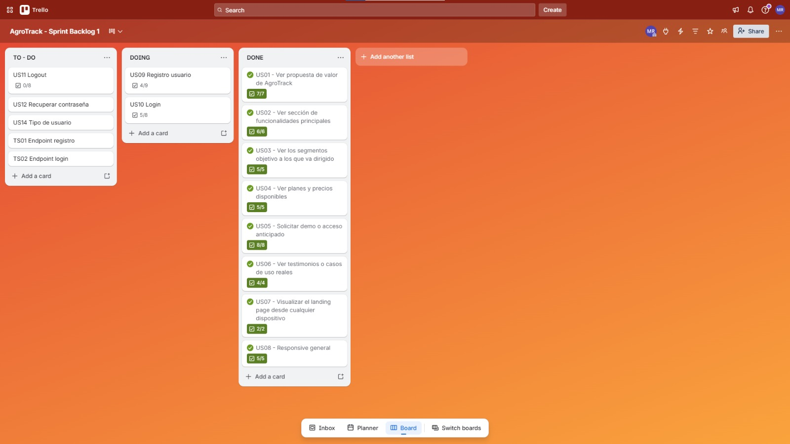

*Sprint 1 de AgroTrack*

*Nota* Elaboración propia. Obtenido de
https://trello.com/invite/b/69ec6b9c1f448409979be07f/ATTI57cb684f86da5dce34b16c20796587777599AEFD/agrotrack-sprint-backlog-1

 
#### 5.2.1.4  Development Evidence for Sprint Review

| Repository                                  | Branch  | Commit Id                                                           | Commit Message                                                                                                                                                                                                                                                                          | Body | Commited on (Date) |
|---------------------------------------------|---------|---------------------------------------------------------------------|-----------------------------------------------------------------------------------------------------------------------------------------------------------------------------------------------------------------------------------------------------------------------------------------|------|--------------------|
| Edu-VLL/AgroTack-Project-Landing-page       | develop | <br>23e7ffe<br/> <br>3c5e87e<br/> <br>2149b10<br/> <br>d00435b<br/> | <br> feat: Add plans seccion on Landing Page<br/>  <br> feat: Add button logic EN/ES and translate <br/> <br> feat: Add words in EN/ES for translate<br/> <br>Add html structure of demo form<br/>                                                                                      | - | 24/04/2025 |
| DuDu-tech/AgroTack-Project-Landing-page     | develop | <br>da737c7<br/>                                                    | <br> feat: add problem section on landing page <br/>                                                                                                                                                                                                                                    | - | 24/04/2025 |
| elprrr/AgroTack-Project-Landing-page        | develop | <br>6711fe9<br/> <br>2144fe2<br/>                                   | <br> feat(functions-section): add features grid section with soil, irrigation, weather and crop history cards <br/> <br> feat(segments-section): add target audience section with farmer and agricultural business owner profile cards <br/>                                                                                                                                                                                                                                   | - | 24/04/2025 |
| Miler2003/AgroTack-Project-Landing-page     | develop | <br>55db4bf<br/> <br>f28b50b<br/> <br>f26a98a<br/>                  | <br> feat: add footer section with navigation, social media, contact and footer links also added copyright and terms and conditions. <br/> <br> feat: add footer translation of english language strings and spanish language strings. <br/> <br> feat: add footer section styles <br/> | - | 24/04/2025 |
| Delzekl/AgroTack-Project-Landing-page       | develop | <br>039e4af<br/>                                                    | <br> feat: implement landing page hero section <br/>                                                                                                                                                                                                                                    | - | 24/04/2025 |

#### 5.2.1.5. Execution Evidence for Sprint Review

Fotos de la landing implementada y video que ilustre y explique la
visualización y navegación.


link de la landing: https://agrotrack-project.github.io/Landing-Page/

link del video:
https://upcedupe-my.sharepoint.com/:v:/g/personal/u20241a827_upc_edu_pe/IQCHKXSXfiGjTKYe4gDB3oUZAWgYlplm50CGrMfFiBHi4aI?e=fnoiA6&nav=eyJyZWZlcnJhbEluZm8iOnsicmVmZXJyYWxBcHAiOiJTdHJlYW1XZWJBcHAiLCJyZWZlcnJhbFZpZXciOiJTaGFyZURpYWxvZy1MaW5rIiwicmVmZXJyYWxBcHBQbGF0Zm9ybSI6IldlYiIsInJlZmVycmFsTW9kZSI6InZpZXcifX0%3D

#### 5.2.1.6. Services Documentation Evidence for Sprint Review

Durante este Sprint, el equipo de desarrollo se centró en definir la
visión inicial del backend de AgroTrack, estableciendo las bases
necesarias para el funcionamiento interno de la plataforma. Esta etapa
permitió organizar la estructura principal del sistema y proyectar cómo
se gestionará la información relacionada con las actividades agrícolas.

El backend de AgroTrack estará orientado a facilitar la administración
de procesos clave dentro del entorno agrícola, permitiendo un manejo más
ordenado de datos, recursos y operaciones diarias. Asimismo, servirá
como soporte para futuras funcionalidades que contribuirán a mejorar la
eficiencia y el control dentro de la plataforma.

Este avance representa un paso importante para el crecimiento del
proyecto, ya que permitirá consolidar una base sólida sobre la cual se
desarrollarán las siguientes etapas del sistema.

#### 5.2.1.7. Software Deployment Evidence for Sprint Review

Para llevar a cabo el deployment correspondiente a este sprint, se
realizaron diversas actividades orientadas a publicar y poner en
funcionamiento la landing page del proyecto. A continuación, se presenta
un resumen del proceso ejecutado.

La landing page fue desplegada como un sitio web público mediante
**GitHub Pages**, con el fin de que pueda ser accesible para cualquier
usuario. Como primer paso, se creó una cuenta en GitHub y se configuró
un repositorio público con el nombre asignado al proyecto.

Posteriormente, se cargaron los archivos desarrollados de la página web
dentro del repositorio. Luego, desde la sección de configuración, se
habilitó la opción de **GitHub Pages** para publicar el contenido en
línea.

Finalmente, se verificó el correcto funcionamiento del sitio web y su
disponibilidad en internet. En caso de requerir modificaciones o
mejoras, solo es necesario actualizar los archivos del repositorio para
que los cambios se reflejen nuevamente en la página publicada.

**Figura**\
*Evidencia de deployment 1*

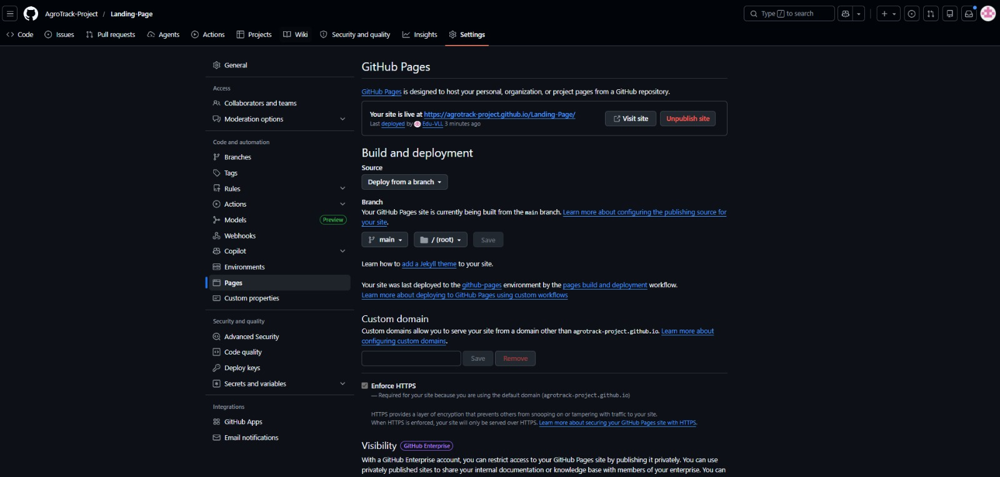

*Nota.* Elaboración propia.

**Figura**\
*Evidencia de deployment 2*


*Nota.* Elaboración propia.

#### 5.2.1.8 Team Collaboration Insights during Sprint


*Nota.* Elaboración propia.

# Conclusiones

El desarrollo de AgroTrack nos permitió entender con mayor claridad los
principales problemas que enfrentan los pequeños agricultores y
empresarios agrícolas en el Perú. Se evidenció que muchas de sus
decisiones todavía se basan en la experiencia o la intuición,
principalmente por la falta de herramientas digitales accesibles y de
información confiable para la gestión de sus cultivos. Esto termina
afectando directamente la productividad, el uso del agua y, en muchos
casos, las pérdidas económicas.

Durante el trabajo, el análisis de entrevistas, la revisión de
competidores y el uso de Lean UX nos ayudaron a confirmar que sí existe
una necesidad real por soluciones tecnológicas más simples y adaptadas
al contexto local. En ese sentido, AgroTrack surge como una alternativa
pensada para ser fácil de usar, accesible y útil desde el primer
momento, sin requerir conocimientos técnicos avanzados.

También fue importante el trabajo en equipo, ya que permitió organizar
mejor las ideas y darle forma a una propuesta más clara, alineada tanto
a lo que necesita el usuario como a los objetivos del proyecto. Esto
hizo posible construir una base sólida para el producto, sustentada en
información recogida directamente de los usuarios.

En general, se puede concluir que AgroTrack tiene potencial para generar
un impacto positivo en el sector agrícola, ayudando a mejorar la toma de
decisiones, optimizar recursos y hacer más eficiente el trabajo en el
campo. Sin embargo, su verdadero valor dependerá de seguir validándolo
con usuarios reales y de ir incorporando mejoras progresivas, como la
integración de sensores y datos en tiempo real.

# Bibliografía

        Agroptima. (s.f.). Agroptima: Software de gestión agrícola.
Recuperado el 26 de abril de 2026, de https://www.agroptima.com

        CropX Technologies. (s.f.). CropX agronomic farm management
system. Recuperado el 26 de abril de 2026, de https://www.cropx.com

        Google. (s.f.). Google HTML/CSS style guide.
https://google.github.io/styleguide/htmlcssguide.html

        Google. (s.f.). Google JavaScript style guide.
https://google.github.io/styleguide/jsguide.html

        Gothelf, J., & Seiden, J. (2021). Lean UX: Creating great
products with agile teams (3rd ed.). O'Reilly Media.

        Instituto Nacional de Estadística e Informática. (2012). IV
Censo Nacional Agropecuario 2012. Ministerio de Agricultura y Riego del
Perú.
https://www.inei.gob.pe/media/MenuRecursivo/publicaciones_digitales/Est/Lib1087/index.htm

        MDN Web Docs. (s.f.). CSS: Cascading Style Sheets. Mozilla.
https://developer.mozilla.org/en-US/docs/Web/CSS

        MDN Web Docs. (s.f.). HTML: HyperText Markup Language. Mozilla.
https://developer.mozilla.org/en-US/docs/Web/HTML

        MDN Web Docs. (s.f.). JavaScript reference. Mozilla.
https://developer.mozilla.org/en-US/docs/Web/JavaScript

        Ministerio de Agricultura y Riego. (2023). Plan estratégico
sectorial multianual del Ministerio de Agricultura y Riego 2022--2030.
Gobierno del Perú. https://www.midagri.gob.pe

        SpecFlow. (s.f.). Gherkin conventions for readable
specifications.
https://specflow.org/gherkin/gherkin-conventions-for-readable-specifications/

        Trimble Inc. (s.f.). Trimble agriculture: Precision farming
solutions. Recuperado el 26 de abril de 2026, de
https://agriculture.trimble.com

        W3Schools. (s.f.). HTML style guide and coding conventions.
https://www.w3schools.com/html/html5_syntax.asp
