### 4.1.1. General Style Guidelines

#### Branding

- **Nombre del producto:** AgroTrack
- **Tagline:** *Cultiva mejor con datos reales.*
- **Identidad visual:** AgroTrack busca transmitir confianza, cercanía y
  modernidad accesible para el agricultor peruano. La identidad visual
  combina elementos naturales (tierra, agua, cultivos) con una estética
  limpia y funcional, adaptada a usuarios con poca experiencia
  tecnológica.
- **Logo:** El logotipo está compuesto por un ícono que representa una
  hoja o planta estilizada acompañada del nombre "AgroTrack" en
  tipografía sans-serif legible, reflejando el equilibrio entre el campo
  y la tecnología.
- **Valores visuales:** Confianza, simplicidad, eficiencia y cercanía
  con el campo.


------------------------------------------------------------------------

#### Typography

- **Tipografía principal:** **Inter** (sans-serif), elegida por su alta
  legibilidad en pantallas, especialmente en dispositivos móviles con
  conectividad limitada. Usada en títulos y encabezados.
- **Tipografía secundaria:** **Roboto** (sans-serif), empleada en
  cuerpos de texto, etiquetas y elementos de interfaz por su claridad en
  tamaños pequeños.

**Jerarquía tipográfica:** \* **Títulos (H1):** 32--40 px \*
**Subtítulos (H2):** 24--28 px \* **Texto base:** 16 px \* **Botones y
etiquetas:** 14--16 px, en mayúsculas o negrita según jerarquía.

> **Principio aplicado:** Legibilidad máxima para usuarios con baja
> experiencia tecnológica, sin recursos decorativos que dificulten la
> lectura rápida en campo.

------------------------------------------------------------------------

#### Colors

La paleta cromática busca evocar el entorno natural del campo peruano
(tierra, vegetación y agua) combinada con tonos neutros que transmiten
confianza y claridad de información.

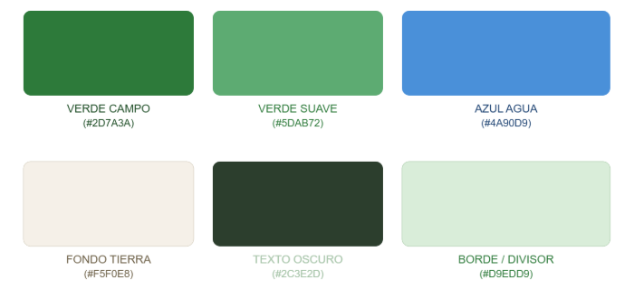

La tabla a continuación resume la paleta con su aplicación principal:

  --------------------------------------------------------------------------
  Tipo                 Nombre            Código            Aplicación
                                                           principal
  -------------------- ----------------- ----------------- -----------------
  **Primario**         Verde campo       `#2D7A3A`         Botones
                                                           principales,
                                                           íconos activos,
                                                           encabezados

  **Secundario**       Verde suave       `#5DAB72`         Estados
                                                           positivos,
                                                           confirmaciones,
                                                           alertas de riego
                                                           OK

  **Complementario**   Azul agua         `#4A90D9`         Indicadores de
                                                           humedad, datos
                                                           del suelo,
                                                           gráficos

  **Neutro claro**     Fondo tierra      `#F5F0E8`         Fondos de
                                                           páginas, tarjetas
                                                           de parcela

  **Neutro oscuro**    Texto oscuro      `#2C3E2D`         Texto principal y
                                                           encabezados

  **Borde/divisor**    Verde pálido      `#D9EDD9`         Líneas,
                                                           contenedores,
                                                           separadores
  --------------------------------------------------------------------------

*Figura 14. Paleta de colores institucional de AgroTrack. Nota.
Elaboración propia.*

------------------------------------------------------------------------

#### Spacing y Layout

- **Márgenes y paddings:** Uniformes (mínimo 16 px).
- **Bordes:** Redondeados entre **4--8 px** para suavizar la interfaz y
  dar sensación de accesibilidad.
- **Grillas:** Uso de sistema de grillas (*grid system*) adaptable a
  distintos tamaños de pantalla.
- **Distribución:**
  - **Mobile:** Una sola columna.
  - **Desktop:** Dos o tres columnas para optimizar legibilidad y ritmo
    visual.
- **Interactividad:** Especial atención al tamaño de los elementos
  interactivos (botones, campos) para facilitar el uso táctil en campo.

------------------------------------------------------------------------

#### Tone of Voice

- **Dimensión tonal:** Cercano, claro y alentador.
- **Lenguaje:** Directo, sencillo y sin tecnicismos, hablando el mismo
  idioma que el agricultor.
- **Estilo comunicativo:** Práctico y orientado a la acción, generando
  confianza inmediata desde el primer uso.

**Ejemplos de tono de acción:** \* *"Tu parcela necesita riego hoy."* \*
*"Registra tu cultivo en segundos."* \* *"Recibe alertas antes de que
llegue la helada."*

### 4.1.2. Web Style Guidelines

#### Diseño Responsivo

- **Breakpoints definidos:**
  - Móvil: ≤768 px
  - Tablet: 769--1024 px
  - Desktop: ≥1025 px


*Figura 15. Tamaños de Breakpoints definidos para AgroTrack. Nota.
Elaboración propia.*

- **Comportamiento adaptativo:**
  - En móvil, se prioriza la visualización vertical con menú hamburguesa
    y tarjetas de parcelas apiladas.
  - En desktop, se emplea una distribución horizontal con estructura de
    dos o tres columnas.
  - El diseño mantiene jerarquía visual y lenguaje cromático consistente
    en todos los dispositivos.

------------------------------------------------------------------------

#### Componentes Web

- **Botones (CTAs):**
  - **Primario:** Fondo verde `#2D7A3A`, texto blanco, borde redondeado
    (8--12 px).
  - **Secundario:** Fondo blanco, borde verde `#5DAB72`, texto verde.
  - **Estados:** *hover* (tono más oscuro), *active* (sombra ligera),
    *disabled* (opacidad reducida).


*Figura 16. Variantes de botones CTA de AgroTrack. Nota. Elaboración
propia.*

- **Formularios:**
  - Campos con bordes finos y feedback visual al error o validación.
  - Etiquetas visibles y mensajes de error en texto rojo o ícono de
    advertencia.
  - Campos de ingreso de datos del suelo (humedad, temperatura) con
    validación de rango inmediata.
- **Navegación:**
  - Barra superior fija (*sticky header*) con logo, enlaces principales
    y CTA de registro.
  - Menú desplegable para secciones secundarias.
  - En móvil, menú tipo hamburguesa con ícono fácilmente reconocible.
- **Cards (tarjetas de parcela):**
  - Secciones por parcela con nombre, cultivo activo, estado del suelo e
    última alerta.
  - Bordes suaves, sin sombra pesada, márgenes consistentes de 16 px.
  - Indicador de estado del suelo con color semántico: verde (normal),
    amarillo (atención), rojo (crítico).

------------------------------------------------------------------------

#### Interacción y Accesibilidad

- **Animaciones:** Transiciones suaves de 0.2 s para interacciones con
  botones o cambios de vista.
- **Indicadores de carga:** Ícono circular o barra de progreso visible
  durante procesos de espera.
- **Accesibilidad (WCAG 2.1):**
  - Contraste mínimo AA en texto e íconos.
  - Navegación mediante teclado.
  - Etiquetas alternativas (*alt text*) en imágenes y gráficos de
    parcelas.
- **Microinteracciones:** Animaciones sutiles al hacer clic y
  retroalimentación visual al confirmar una acción (p.ej. registro de
  riego exitoso).

# 4.2. Information Architecture

## 4.2.1. Organization Systems

El equipo de AgroTrack definió los sistemas de organización del
contenido considerando los dos segmentos objetivo ---agricultores y
empresarios agrícolas--- y la naturaleza de cada experiencia: Landing
Page y Web Application.

**Landing Page**\*

La Landing Page organiza su contenido de forma **secuencial
(top-to-bottom)**, guiando al visitante a través de un flujo narrativo
que va desde la presentación del problema hasta la conversión:

1.  Hero / Propuesta de valor
2.  Funcionalidades principales
3.  Segmentos objetivo (Agricultor / Empresario Agrícola)
4.  Planes y precios
5.  Testimonios
6.  Formulario de demo / CTA final Este orden responde a la lógica de
    persuasión progresiva: el visitante primero entiende el problema,
    luego ve la solución, se identifica con su perfil y, finalmente,
    toma acción. No se aplica organización matricial ni alfabética, ya
    que el contenido es narrativo y no enciclopédico.

La categorización del contenido se realiza **por audiencia**: cada
sección comunica diferencialmente a agricultores individuales y a
empresarios de PYMEs, usando ejemplos y lenguaje adaptado a cada perfil.

**Web Application**

Dentro de la aplicación web, se combinan tres esquemas de organización
según el tipo de información:

**Organización jerárquica (visual hierarchy)** Se aplica en el Dashboard
principal y en la vista de detalle de parcela. El contenido más crítico
(estado del suelo, alertas activas, recomendación de riego) ocupa la
posición y tamaño visual más prominente. Los datos secundarios
(historial, configuración de alertas) se muestran en niveles inferiores
de la jerarquía.

**Organización secuencial (step-by-step)** Se aplica en los flujos de
registro y configuración: - Registro de cuenta → selección de perfil →
acceso al dashboard - Creación de parcela → registro de cultivo →
ingreso de datos del suelo → recepción de recomendación - Solicitud de
demo desde la Landing Page (formulario en pasos) Este esquema es
especialmente importante para el segmento de agricultores, que puede
tener poca experiencia tecnológica y necesita una guía clara paso a
paso.

**Organización por tópicos** Se aplica en la navegación general de la
aplicación. El contenido se agrupa en módulos funcionales claramente
diferenciados: - Mis Parcelas - Mis Cultivos - Estado del Suelo -
Recomendaciones de Riego - Alertas Climáticas - Dashboard / Reportes
(exclusivo para Empresarios Agrícolas) **Organización cronológica** Se
aplica en secciones de historial, donde la información más reciente
siempre aparece primero: - Historial de registros del suelo - Historial
de cultivos anteriores - Historial de riegos aplicados - Historial de
alertas climáticas recibidas **Categorización por audiencia** El
dashboard y las funcionalidades disponibles varían según el tipo de
usuario seleccionado al registrarse. El perfil **Agricultor** accede a
vistas orientadas al registro y seguimiento de su parcela individual. El
perfil **Empresario Agrícola** accede adicionalmente a vistas de
rendimiento centralizado, métricas de pérdidas, consumo de agua por
temporada y exportación de reportes.

## 4.2.2. Labeling Systems

El equipo definió etiquetas breves, en lenguaje directo y sin
tecnicismos, alineadas con el tono de voz de AgroTrack: cercano, claro y
práctico. Se priorizó el uso de términos que el agricultor peruano
reconoce en su práctica cotidiana.

\*\*\* Etiquetas de Navegación Principal (Web Application) \*\*\*

  Sección                                           Etiqueta
  ------------------------------------------------- ------------------------------
  Vista general de todas las parcelas del usuario   **Mis Parcelas**
  Lista de cultivos activos por parcela             **Mis Cultivos**
  Registros de humedad y temperatura                **Estado del Suelo**
  Sugerencias de cuándo y cuánto regar              **Recomendaciones de Riego**
  Notificaciones de helada, sequía o lluvia         **Alertas Climáticas**
  Vista centralizada de métricas (Empresario)       **Panel de Control**
  Exportación de datos de producción                **Reportes**
  Datos personales y preferencias                   **Mi Perfil**
  Preferencias de notificaciones                    **Configuración**

\*\*\* Etiquetas de Acciones Principales (CTAs) \*\*\*

  -----------------------------------------------------------------------
  Acción                              Etiqueta
  ----------------------------------- -----------------------------------
  Crear una nueva parcela             **+ Nueva Parcela**

  Agregar un cultivo a una parcela    **+ Registrar Cultivo**

  Ingresar datos de humedad o         **Registrar Datos del Suelo**
  temperatura                         

  Marcar un cultivo como terminado    **Marcar como Cosechado**

  Aceptar una sugerencia de riego     **Confirmar Riego**

  Rechazar una sugerencia de riego    **No Aplicado**

  Descargar reporte en PDF o Excel    **Exportar Reporte**

  Completar formulario de contacto en **Solicitar Demo**
  Landing Page                        

  Crear cuenta                        **Crear Cuenta**

  Entrar a la plataforma              **Iniciar Sesión**

  Salir de la cuenta                  **Cerrar Sesión**
  -----------------------------------------------------------------------

\*\*\* Etiquetas de Estado del Suelo \*\*\*

Los indicadores visuales del estado de la parcela usan colores
semánticos (verde, amarillo, rojo) acompañados de etiquetas de texto
para garantizar accesibilidad:

  Estado                        Etiqueta                Color
  ----------------------------- ----------------------- -----------------
  Humedad entre 40 % y 70 %     **Normal**              Verde `#5DAB72`
  Humedad por debajo del 40 %   **Necesita Riego**      Amarillo
  Humedad por encima del 70 %   **Exceso de Humedad**   Rojo

\*\*\* Etiquetas de Tipo de Alerta Climática \*\*\*

  Evento                                  Etiqueta
  --------------------------------------- ----------------------
  Temperatura pronosticada \< 0 °C        **Riesgo de Helada**
  Ausencia de lluvias por más de 7 días   **Riesgo de Sequía**
  Precipitaciones intensas previstas      **Lluvias Intensas**

\*\*\* Etiquetas de Estado de Cultivo \*\*\*

  Estado                          Etiqueta
  ------------------------------- ----------------
  Cultivo en curso                **Activo**
  Cultivo terminado y cosechado   **Finalizado**

\*\*\* Etiquetas de Formularios y Campos \*\*\*

  -----------------------------------------------------------------------
  Campo                               Etiqueta
  ----------------------------------- -----------------------------------
  Nombre de la parcela                **Nombre**

  Extensión del terreno               **Tamaño (ha)**

  Coordenadas o lugar                 **Ubicación**

  Tipo de planta sembrada             **Tipo de Cultivo**

  Fecha de inicio de la siembra       **Fecha de Siembra**

  Porcentaje de agua en el suelo      **Humedad del Suelo (%)**

  Grados del suelo al momento del     **Temperatura del Suelo (°C)**
  registro                            

  Correo electrónico del usuario      **Correo**

  Clave de acceso                     **Contraseña**

  Tipo de cuenta del usuario          **Soy...** (`Agricultor` /
                                      `Empresario Agrícola`)
  -----------------------------------------------------------------------

\*\*\* Etiquetas de la Landing Page \*\*\*

  -----------------------------------------------------------------------
  Sección                             Etiqueta visible
  ----------------------------------- -----------------------------------
  Bloque principal con propuesta de   **Cultiva mejor con datos reales**
  valor                               

  Lista de funciones del producto     **¿Qué puedes hacer con
                                      AgroTrack?**

  Descripción de perfiles de usuario  **¿Para quién es AgroTrack?**

  Tabla de planes disponibles         **Planes y Precios**

  Opiniones de usuarios               **Lo que dicen nuestros usuarios**

  Formulario de interés               **Solicita tu demo gratuita**

  Enlace a registro                   **Empieza ahora**
  -----------------------------------------------------------------------

### 4.2.3 SEO Tags and Meta Tags

Los SEO Tags y Meta Tags de AgroTrack se definen con el objetivo de
mejorar la visibilidad del producto en motores de búsqueda y facilitar
que agricultores, empresarios agrícolas y visitantes interesados
comprendan rápidamente el propósito de la solución. Estos metadatos se
aplican tanto al Landing Page como a la futura Web Application,
manteniendo una comunicación clara, directa y alineada con la propuesta
de valor del producto: ayudar a tomar decisiones agrícolas con datos
reales, especialmente en el registro de parcelas, monitoreo del suelo,
recomendaciones de riego y alertas climáticas. AgroTrack está orientado
a pequeños agricultores y empresarios agrícolas del Perú que necesitan
herramientas simples para registrar sus cultivos, monitorear el estado
del suelo y tomar decisiones más informadas sobre el riego y la gestión
de sus parcelas. Esta orientación se basa en el perfil del producto,
definido como una plataforma web para registrar parcelas, ingresar
información de cultivos y recibir recomendaciones prácticas para
optimizar el riego.

#### **Landing Page SEO & Meta Tags**

La Landing Page tiene una finalidad informativa y comercial. Por ello,
los meta tags se enfocan en comunicar la propuesta de valor de
AgroTrack, presentar sus funcionalidades principales y atraer a
visitantes interesados en digitalizar la gestión agrícola.

``` html
<title>AgroTrack | Grow better with real data</title>

<meta
    name="description"
    content="AgroTrack helps farmers and agricultural SMEs register plots, monitor soil conditions, receive irrigation recommendations and manage climate alerts using real data."
/>

<meta
    name="keywords"
    content="AgroTrack, agriculture technology, smart farming, soil monitoring, irrigation recommendations, climate alerts, crop management, agricultural SMEs, farmers Peru"
/>

<meta name="author" content="Andes Smart Team" />

<meta name="robots" content="index, follow" />

<meta
    property="og:title"
    content="AgroTrack | Grow better with real data"
/>

<meta
    property="og:description"
    content="Register your plots, monitor soil conditions and receive clear irrigation recommendations with AgroTrack."
/>

<meta
    property="og:image"
    content="https://www.agrotrack.com/assets/agrotrack-og-image.jpg"
/>

<meta
    property="og:url"
    content="https://www.agrotrack.com"
/>

<meta property="og:type" content="website" />
```

------------------------------------------------------------------------

#### **Web Application SEO & Meta Tags**

La Web Application está orientada a usuarios registrados, como
agricultores y empresarios agrícolas. En este caso, los meta tags se
enfocan en la funcionalidad principal de la plataforma: gestión de
parcelas, cultivos, suelo, riego, alertas y reportes. Aunque muchas
pantallas internas pueden requerir autenticación, estos metadatos ayudan
a mantener una identidad clara del producto dentro del navegador y en
páginas públicas o accesibles desde la aplicación.

``` html
<title>AgroTrack | Agricultural management platform</title>

<meta
    name="description"
    content="Access AgroTrack to manage plots, crops, soil records, irrigation recommendations, climate alerts, dashboards and agricultural reports from one platform."
/>

<meta
    name="keywords"
    content="AgroTrack platform, plot management, crop tracking, soil records, irrigation schedule, weather alerts, agricultural dashboard, farming reports"
/>

<meta name="author" content="Andes Smart Team" />

<meta name="robots" content="index, follow" />

<meta
    property="og:title"
    content="AgroTrack | Agricultural management platform"
/>

<meta
    property="og:description"
    content="Manage your agricultural operation with plot tracking, soil monitoring, irrigation recommendations, climate alerts and reports."
/>

<meta
    property="og:image"
    content="https://app.agrotrack.com/assets/agrotrack-app-og-image.jpg"
/>

<meta
    property="og:url"
    content="https://app.agrotrack.com"
/>

<meta property="og:type" content="website" />
```

### 4.2.4 Searching Systems

Dentro de la plataforma AgroTrack, los sistemas de búsqueda han sido
diseñados para facilitar el acceso rápido y eficiente a la información
relacionada con la gestión agrícola. Debido al manejo constante de datos
vinculados con parcelas, alertas, usuarios, configuraciones y registros
operativos, se contempla un sistema de búsqueda que permita a los
usuarios localizar información relevante de manera inmediata y mantener
un control ordenado de sus actividades. El sistema permitirá realizar
búsquedas dentro de los distintos módulos de la plataforma mediante:

- Palabras clave (nombre de parcela, ubicación, tipo de registro, nombre
  de usuario o descripción relacionada).
- Filtros por categoría (parcelas, alertas, configuraciones, perfiles o
  registros administrativos).
- Estados del registro (activo, pendiente, completado o actualizado).
- Identificadores internos asociados a parcelas, usuarios o elementos
  registrados dentro del sistema.

Este sistema será especialmente útil para:

- Ahorrar tiempo en la localización de parcelas, configuraciones o
  registros específicos sin necesidad de navegar manualmente entre
  módulos.

- Encontrar rápidamente información relacionada con parcelas agrícolas,
  alertas emitidas o datos administrativos.

- Mejorar la organización operativa mediante el acceso inmediato a
  información previamente registrada.

- Facilitar la gestión diaria del usuario al mantener una navegación más
  ágil y ordenada dentro de la plataforma.

- Una vez realizada la búsqueda, los resultados se mostrarán de forma
  estructurada dentro de listas, tablas o formularios interactivos según
  el módulo correspondiente, permitiendo visualizar, editar o gestionar
  la información de acuerdo con los permisos asignados al usuario.

### 4.2.5 Navigation Systems

Para el sistema de navegación otorgamos libertad y facilidad al usuario
dentro de la plataforma con diversas interfaces de navegación:

***PRIMERA NAVEGACIÓN:*** Acceso a apartados para cada tipo de usuario y
herramientas de registro e inicio de sesión. Este navegador global se
encuentra en la parte superior de la pantalla permitiendo que el usuario
pueda acceder en todo momento a las funciones principales del sitio sin
la necesidad de scrollear.

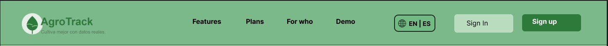

*Fuente: Propia.*

***SEGUNDA NAVEGACIÓN:*** Sección de registro continúa al apartado de
contenido principal. Esta sección de registro que va luego de que el
usuario haya visto el contenido principal del sitio, le ayuda a tomar
decisiones como agricultor.

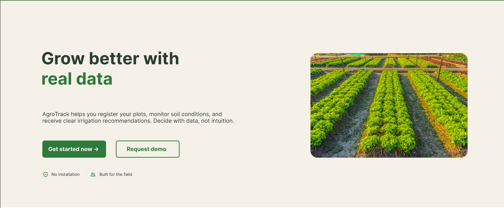

*Fuente: Propia.*

***TERCERA NAVEGACIÓN:*** Pie de página con información complementaria.
Esta sección reúne enlaces de interés tanto para agricultores como para
empresarios agrícolas, permitiendo que los usuarios que llegaron al
final del sitio continúen navegando fácilmente sin necesidad de regresar
al inicio.

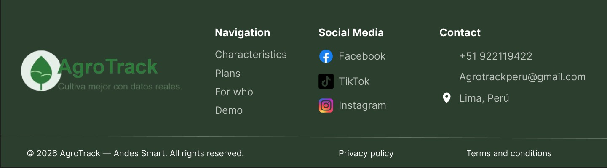

*Fuente: Propia.*

## 4.3. Landing Page UI Design

### 4.3.1. Landing Page Wireframe

Para la landing page se realizaron los Wireframes en figma de toda la
página web

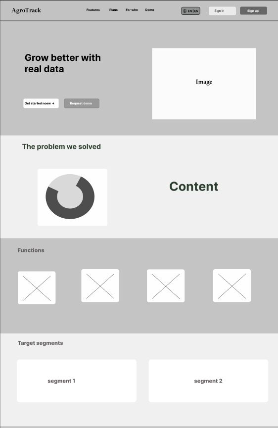 

*Nota: Elaboración propia. Elaborado en:
https://www.figma.com/design/tQSFHjZZpLcvBWkbzUfWLw/Untitled?node-id=0-1&p=f&t=rDZhOjwZFkCWZdXw-0*

### 4.3.2. Landing Page Mock-up

`<br>`{=html}

**Desktop Web Browser**

 

`<br>`{=html}

**Mobile Web Browser**

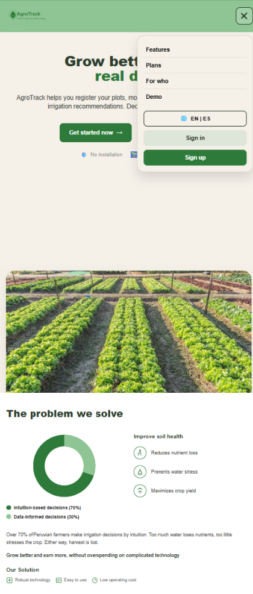  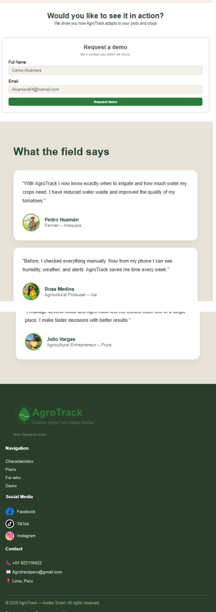

`<br>`{=html}

*Elaborado en:
https://www.figma.com/design/tQSFHjZZpLcvBWkbzUfWLw/Untitled?node-id=0-1&p=f&t=rDZhOjwZFkCWZdXw-0*

### 4.4.1. Web Applications Wireframes

    

### 4.4.2. Web Applications Wireflow Diagrams

Los Web Applications Wireflow Diagrams son representaciones visuales de
los flujos de navegación y la arquitectura de una aplicación web. Estos
diagramas combinan elementos de wireframes y diagramas de flujo para
proporcionar una vista general de cómo los usuarios navegarán a través
de la aplicación y cómo interactuarán con ella.

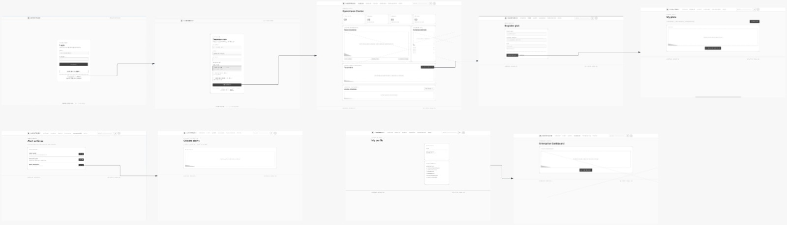

### 4.4.3. Web Applications Mock-ups

  


### 4.4.4. Web Applications User Flow Diagrams

El diagrama de flujo de usuario es una representación visual de los
pasos que un usuario sigue al interactuar con una aplicación o sitio
web. Muestra la secuencia de acciones que el usuario realiza para
completar una tarea específica, lo que nos ayuda a identificar posibles
puntos de fricción y a optimizar la experiencia del usuario.

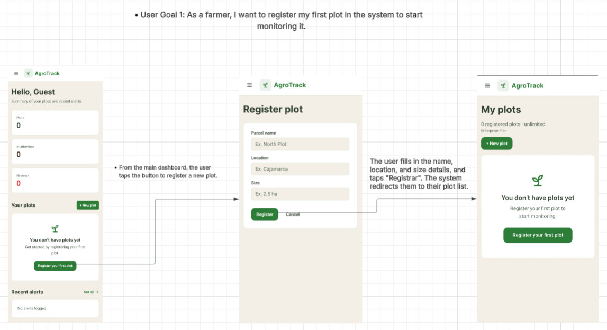  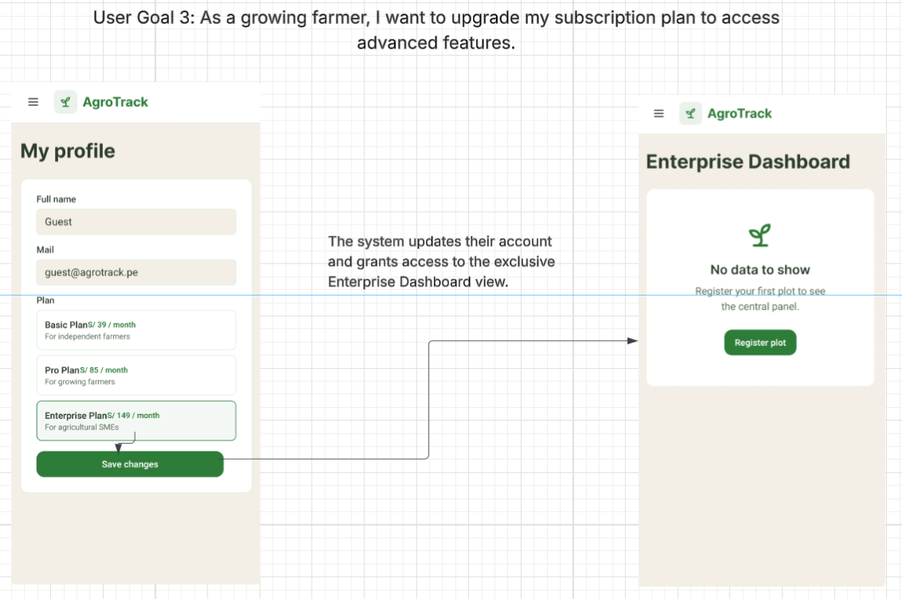

### 4.5. Web Applications Prototyping

Prototipo de la aplicación web AgroTrack en Figma:
[Prototipo-AgroTrack](https://www.figma.com/design/tQSFHjZZpLcvBWkbzUfWLw/Untitled?node-id=0-1&p=f&t=VDnBfHM1uPU4jdXO-0)

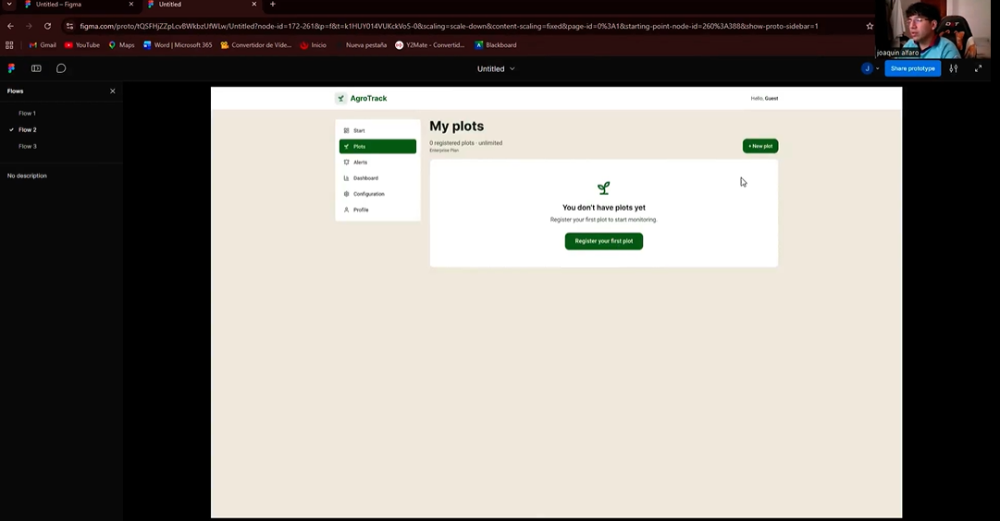

Video del flujo del prototipo:
[FLUJO-PROTOTIPO-AGROTRACK.mp4](https://upcedupe-my.sharepoint.com/:v:/g/personal/u20241a267_upc_edu_pe/IQBGdqAI0J_NR7IAsWPnBl3TAe0ieQNo8cg4MmurJ2Owfuc?e=2yMdi8&nav=eyJyZWZlcnJhbEluZm8iOnsicmVmZXJyYWxBcHAiOiJTdHJlYW1XZWJBcHAiLCJyZWZlcnJhbFZpZXciOiJTaGFyZURpYWxvZy1MaW5rIiwicmVmZXJyYWxBcHBQbGF0Zm9ybSI6IldlYiIsInJlZmVycmFsTW9kZSI6InZpZXcifX0%3D)

### 4.6. Domain-Driven Software Architecture.

En esta sección se presenta la arquitectura de software de AgroTrack
desde el enfoque de Domain-Driven Design, tomando como base el Big
Picture Event Storming desarrollado previamente. A partir de dicho
análisis, se identificaron eventos, comandos, actores y sistemas
externos relevantes para el dominio agrícola, como el registro de
usuarios, la creación de parcelas, el ingreso de datos del suelo, las
recomendaciones de riego y las alertas climáticas. Con esta información,
el sistema se organizará en Bounded Contexts que separan las principales
responsabilidades del producto, como autenticación, gestión de parcelas
y cultivos, monitoreo del suelo, recomendaciones climaticas y de riego y
reportes. Esta división permite representar con mayor claridad cada
parte del dominio y mantener relación con el lenguaje ubicuo definido
para AgroTrack, donde se incluyen términos como Plot, Crop, Soil
Moisture, Weather Alert e Irrigation Schedule.

### 4.6.1. Design-Level Event Storming.

**Identity & Access Management**

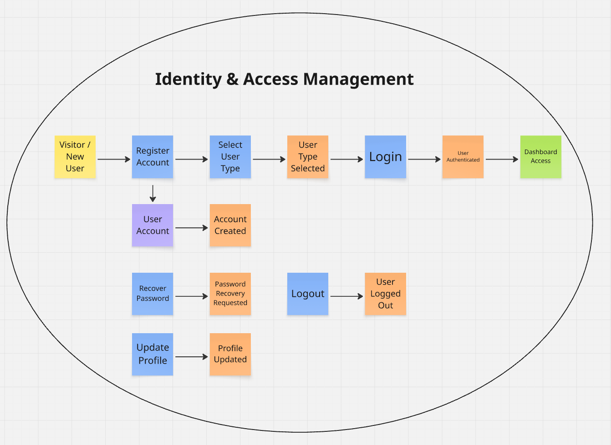

**Farm Management**

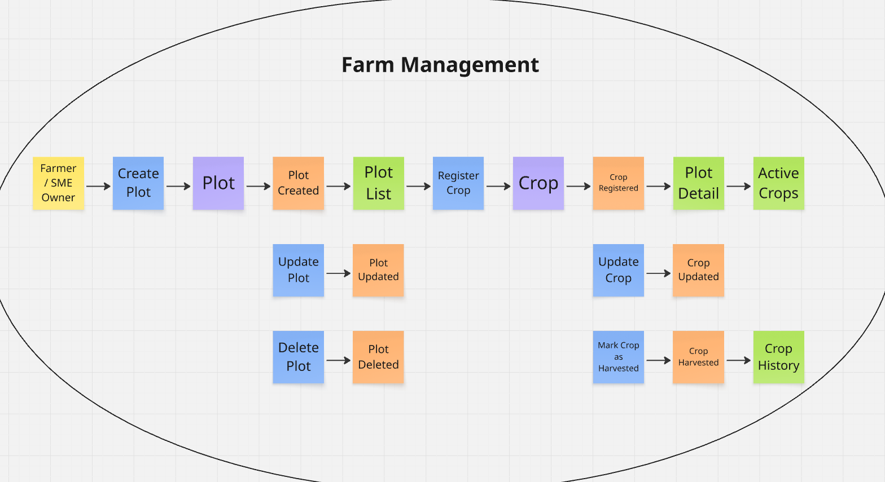

**Soil Monitoring**

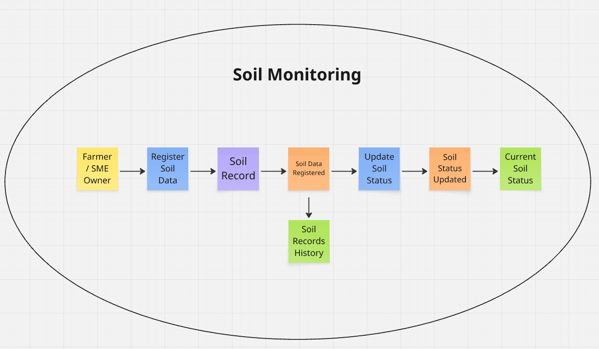

**Irrigation & Weather Advisory**

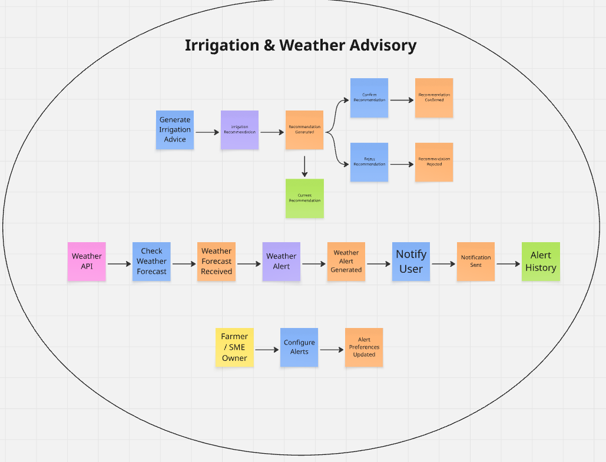

**Analytics & Reporting**

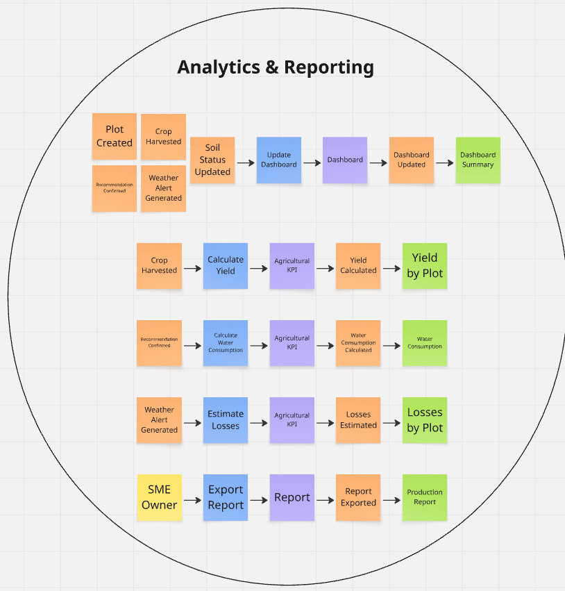

Miro:
https://miro.com/app/board/uXjVHcOGric=/?share_link_id=857544303236

### 4.6.2. Software Architecture Context Diagram.


### 4.6.3. Software Architecture Container Diagrams.

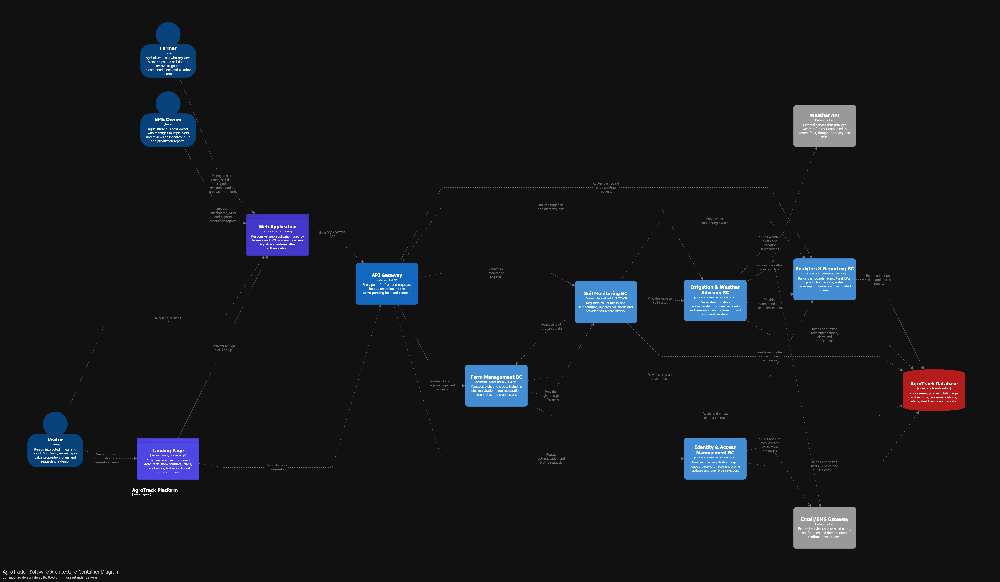

### 4.6.4. Software Architecture Components Diagrams.

**Identity & Access Management**


**Farm Management**


**Soil Monitoring**


**Irrigation & Weather Advisory**


**Analytics & Reporting**


## 4.7. Software Object-Oriented Design

### 4.7.1. Class Diagrams

``` plantuml
@startuml AgroTrack_ClassDiagram
 
'BOUNDED CONTEXT: User & Auth
package "Identity.domain.model" {
 
  interface Plan {
    +getMaxPlots() : int
    +getPrice() : double
    +isEnterpriseDashboardEnabled() : boolean
    +isExportEnabled() : boolean
    +isMultiUserEnabled(): boolean
    +hasPrioritySupport(): boolean
  }
 
  class BasicPlan {
    -price : double
    -maxPlots : int
    +getMaxPlots() : int
    +getPrice() : double
    +isEnterpriseDashboardEnabled() : boolean
    +isExportEnabled() : boolean
    +isMultiUserEnabled() : boolean
    +hasPrioritySupport() : boolean
  }
 
  class ProPlan
  {
    - price: double
    - maxPlots: int
    + getMaxPlots() : int
    + getPrice() : double
    + isEnterpriseDashboardEnabled(): boolean
    + isExportEnabled(): boolean
    + isMultiUserEnabled() : boolean
    + hasPrioritySupport() : boolean
  }
 
  class EnterprisePlan {
    -price : double
    -maxPlots : int
    +getMaxPlots() : int
    +getPrice() : double
    +isEnterpriseDashboardEnabled() : boolean
    +isExportEnabled() : boolean
    +isMultiUserEnabled(): boolean
    +hasPrioritySupport(): boolean
  }
 
  class TeamMemberId
  {
    *value: UUID
  }
  class TeamMember {
    *id : TeamMemberId
    -email : String
    -role : TeamRole
    -managerId : UserId
    -joinedAt : LocalDateTime
    +invite(email: String, role: TeamRole) : TeamMember
    +remove() : void
    +getRole() : TeamRole
    +getManagerId() : UserId
  }
 
  enum TeamRole {
    VIEWER
    EDITOR
  }
 
  class UserId
  {
    *value: UUID
  }
 
  abstract class User {
    *id : UserId
    #name : String
    -email : String
    -passwordHash : String
    #plan : Plan
    -createdAt : LocalDateTime
    -updatedAt : LocalDateTime
    +updateProfile(name: String, email: String) : void
    +changePlan(plan: Plan) : void
    +getId() : UserId
    +getEmail() : String
    +getPlan() : Plan
  }
 
  class Farmer {
    -plots : List<Plot>
    +getPlots() : List<Plot>
    +addPlot(plot: Plot) : void
    +removePlot(plotId: PlotId) : void
  }
 
  class AgriculturalManager {
    -companyName : String
    -managedPlots : List<Plot>
    +getDashboard() : Dashboard
    +exportReport(format: ReportFormat) : byte[]
    +getYieldSummary() : List<YieldSummary>
    +getLossSummary() : List<LossSummary>
    +getWaterConsumption() : List<WaterConsumption>
  }
 
  class AlertPreferenceId
  {
    *value: UUID
  }
 
  class AlertPreference {
    *id : AlertPreferenceId
    -userId : UserId
    -frostEnabled : boolean
    -droughtEnabled : boolean
    -heavyRainEnabled : boolean
    +update(frost: boolean, drought: boolean, rain: boolean) : void
    +isEnabled(type: AlertType) : boolean
    +getUserId() : UserId
  }
 
  AlertPreference o--> "1" AlertPreferenceId : has >
  TeamMember o--> "1" TeamMemberId : has >
  User o--> "1" UserId : has >
  User <|-- Farmer
  User <|-- AgriculturalManager
  Plan <|.. BasicPlan
  Plan <|.. ProPlan
  Plan <|.. EnterprisePlan
  User "1" --> "1" Plan : subscribes to >
  User "1" *-- "0..1" AlertPreference : configures >
  AgriculturalManager "1" *-- "0..*" TeamMember: manages>
  TeamMember "1" --> "1" TeamRole : has>
}
 
 
' Support
package Support.domain.model{
 
    class SupportTicketId
    {
        *value: UUID
    }
    class SupportTicket {
      *id : SupportTicketId
      -userId : UserId
      -subject : String
      -message : String
      -status : TicketStatus
      -createdAt : LocalDateTime
      -respondedAt : LocalDateTime
      +create(subject: String, message: String) : SupportTicket
      +close() : void
      +getId() : SupportTicketId
      +getStatus() : TicketStatus
    }
 
    enum TicketStatus {
      OPEN
      IN_PROGRESS
      CLOSED
    }
    SupportTicket o--> "1" SupportTicketId : has >
    SupportTicket "1" --> "1" TicketStatus : has >
}
 
 
' BOUNDED CONTEXT: Plot & Crop
 
package "Plot & Crop.domain.model" {
 
  enum PlotStatus {
    ACTIVE
    INACTIVE
    DELETED
  }
 
  enum CropStatus {
    ACTIVE
    HARVESTED
    LOST
  }
 
  class PlotId
  {
    *value: UUID
  }
 
  class Plot {
    *id: PlotId
    -name : String
    -location : String
    -sizeHectares : double
    -status : PlotStatus
    -userId : UserId
    -createdAt : LocalDateTime
    +register(name: String, location: String, size: double) : Plot
    +update(name: String, location: String, size: double) : void
    +delete() : void
    +getId() : PlotId
    +getName() : String
    +getStatus() : PlotStatus
    +getActiveCrops() : List<Crop>
    +getCropHistory() : List<Crop>
    +getCurrentSoilStatus() : SoilStatus
  }
 
  class CropId
  {
    *value: UUID
  }
 
  class Crop {
    *id : CropId
    -type : String
    -sowingDate : LocalDate
    -harvestDate : LocalDate
    -status : CropStatus
    -plotId : PlotId
    +register(type: String, sowingDate: LocalDate, plotId: PlotId) : Crop
    +update(type: String, sowingDate: LocalDate) : void
    +markAsHarvested(harvestDate: LocalDate) : void
    +getId() : CropId
    +getType() : String
    +getStatus() : CropStatus
    +isActive() : boolean
  }
 
  Crop o--> "1" CropId : has >
  Plot o--> "1" PlotId : has >
  Plot "1" --> "1" PlotStatus : has >
  Plot "1" *-- "0..*" Crop : contains >
  Crop "1" --> "1" CropStatus : has >
}
 
 
' BOUNDED CONTEXT: Soil Monitoring
 
package "Soil Monitoring.domain.model" {
 
  enum SoilStatus {
    LOW
    NORMAL
    HIGH
  }
 
  enum UrgencyLevel {
    LOW
    MEDIUM
    HIGH
    CRITICAL
  }
 
  enum RecommendationStatus {
    PENDING
    CONFIRMED
    REJECTED
  }
 
  enum ScheduleStatus {
    PENDING
    COMPLETED
    SKIPPED
  }
 
  class SoilRecordId
  {
    *value: UUID
  }
 
  class SoilRecord {
    *id : SoilRecordId
    -humidity : double
    -temperature : double
    -recordedAt : LocalDateTime
    -plotId : PlotId
    +register(humidity: double, temperature: double, plotId: PlotId) : SoilRecord
    +getId() : SoilRecordId
    +getHumidity() : double
    +getTemperature() : double
    +getRecordedAt() : LocalDateTime
    +getSoilStatus() : SoilStatus
  }
 
  class IrrigationRecommendationId
  {
    *value: UUID
  }
 
  class IrrigationRecommendation {
    *id : IrrigationRecommendationId
    -message : String
    -urgency : UrgencyLevel
    -status : RecommendationStatus
    -plotId : PlotId
    -generatedAt : LocalDateTime
    -respondedAt : LocalDateTime
    +generate(soilRecord: SoilRecord) : IrrigationRecommendation
    +confirm() : void
    +reject() : void
    +getId() : IrrigationRecommendationId
    +getStatus() : RecommendationStatus
    +getUrgency() : UrgencyLevel
  }
 
  class IrrigationScheduleId
  {
    *value:UUID
  }
 
  class IrrigationSchedule {
    *id : IrrigationScheduleId
    -suggestedAt : LocalDateTime
    -durationMinutes : int
    -plotId : PlotId
    -status : ScheduleStatus
    +create(plotId: PlotId, suggestedAt: LocalDateTime) : IrrigationSchedule
    +getId() : IrrigationScheduleId
    +getSuggestedAt() : LocalDateTime
    +getStatus() : ScheduleStatus
  }
 
  interface RecommendationEngine {
    +evaluate(soilRecord: SoilRecord) : IrrigationRecommendation
    +generateSchedule(plot: Plot) : IrrigationSchedule
  }
 
  class SoilBasedRecommendationEngine {
    -lowThreshold : double
    -highThreshold : double
    +evaluate(soilRecord: SoilRecord) : IrrigationRecommendation
    +generateSchedule(plot: Plot) : IrrigationSchedule
    -classifyHumidity(humidity: double) : SoilStatus
    -calculateUrgency(humidity: double) : UrgencyLevel
  }
 
 
  IrrigationSchedule o--> "1" IrrigationScheduleId : has >
  IrrigationRecommendation o--> "1" IrrigationRecommendationId : has >
  SoilRecord o--> "1" SoilRecordId : has >
  SoilRecord "1" --> "1" SoilStatus : evaluates to >
  IrrigationRecommendation "1" --> "1" RecommendationStatus : has >
  IrrigationRecommendation "1" --> "1" UrgencyLevel : has >
  IrrigationSchedule "1" --> "1" ScheduleStatus : has >
  RecommendationEngine <|.. SoilBasedRecommendationEngine
  SoilBasedRecommendationEngine ..> SoilRecord : uses >
  SoilBasedRecommendationEngine ..> IrrigationRecommendation : produces >
  SoilBasedRecommendationEngine ..> IrrigationSchedule : produces >
  SoilBasedRecommendationEngine ..> SoilStatus : uses >
  SoilBasedRecommendationEngine ..> UrgencyLevel : uses >
}
 
 
' BOUNDED CONTEXT: Climate Alerts
 
package "Climate Alerts.domain.model" {
 
  enum AlertType {
    FROST
    DROUGHT
    HEAVY_RAIN
  }
 
  enum AlertStatus {
    ACTIVE
    DISMISSED
    EXPIRED
  }
 
  class ClimateAlertId
  {
    *value: UUID
  }
 
  class ClimateAlert {
    *id : ClimateAlertId
    -type : AlertType
    -description : String
    -alertDate : LocalDate
    -status : AlertStatus
    -plotId : PlotId
    +create(type: AlertType, plotId: PlotId) : ClimateAlert
    +dismiss() : void
    +getId() : ClimateAlertId
    +getType() : AlertType
    +getStatus() : AlertStatus
  }
 
  class WeatherForecast {
    -location : String
    -minTemperature : double
    -maxTemperature : double
    -precipitationMm : double
    -daysWithoutRain : int
    -forecastDate : LocalDate
    +getMinTemperature() : double
    +getPrecipitationMm() : double
    +getDaysWithoutRain() : int
    +hasFrostRisk() : boolean
    +hasDroughtRisk() : boolean
    +hasHeavyRainRisk() : boolean
  }
 
  interface WeatherService {
    +getForecast(location: String) : WeatherForecast
    +checkFrostRisk(location: String) : boolean
    +checkDroughtRisk(location: String) : boolean
    +checkHeavyRainRisk(location: String) : boolean
  }
 
  ClimateAlert o--> "1" ClimateAlertId : has >
  ClimateAlert "1" --> "1" AlertType : has >
  ClimateAlert "1" --> "1" AlertStatus : has >
  WeatherService ..> WeatherForecast : returns >
  WeatherForecast ..> ClimateAlert : triggers >
  AlertPreference ..> AlertType : filters >
}
 
 
' BOUNDED CONTEXT: Enterprise Dashboard
 
package "Enterprise Dashboard.domain.model" {
 
  class Dashboard {
    -plots : List<Plot>
    -yieldSummaries : List<YieldSummary>
    -lossSummaries : List<LossSummary>
    -waterConsumptions : List<WaterConsumption>
    +getPlotsSummary() : List<Plot>
    +getYieldSummary() : List<YieldSummary>
    +getLossSummary() : List<LossSummary>
    +getWaterSummary() : List<WaterConsumption>
    +exportPDF() : byte[]
    +exportExcel() : byte[]
  }
 
  class YieldSummary {
    -plotId : PlotId
    -plotName : String
    -yieldPerHectare : double
    -season : String
    +getPlotId() : PlotId
    +getYieldPerHectare() : double
    +getSeason() : String
  }
 
  class LossSummary {
    -plotId : PlotId
    -plotName : String
    -lossPercentage : double
    -cause : String
    +getPlotId() : PlotId
    +getLossPercentage() : double
    +getCause() : String
  }
 
  class WaterConsumption {
    -plotId : PlotId
    -plotName : String
    -totalLiters : double
    -season : String
    +getPlotId() : PlotId
    +getTotalLiters() : double
    +getSeason() : String
  }
 
  User "1" ..> "0..1" Dashboard: Accesses if the plan is suitable
  Dashboard "1" *-- "0..*" YieldSummary : contains >
  Dashboard "1" *-- "0..*" LossSummary : contains >
  Dashboard "1" *-- "0..*" WaterConsumption : contains >
}
 
 
' RELACIONES ENTRE BOUNDED CONTEXTS
 
Farmer "1" --> "0..*" Plot : owns >
AgriculturalManager "1" --> "0..*" Plot : manages >
Plot "1" *-- "0..*" SoilRecord : records >
Plot "1" *-- "0..*" IrrigationRecommendation : receives >
Plot "1" *-- "0..*" IrrigationSchedule : schedules >
Plot "1" *-- "0..*" ClimateAlert : receives >
User "1" --> "0..*" SupportTicket: creates >
@enduml
```

## 4.8. Database Design.

### 4.8.1. Database Diagrams.

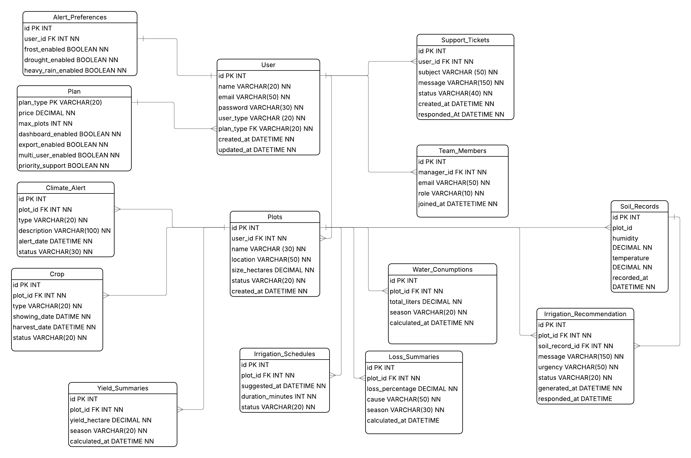
