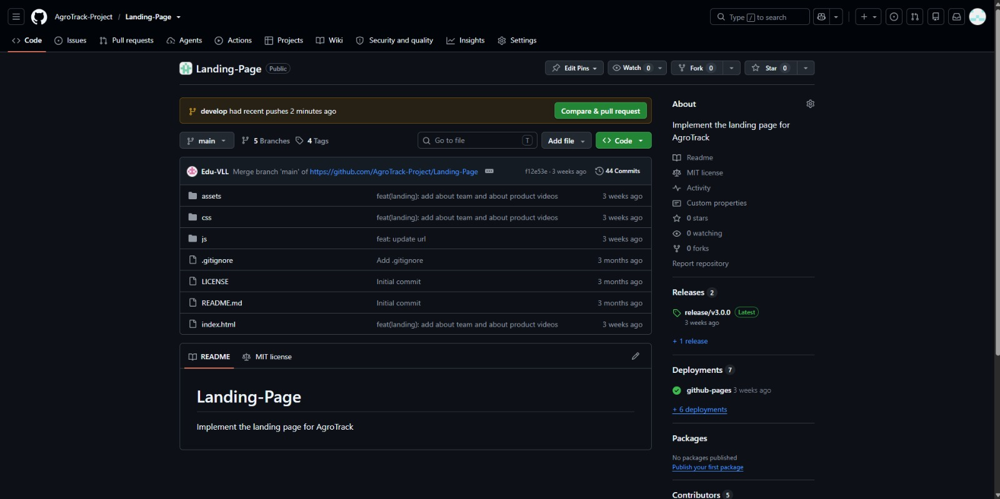
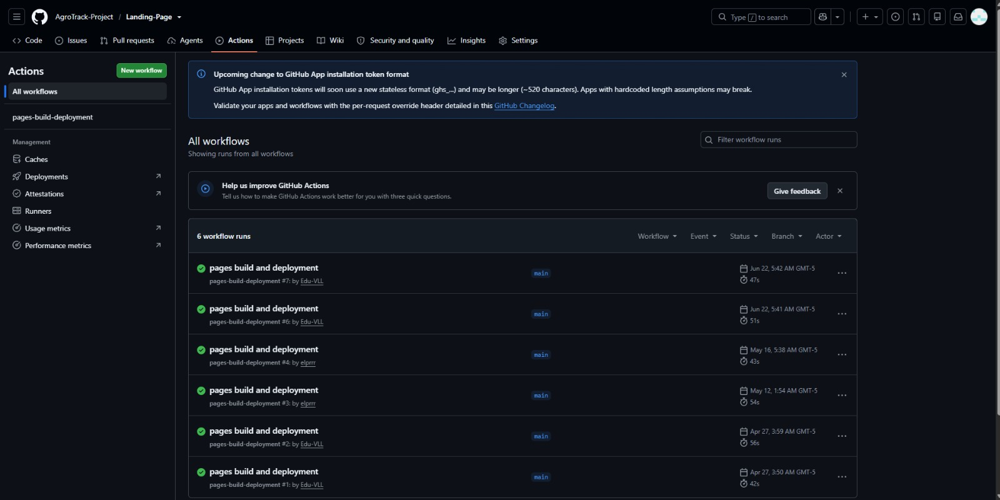
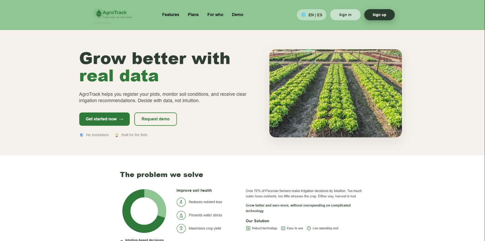

#### 5.2.4.7. Software Deployment Evidence for Sprint Review.

En el transcurso del Sprint 4, el equipo verificó, actualizó y validó el despliegue productivo de los tres productos que conforman la solución: el **Web Service de AgroTrack**, el **Landing Page** y la **Web Application**. Se confirmó la estabilidad de la infraestructura configurada en sprints previos y se aplicaron los ajustes necesarios derivados de las nuevas funcionalidades implementadas en este sprint. Se mantuvo el uso de **Aiven** para la base de datos MySQL, **Render** para el backend, **GitHub Pages** para el Landing Page y **Cloudflare Workers** para la Web Application.

---

 

**Fase 1: Verificación y ajuste de la base de datos en Aiven (MySQL)**

Ingreso al panel de administración de Aiven (aiven.io) para validar la continuidad operativa del servicio de base de datos utilizado por el backend durante este sprint.

 

Verificación del estado del servicio `mysql-58d1d5c` en el dashboard de Aiven, confirmando que continuaba con estado **Running** en la infraestructura de DigitalOcean, región California, bajo el plan **Free-1-1gb**, sin incidencias reportadas durante el periodo del sprint.

 

Revisión del apartado Services de Aiven para descartar la necesidad de aprovisionar servicios adicionales, dado que el esquema existente soportaba adecuadamente las nuevas entidades incorporadas al modelo de datos.

 

Confirmación del motor de base de datos en uso, **MySQL**, como sustento relacional para las nuevas tablas y relaciones incorporadas al esquema durante el Sprint 4.

 

Revisión del plan de servicio contratado, manteniéndose el tier **Free** ($0/mes), región **North America**, plan **Free-1-1gb**, validando que la capacidad de almacenamiento (1 GB) seguía siendo suficiente para el volumen de datos generado hasta la fecha.

 

Actualización de las credenciales de conexión utilizadas por el backend: host `mysql-58d1d5c-joaquinaso5612-e97f.a.aivencloud.com`, puerto `27774`, usuario `avnadmin`, modo SSL `REQUIRED`, reconfirmando su vigencia como variables de entorno en el servicio desplegado en Render.

---

 

**Fase 2: Actualización del despliegue del API REST en Render**

Ingreso a la plataforma Render (render.com) para gestionar la nueva versión del backend correspondiente a los avances del Sprint 4.

 

Revisión del historial de despliegues del servicio **AGOTRACK**, confirmando que el runtime **Docker** en la región **Ohio** continuaba operativo tras la incorporación de los nuevos endpoints (status: Deployed).

 

Verificación del estado general del proyecto en Render, donde el panel "My project" reportaba "All services are up and running", validando la disponibilidad continua de todos los servicios asociados.

 

Revisión de la configuración de disparadores de despliegue automático (auto-deploy) desde el branch `main`, confirmando que los últimos merges de features del Sprint 4 dispararon correctamente un nuevo build.

 

Inspección del repositorio vinculado **BACKEND-AGROTRACK**, confirmando que el commit más reciente correspondiente a las funcionalidades del Sprint 4 fue tomado correctamente por Render para el nuevo build.

 

Revisión de la configuración del Web Service: runtime, branch de despliegue (`main`) y región de hosting (**Ohio, US East**), sin cambios respecto a la configuración base, dado que la infraestructura existente soportaba los nuevos requerimientos.

 

Verificación del plan de instancia activo, manteniéndose el plan **Free** (512 MB RAM, 0.1 CPU, $0/mes), suficiente para las necesidades del entorno de demostración en esta etapa del proyecto.

 

Actualización de las variables de entorno del servicio para incorporar nuevos parámetros requeridos por las funcionalidades del Sprint 4, manteniendo `DB_URL`, `DB_USERNAME`, `DB_PASSWORD` y `OPENWEATHER_API_KEY`, y ejecutando un nuevo despliegue mediante **Manual Deploy**.

 

Confirmación del nuevo build en estado **Live**, validando que el backend actualizado quedó disponible públicamente con las funcionalidades incorporadas en el Sprint 4 y el auto-deploy habilitado desde `main`.

---

 

**Fase 3: Actualización del despliegue del Landing Page en GitHub Pages**

Se verificó el repositorio **Landing-Page** dentro de la organización **AgroTrack-Project**, confirmando que la rama `develop` recibió pushes recientes con los últimos ajustes visuales y de contenido correspondientes al Sprint 4, y que la rama `main` mantenía integrados los cambios de las carpetas `assets`, `css` y `js`, junto con 44 commits acumulados, 4 tags y 2 releases publicados (siendo `release/v3.0.0` la versión vigente).

 

Ingreso a la sección **Actions** del repositorio para revisar la ejecución del workflow **pages-build-deployment**, encargado de automatizar la publicación del sitio estático. Se confirmó que las 6 ejecuciones registradas finalizaron de manera exitosa sobre el branch `main`, incluyendo las dos corridas más recientes generadas a raíz de los últimos cambios incorporados al Landing Page durante este sprint.

 

Verificación del sitio publicado en producción mediante **GitHub Pages**, confirmando la correcta visualización de la sección hero ("Grow better with real data"), la propuesta de valor del producto, los botones de llamada a la acción (Get started now / Request demo) y la sección "The problem we solve", validando que el contenido, los estilos y las imágenes se cargaran correctamente en el entorno desplegado.

---

 

**Fase 4: Verificación del despliegue de la Web Application en Cloudflare Workers**

Como parte del Sprint 4, se verificó y actualizó el despliegue de la Web Application de AgroTrack, previamente publicada en el Sprint 2 sobre la plataforma **Cloudflare Workers**. Se confirmó que las ramas feature de los integrantes del equipo con las nuevas funcionalidades del sprint fueron integradas a la rama `develop` mediante pull requests revisados por el Team Leader, y posteriormente fusionadas hacia `main` para disparar una nueva publicación del entorno de producción.

Se comprobó el correcto funcionamiento de las vistas actualizadas desde distintos dispositivos, validando que los módulos de gestión de parcelas, cultivos, monitoreo del suelo, alertas climáticas y perfil de usuario continuaran operando correctamente en producción tras la incorporación de los cambios del Sprint 4.

**Repositorio Frontend Web Application:**
[https://github.com/AgroTrack-Project/web-Application](https://github.com/AgroTrack-Project/web-Application)

**URL de la Web Application desplegada:**
[https://agro-track.andessmart.workers.dev/home](https://agro-track.andessmart.workers.dev/home)

 

**Figura**
*Evidencia de deployment 1*

*Nota.* Elaboración propia.

**Figura**
*Evidencia de deployment 2*

*Nota.* Elaboración propia.

**Figura**
*Evidencia de deployment 3*

*Nota.* Elaboración propia.

**Figura**
*Evidencia de deployment 4*

*Nota.* Elaboración propia.

**Figura**
*Evidencia de deployment 5*

*Nota.* Elaboración propia.

 