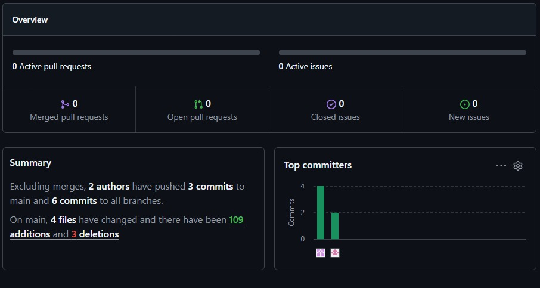
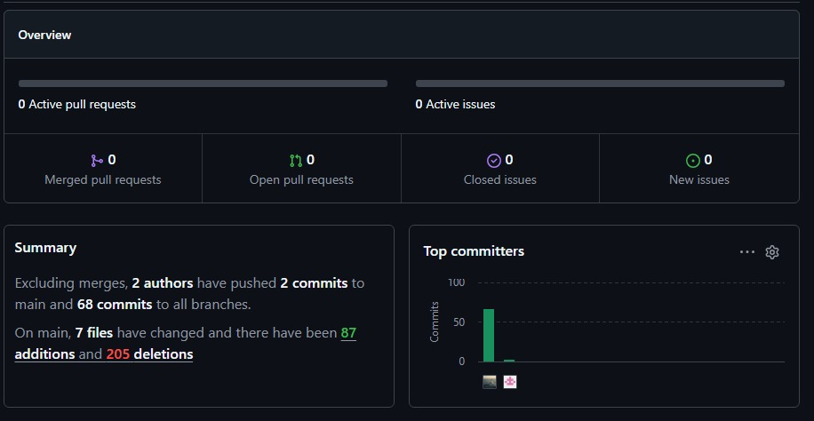
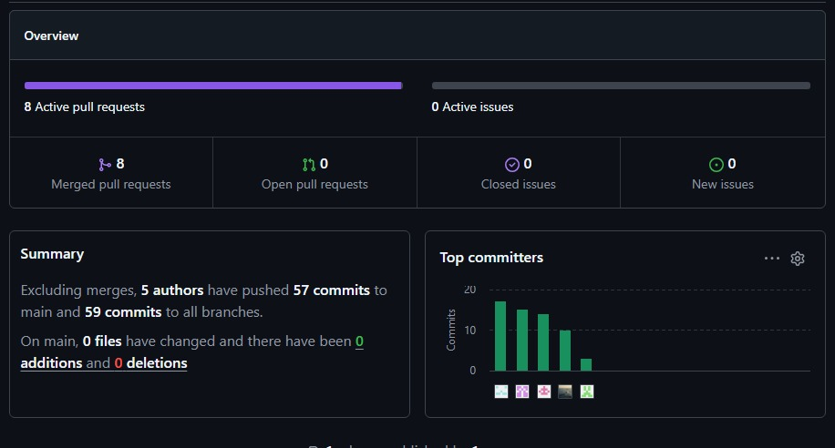

### 5.2.4.8. Team Collaboration Insights during Sprint.

En esta sección el equipo explica cómo se han desarrollado las actividades de implementación y se presenta los analíticos de colaboración y commits en GitHub, realizados por los miembros del equipo durante el Sprint 4.

**Distribución de Trabajo:**

Durante el Sprint 4, el equipo consolidó el desarrollo del proyecto atendiendo tres frentes en paralelo: completar la cuarta versión de la Landing Page, continuar la evolución de la Web Application hacia la versión v3.0.0 e iniciar el desarrollo de la versión v2.0.0 del Backend de AgroTrack Platform. A diferencia del Sprint anterior, donde cada integrante desarrolló un único Bounded Context de manera independiente, en este Sprint se adoptó una estrategia de colaboración cruzada, en la que todos los integrantes participaron activamente en el desarrollo de cada uno de los Bounded Contexts del Backend, compartiendo conocimientos y resolviendo problemas técnicos de manera conjunta.

El equipo mantuvo un enfoque de trabajo colaborativo mediante reuniones de seguimiento, revisiones de código y la integración continua en GitHub, lo que permitió coordinar eficientemente las tareas desarrolladas por cada integrante y garantizar la correcta integración de todos los componentes implementados durante el Sprint.

**Métricas de Colaboración:**

  

    <b>Contributors de la Landing Page v4.0.0</b>
  

  
  
<i><b>Fuente</b>: GitHub Insights del repositorio agrotrack-landing-page.</i>

  

    <b>Contributors de la Web Application v3.0.0</b>
  

  
  
<i><b>Fuente</b>: GitHub Insights del repositorio agrotrack-frontend.</i>

  

    <b>Contributors del Backend (AgroTrack Platform v2.0.0)</b>
  

  
  
<i><b>Fuente</b>: GitHub Insights del repositorio agrotrack-backend.</i>

Los analíticos muestran la participación activa de todos los integrantes durante el Sprint, evidenciando un incremento en las contribuciones como resultado del desarrollo simultáneo de la Landing Page, la Web Application y el Backend.

**Reflexiones del Equipo:**

- Velasquez Laquihuanaco, Eduardo David: "En el Sprint 4 implementé el Bounded Context de Identity en el Backend, encargado del registro y autenticación de agricultores y empresarios agrícolas, y desarrollé la sección Home de la cuarta versión de la Landing Page. Trabajar en la puerta de entrada de la plataforma, tanto a nivel de backend como de primera impresión visual, me hizo pensar mucho en la experiencia del usuario desde el primer contacto con AgroTrack."

- Alfaro Mallma, Alberto Joaquin: "Continué la evolución del Bounded Context de Dashboard en el Frontend y sumé el desarrollo del módulo de Support, encargado de canalizar consultas y soporte prioritario para los planes que lo incluyen. Combinar analíticas con soporte al usuario me permitió entender mejor qué información necesitan realmente los agricultores y empresarios agrícolas al usar la plataforma."

- Quispe Perez, Eder Edu: "Implementé el Bounded Context de Monitoring en el Backend de AgroTrack, encargado del seguimiento de las condiciones de las parcelas, y colaboré activamente en el desarrollo e integración de los demás Bounded Contexts. Trabajar de forma cruzada con los módulos de mis compañeros me ayudó a entender mejor cómo se conecta todo el ecosistema del backend agrícola."

- Rodriguez Rojas, Miler Alexander: "Desarrollé el Bounded Context de Alerts, encargado de generar las alertas básicas y avanzadas según el plan contratado (Basic, Pro o Enterprise), y colaboré en la implementación conjunta de los distintos Bounded Contexts del Backend. Diseñar las reglas de alerta a partir de los datos de Monitoring me permitió ver con claridad cómo dos Bounded Contexts distintos deben comunicarse manteniendo bajo acoplamiento."

**Lección Aprendida:**

El equipo identifica las siguientes lecciones de este Sprint 4:

1. **La colaboración cruzada en el desarrollo del Backend aceleró la implementación de los Bounded Contexts:** Trabajar todos sobre los mismos módulos permitió compartir conocimientos, resolver bloqueos técnicos más rápido y mantener consistencia entre Frontend y Backend.

2. **Atender tres productos en paralelo (Landing Page, Web Application y Backend) exige una coordinación de prioridades más estricta:** Fue necesario planificar con cuidado el tiempo de cada integrante para no descuidar ninguno de los tres frentes de trabajo del Sprint.

3. **Separar Monitoring y Alerts en dos Bounded Contexts distintos permitió un diseño más claro de responsabilidades:** Monitoring se enfoca en capturar y almacenar el estado de las parcelas, mientras que Alerts consume esa información para generar notificaciones según el plan del usuario, evitando mezclar ambas responsabilidades en un solo módulo.

4. **Integrar el módulo de Support al Bounded Context de Dashboard permitió centralizar la experiencia post-venta del usuario:** Al tener analíticas y soporte en un mismo espacio, se facilita que agricultores y empresarios agrícolas encuentren ayuda contextual junto a la información que ya están consultando.

5. **La revisión conjunta de código entre integrantes que trabajaron en los mismos Bounded Contexts mejoró la calidad de la integración:** Al tener varias personas familiarizadas con un mismo módulo, fue más sencillo detectar inconsistencias antes de fusionar los cambios en `develop`.

6. **La integración progresiva y constante en `develop` permitió sostener el desarrollo simultáneo de tres productos sin generar conflictos mayores al cierre del Sprint:** Mantener commits frecuentes facilitó que el trabajo de frontend, backend y landing page se integrara de forma ordenada.

---